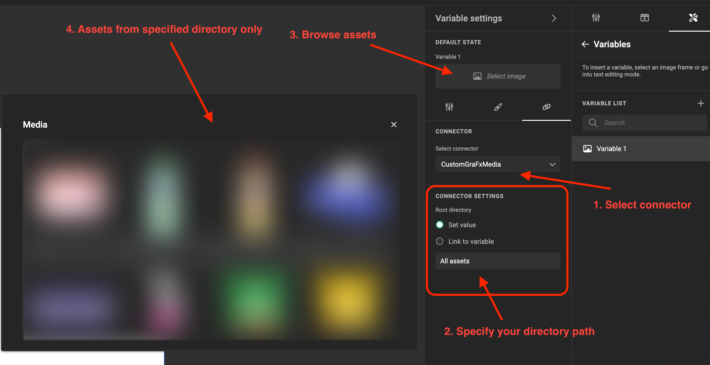

# Create Custom Media connector

In this guide, we’ll create a simplified version of the GraFx Media connector, complete with real functionality and various configuration options. This will give you a better understanding of the possibilities offered by the Connector Framework, which you can leverage when building your own Media connector

## Initialize project

Let's setup a new connector project

```bash
connector-cli new -n grafx-media # creates connector's project
cd grafx-media
npm install # install dependencies
```

to check that all setup correctly let's perform `info` command

```bash
connector-cli info
```

## Implementation

Not it's time to provide implementation for connector's methods. Open the directory created from previous step in any code editor on your choice

Let's inspect the `connector.ts` file. Its content should be following

```typescript title="connector.ts"
import { Connector, Media } from "@chili-publish/studio-connectors";

export default class MyConnector implements Media.MediaConnector {
  private runtime: Connector.ConnectorRuntimeContext;

  constructor(runtime: Connector.ConnectorRuntimeContext) {
    this.runtime = runtime;
  }

  query(
    options: Connector.QueryOptions,
    context: Connector.Dictionary
  ): Promise<Media.MediaPage> {
    throw new Error("Method not implemented.");
  }
  detail(
    id: string,
    context: Connector.Dictionary
  ): Promise<Media.MediaDetail> {
    throw new Error("Method not implemented.");
  }
  download(
    id: string,
    previewType: Media.DownloadType,
    intent: Media.DownloadIntent,
    context: Connector.Dictionary
  ): Promise<Connector.ArrayBufferPointer> {
    throw new Error("Method not implemented.");
  }
  getConfigurationOptions(): Connector.ConnectorConfigValue[] | null {
    return [];
  }
  getCapabilities(): Media.MediaConnectorCapabilities {
    return {
      query: false,
      detail: false,
      filtering: false,
      metadata: false,
    };
  }
}
```

### "Query" method

Let's begin from implementing a `query` method to retreive list of assets

<!-- ```typescript title="connector.ts"
async query(
  options: Connector.QueryOptions,
  context: Connector.Dictionary
): Promise<Media.MediaPage> {
	// const filter = options.filter?.join(' ') ?? '';
	// const pageToken = options.pageToken ?? '';
	// const sortBy = options.sortBy ?? '';
	// const sortOrder = options.sortOrder ?? '';
	// const pageSize = options.pageSize ?? '';
	// const configFolder = this._formatPath(context['folder'] ?? '');
	// const includeSubfolders = this._asBoolean(context['includeSubfolders']) ?? true;
	// const isSearching = filter.length > 0 ? true : false;
	// const includeItemsFromSubfolders = isSearching && includeSubfolders;
	// const collection = this._formatPath(options.collection ?? '');
	// const collectionIsSubOfContextFolder = collection?.toLocaleLowerCase().startsWith(configFolder.toLocaleLowerCase());
	// const folder = collectionIsSubOfContextFolder ? collection : configFolder;

	// Construct url
	// let queryEndpoint = this._getBaseMediaUrl();
  const baseURL =
    "https://int-product-1.chili-publish-sandbox.online/grafx/api/v1/environment/int-product-1/";
  let queryEndpoint = baseURL + "media?includeFolders=true";

	// queryEndpoint += `?search=${filter}`;
	// queryEndpoint += `&limit=${pageSize}`;
	// queryEndpoint += `&limit=${pageSize}`;
	// queryEndpoint += `&sortBy=${sortBy}`;
	// queryEndpoint += `&sortOrder=${sortOrder}`;
	// queryEndpoint += `&includeItemsFromSubfolders=${includeItemsFromSubfolders}`;
	// queryEndpoint += `&includeFolders=${includeSubfolders}`;
	queryEndpoint += `&includeFolders=true`;
	// queryEndpoint += `&folder=${folder}`;

	// if (pageToken != null && pageToken.length > 0) {
	// 	queryEndpoint += `&nextPageToken=${pageToken}`;
	// }

	const result = await this.runtime.fetch(queryEndpoint, {
		method: 'GET',
		// referrer: 'grafx-media-connector',
	});

	// if (!result.ok) {
	// 	this.runtime.logError(`Error (query): ${result.status}-${result.statusText}`)
	// 	throw new Error('Query method failed');
	// 	// throw new ConnectorHttpError(result.status, `Query failed ${result.status} ${result.statusText}`);
	// }

	// return this._formatRelativePath(JSON.parse(result.text));
	return JSON.parse(result.text);
}
``` -->

First of all let's add a private class field that's going to be referenced our environment baseURL (we will need it for re-use later)

```typescript title="connector.ts"
// Specify your baseURL
private baseURL = "https://int-product-1.chili-publish-sandbox.online/grafx/api/v1/environment/int-product-1/"
```

!!! warning "baseURL"
    You have to specify your "baseURL" field value according to your environment:

    **Production**

    	<ENVIRONMENT NAME>.chili-publish.online/grafx/api/v1/environment/<ENVIRONMENT NAME>/

    or **Sandbox**

    	<ENVIRONMENT NAME>.chili-publish-sandbox.online/grafx/api/v1/environment/<ENVIRONMENT NAME>/

and implementation of the `query` method

```typescript title="connector.ts"
async query(
  options: Connector.QueryOptions,
  context: Connector.Dictionary
): Promise<Media.MediaPage> {
  let queryEndpoint = this.baseURL + "media?includeFolders=true&includeItemsFromSubfolders=false";

  const result = await this.runtime.fetch(queryEndpoint, {
  	method: 'GET',
  });

  return JSON.parse(result.text);
}
```

Now it's time to test it out using our Debug Application.

```bash
connector-cli debug --watch
```

!!! tip
    `--watch` param means Debug Application reloads any time your change and save the `connector.ts`, allowing your easily test updates immediatelly.
    If you prefer re-run Debug Application manually after any connector's code update, consider to run the `debug` command without `--watch

Go to `Query` tab from the left-side menu and click `Invoke` button. You should see following results

```json
{
  "type": "https://httpstatuses.io/401",
  "title": "Unauthorized",
  "status": 401,
  "traceId": "00-372aff30545844b4152b2e876723aa67-a7abc999a03003ce-00"
}
```

This is expected behavior because we didn't specify any token for our request yet. Let's fix it.

### Authorization (in code)

First of all wee need to create an [integration token](../../../environment-api/02-managing-integrations/index.md) with `Read` and `List` permisions for `Media`.
Then let's copy the generated value and set it to new `authToken` private property of the connector's class

```typescript title="connector.ts"
private authToken = 'Bearer *****';
```

Also we need to update the HTTP request to include the token as `Authorization` header

```typescript title="connector.ts"
const result = await this.runtime.fetch(queryEndpoint, {
  method: "GET",
  // Append authorization header
  headers: {
    Authorization: this.authToken,
  },
});
```

Save changes and try to query the media assets again. This time request should return success results - list of `folders` (Each items have `"type": 1`)

### "Detail" and "Download" methods

Let's quickly provide implementation for others connector's methods

#### Detail

```typescript title="connector.ts"
  async detail(
    id: string,
    context: Connector.Dictionary
  ): Promise<Media.MediaDetail> {

    let queryEndpoint = this.baseURL + `media/${id}`;

    const result = await this.runtime.fetch(queryEndpoint, {
      method: 'GET',
      headers: {
  	    Authorization: this.authToken
      }
    });

    return JSON.parse(result.text).data;
  }
```

#### Download

```typescript
  async download(
    id: string,
    previewType: Media.DownloadType,
    intent: Media.DownloadIntent,
    context: Connector.Dictionary
  ): Promise<Connector.ArrayBufferPointer> {
    let queryEndpoint = this.baseURL + `media/${id}/preview/medium`;

    const result = await this.runtime.fetch(queryEndpoint, {
      method: 'GET',
      headers: {
  	    Authorization: this.authToken
      }
    });

    return result.arrayBuffer;
  }
```

#### Test

In order to test "detail" and "download" in Debug App we need to adjust "query" method to be able consume `collections` and return assets from them

```typescript title="connector.ts"
async query(
  options: Connector.QueryOptions,
  context: Connector.Dictionary
): Promise<Media.MediaPage> {

  let queryEndpoint = this.baseURL + "media?includeFolders=true&includeItemsFromSubfolders=false";

  // Append value of the collection
  queryEndpoint += `&folder=${this.formatPath(options.collection ?? '')}`

  const result = await this.runtime.fetch(queryEndpoint, {
  	method: 'GET',
    headers: {
  	  Authorization: this.authToken
    }
  });

  return JSON.parse(result.text);
}

// Utility function to treat folder path correctly
private formatPath(path: string) {
  // Trim leading/trailing white spaces
  path = path.trim();

  // If the path is empty after trimming, return early
  if (path.length === 0) {
      return '/';
  }

  // Replacing backslashes and multiple slashes + adding leading slash
  path = ('/' + path).replace(/\\/g, '/').replace(/\/+/g, '/');

  // Remove trailing slash if it exists and it's not the only character
  if (path.length > 1 && path.endsWith('/')) {
      path = path.slice(0, -1);
  }

  return path;
}
```

Now let's go to Debug App. Select `Query` item from left-side menu and click by `Invoke` button. Then from the result pick any `folder` that contains assets it in, paste to `collection` input field and click `Invoke` again.


This time it should return assets from this folder. Find any item with `"type": 0` (assets identification) and copy its `id`.


Go to `Detail` paste copied id and click `Invoke`.


Repeat the same step for `Download`.


## Deployment

Now it's time to make a first deployment of our connector, but before doing it we need to make couple of adjustments

### Preparation

#### Connector capability

In order to appear in Media Panel, our connector should define corresponding capabilities. Let's update them

```typescript title="connector.ts"
  getCapabilities(): Media.MediaConnectorCapabilities {
    return {
      query: true,
      detail: true,
      filtering: true,
      metadata: false,
    };
  }
```

!!! tip
    See [capabilities](../../media-connector/fundamentals/index.md#available-capabilities) section for detailed explanation

#### Authorization

Currently our authorization information (authorization token) is laying in a connector's code. Although it's "ok" to have it during debug of our connector, we don't want to deploy it since our code is just a plain text.
Following [this](../../authorization/index.md#connector-project) we're going to configure our project to consume `staticKey` authorization type

After this we can safely remove `authToken` and any of its usages from connector's code

#### Support for "pageSize", "pageToken" and "filter"

```typescript title="connector.ts"
  async query(
    options: Connector.QueryOptions,
    context: Connector.Dictionary
  ): Promise<Media.MediaPage> {
    let queryEndpoint =
      this.baseURL +
      "media?includeFolders=true";

    // Read values of `pageToken`, `pageSize` and 'filter'
    const filter = options.filter?.join(' ') ?? '';
    const pageToken = options.pageToken ?? "";
    const pageSize = options.pageSize;

    const isSearching = filter.length > 0 ? true : false;

    queryEndpoint += `&folder=${this.formatPath(options.collection ?? "")}`;
    queryEndpoint += `&includeItemsFromSubfolders=${isSearching}`;
    queryEndpoint += `&search=${filter}`;

    if (pageSize > 0) {
      queryEndpoint += `&limit=${pageSize}`;
    }

    if (pageToken != null && pageToken.length > 0) {
      queryEndpoint += `&nextPageToken=${pageToken}`;
    }

    const result = await this.runtime.fetch(queryEndpoint, {
      method: "GET",
    });

    const data = JSON.parse(result.text);

    return {
      ...data,
      links: {
        ...data.links,
        nextPage: data.links.nextPage
          ? this.extractQueryParameters(data.links.nextPage)["nextPageToken"]
          : "",
      },
    };
  }

  // Utility function to read query params from URL
  private extractQueryParameters(url: string): Record<string, string> {
    const params: Record<string, string> = {};
    const queryString = url.split("?")[1]; // Get the part after the '?'
    if (queryString) {
      const keyValuePairs = queryString.split("&");
      keyValuePairs.forEach((pair) => {
        const [key, value] = pair.split("=");
        params[key] = decodeURIComponent(value); // Decode URL-encoded value
      });
    }
    return params;
  }
```


#### Test in "Debug Application"

Ensure that you have same version of connector's file

```typescript title="connector.ts"
import { Connector, Media } from "@chili-publish/studio-connectors";

export default class MyConnector implements Media.MediaConnector {
  private runtime: Connector.ConnectorRuntimeContext;
  private baseURL =
    "https://int-product-1.chili-publish-sandbox.online/grafx/api/v1/environment/int-product-1/";

  constructor(runtime: Connector.ConnectorRuntimeContext) {
    this.runtime = runtime;
  }

  async query(
    options: Connector.QueryOptions,
    context: Connector.Dictionary
  ): Promise<Media.MediaPage> {
    let queryEndpoint = this.baseURL + "media?includeFolders=true";

    // Read values of `pageToken`, `pageSize` and 'filter'
    const filter = options.filter?.join(" ") ?? "";
    const pageToken = options.pageToken ?? "";
    const pageSize = options.pageSize;

    const isSearching = filter.length > 0 ? true : false;

    queryEndpoint += `&folder=${this.formatPath(options.collection ?? "")}`;
    queryEndpoint += `&includeItemsFromSubfolders=${isSearching}`;
    queryEndpoint += `&search=${filter}`;

    if (pageSize > 0) {
      queryEndpoint += `&limit=${pageSize}`;
    }

    if (pageToken != null && pageToken.length > 0) {
      queryEndpoint += `&nextPageToken=${pageToken}`;
    }

    const result = await this.runtime.fetch(queryEndpoint, {
      method: "GET",
    });

    const data = JSON.parse(result.text);

    return {
      ...data,
      links: {
        ...data.links,
        nextPage: data.links.nextPage
          ? this.extractQueryParameters(data.links.nextPage)["nextPageToken"]
          : "",
      },
    };
  }

  // Utility function to read query params from URL
  private extractQueryParameters(url: string): Record<string, string> {
    const params: Record<string, string> = {};
    const queryString = url.split("?")[1]; // Get the part after the '?'
    if (queryString) {
      const keyValuePairs = queryString.split("&");
      keyValuePairs.forEach((pair) => {
        const [key, value] = pair.split("=");
        params[key] = decodeURIComponent(value); // Decode URL-encoded value
      });
    }
    return params;
  }

  // Utility function to treat folder path correctly
  private formatPath(path: string) {
    // Trim leading/trailing white spaces
    path = path.trim();

    // If the path is empty after trimming, return early
    if (path.length === 0) {
      return "/";
    }

    // Replacing backslashes and multiple slashes + adding leading slash
    path = ("/" + path).replace(/\\/g, "/").replace(/\/+/g, "/");

    // Remove trailing slash if it exists and it's not the only character
    if (path.length > 1 && path.endsWith("/")) {
      path = path.slice(0, -1);
    }

    return path;
  }

  async detail(
    id: string,
    context: Connector.Dictionary
  ): Promise<Media.MediaDetail> {
    let queryEndpoint = this.baseURL + `media/${id}`;

    const result = await this.runtime.fetch(queryEndpoint, {
      method: "GET",
    });

    return JSON.parse(result.text).data;
  }
  async download(
    id: string,
    previewType: Media.DownloadType,
    intent: Media.DownloadIntent,
    context: Connector.Dictionary
  ): Promise<Connector.ArrayBufferPointer> {
    let queryEndpoint = this.baseURL + `media/${id}/preview/medium`;

    const result = await this.runtime.fetch(queryEndpoint, {
      method: "GET",
    });

    return result.arrayBuffer;
  }
  getConfigurationOptions(): Connector.ConnectorConfigValue[] | null {
    return [];
  }
  getCapabilities(): Media.MediaConnectorCapabilities {
    return {
      query: true,
      detail: true,
      filtering: true,
      metadata: false,
    };
  }
}
```

To continue debug our connector in Debug Application we have to configure corresponding authorization information


Let's check that it works correctly - try to make `query` request, for example. Also you can set `pageSize`, `pageToken` and `filters` to see param's in actions

### Publish to the environment

To setup our connector on environemnt we need to make couple of actions using CLI

#### Login

First of all we need to login to the system

```bash
connector-cli login
```

If succesful, the command line will show this message (with your credentials)

```bash
+35.619s CLI authenticated successfully.
+35.812s User is authenticated => <user email>
```

#### Deploy connector to the environment

Then, we're deploying our connector

For Sandbox environment

```bash
connector-cli publish \
  -n CustomGraFxMedia \
  -b https://<ENVIRONMENT NAME>.chili-publish-sandbox.online/grafx \
  -e <ENVIRONMENT NAME> \
  --proxyOption.allowedDomains "*.chili-publish-sandbox.online"
```

For Production environment

```bash
connector-cli publish \
  -n CustomGraFxMedia \
  -b https://<ENVIRONMENT NAME>.chili-publish.online/grafx \
  -e <ENVIRONMENT NAME> \
  --proxyOption.allowedDomains "*.chili-publish.online"
```

```bash title="Create results"
+0.08s Checking authentication information...
+0.629s User is authenticated => <user email>
+0.631s Validating allowed domains option...
+0.631s Validating runtime options...
+0.631s Extracting package information...
+1.067s Compiling connector...
+1.587s Build full request URL...
+1.587s Creating a new connector...
+2.394s Connector "CustomGraFxMedia" is created
{"id":"connector-id","name":"CustomGraFxMedia"}
```

Copy `connector-id` from results, we will need it for the few next steps

#### Set auth on deployed connector instance

Following [this](../../authorization/index.md#deployed-connector-instance) let's setup `staticKey` for `browser` usage, for our newly deployed connector instance

After success setup, open any of your template or create a new one and open Media Panel - you should see your connector in the List. Select it and try to create image frame or image variable using assets of your connector

!!! Note
    Since we've configured only `browser` authentication usage, producing of output will not work. If you want to test `outputs` as well, consider to setup same authorization for `server` usage.

## Improve connector

Now it's a time to make our connector a bit more dynamic

### Runtime settings

First of all, let's make our `baseURL` value configurable, to be able re-use our connector code across multiple environments. For this we're going to use [runtime settings](../../media-connector/fundamentals/index.md#runtime-settings)

`baseURL` is a `required` runtime setting

```json title="package.json"
...
"config": {
  ...
  "options": {
    "baseURL": null
  }
  ...
}
...
```

Update code to replace `this.baseUrl` with value from runtime settings, i.e. `query` method example

```typescript title="connector.ts"
  async query(
    options: Connector.QueryOptions,
    context: Connector.Dictionary
  ): Promise<Media.MediaPage> {
    // Read "baseURL" from runtime settings
    let queryEndpoint = this.runtime.options['baseURL'] + "media?includeFolders=true";

    const filter = options.filter?.join(" ") ?? "";
    const pageToken = options.pageToken ?? "";
    const pageSize = options.pageSize;

    const isSearching = filter.length > 0 ? true : false;

    queryEndpoint += `&folder=${this.formatPath(options.collection ?? "")}`;
    queryEndpoint += `&includeItemsFromSubfolders=${isSearching}`;
    queryEndpoint += `&search=${filter}`;

    if (pageSize > 0) {
      queryEndpoint += `&limit=${pageSize}`;
    }

    if (pageToken != null && pageToken.length > 0) {
      queryEndpoint += `&nextPageToken=${pageToken}`;
    }

    const result = await this.runtime.fetch(queryEndpoint, {
      method: "GET",
    });

    const data = JSON.parse(result.text)

    return {
      ...data,
      links: {
        ...data.links,
        nextPage: data.links.nextPage
          ? this.extractQueryParameters(data.links.nextPage)["nextPageToken"]
          : "",
      },
    };
  }
```

update `detail` and `download` in the similar way. Eventualy we can remove `private baseUrl` property from the class

Updated version of connector's file

```typescript title="Runtime settigns for baseURL"
import { Connector, Media } from "@chili-publish/studio-connectors";

export default class MyConnector implements Media.MediaConnector {
  private runtime: Connector.ConnectorRuntimeContext;

  constructor(runtime: Connector.ConnectorRuntimeContext) {
    this.runtime = runtime;
  }

  async query(
    options: Connector.QueryOptions,
    context: Connector.Dictionary
  ): Promise<Media.MediaPage> {
    let queryEndpoint =
      this.runtime.options["baseURL"] + "media?includeFolders=true";

    // Read values of `pageToken`, `pageSize` and 'filter'
    const filter = options.filter?.join(" ") ?? "";
    const pageToken = options.pageToken ?? "";
    const pageSize = options.pageSize;

    const isSearching = filter.length > 0 ? true : false;

    queryEndpoint += `&folder=${this.formatPath(options.collection ?? "")}`;
    queryEndpoint += `&includeItemsFromSubfolders=${isSearching}`;
    queryEndpoint += `&search=${filter}`;

    if (pageSize > 0) {
      queryEndpoint += `&limit=${pageSize}`;
    }

    if (pageToken != null && pageToken.length > 0) {
      queryEndpoint += `&nextPageToken=${pageToken}`;
    }

    const result = await this.runtime.fetch(queryEndpoint, {
      method: "GET",
    });

    const data = JSON.parse(result.text);

    return {
      ...data,
      links: {
        ...data.links,
        nextPage: data.links.nextPage
          ? this.extractQueryParameters(data.links.nextPage)["nextPageToken"]
          : "",
      },
    };
  }

  // Utility function to read query params from URL
  private extractQueryParameters(url: string): Record<string, string> {
    const params: Record<string, string> = {};
    const queryString = url.split("?")[1]; // Get the part after the '?'
    if (queryString) {
      const keyValuePairs = queryString.split("&");
      keyValuePairs.forEach((pair) => {
        const [key, value] = pair.split("=");
        params[key] = decodeURIComponent(value); // Decode URL-encoded value
      });
    }
    return params;
  }

  // Utility function to treat folder path correctly
  private formatPath(path: string) {
    // Trim leading/trailing white spaces
    path = path.trim();

    // If the path is empty after trimming, return early
    if (path.length === 0) {
      return "/";
    }

    // Replacing backslashes and multiple slashes + adding leading slash
    path = ("/" + path).replace(/\\/g, "/").replace(/\/+/g, "/");

    // Remove trailing slash if it exists and it's not the only character
    if (path.length > 1 && path.endsWith("/")) {
      path = path.slice(0, -1);
    }

    return path;
  }

  async detail(
    id: string,
    context: Connector.Dictionary
  ): Promise<Media.MediaDetail> {
    let queryEndpoint = this.runtime.options["baseURL"] + `media/${id}`;

    const result = await this.runtime.fetch(queryEndpoint, {
      method: "GET",
    });

    return JSON.parse(result.text).data;
  }
  async download(
    id: string,
    previewType: Media.DownloadType,
    intent: Media.DownloadIntent,
    context: Connector.Dictionary
  ): Promise<Connector.ArrayBufferPointer> {
    let queryEndpoint =
      this.runtime.options["baseURL"] + `media/${id}/preview/medium`;

    const result = await this.runtime.fetch(queryEndpoint, {
      method: "GET",
    });

    return result.arrayBuffer;
  }
  getConfigurationOptions(): Connector.ConnectorConfigValue[] | null {
    return [];
  }
  getCapabilities(): Media.MediaConnectorCapabilities {
    return {
      query: true,
      detail: true,
      filtering: true,
      metadata: false,
    };
  }
}
```

To be able test updated version in Debug Application, similar to `Authorization` information, we need specify actual values in particular configuration section


### Add query options

In addition to the runtime settings, let’s introduce some flexibility when interacting with a connector in Studio. For this we need [query options](../../media-connector/fundamentals/index.md#query-options)

Let's make possibility to specify `folder` under which asset's browsing is going to happen.

```typescript title="connector.ts"
  getConfigurationOptions(): Connector.ConnectorConfigValue[] | null {
    return [{
      type: 'text',
      name: 'folder',
      displayName: 'Root directory'
    }];
  }
```

and we need to update `query` method to reflect value passed as `folder` query option

```typescript title="connector.ts"
  async query(
    options: Connector.QueryOptions,
    context: Connector.Dictionary
  ): Promise<Media.MediaPage> {
    let queryEndpoint =
      this.runtime.options["baseURL"] + "media?includeFolders=true";

    // Read value from 'folder' query option
    const configFolder = this.formatPath((context["folder"] as string) ?? "");
    const collection = this.formatPath(options.collection ?? "");
    const collectionIsSubOfContextFolder = collection
      .toLocaleLowerCase()
      .startsWith(configFolder.toLocaleLowerCase());
    const folder = collectionIsSubOfContextFolder ? collection : configFolder;

    const filter = options.filter?.join(" ") ?? "";
    const pageToken = options.pageToken ?? "";
    const pageSize = options.pageSize;

    const isSearching = filter.length > 0 ? true : false;

    // Set 'folder' variable
    queryEndpoint += `&folder=${folder}`;
    queryEndpoint += `&includeItemsFromSubfolders=${isSearching}`;
    queryEndpoint += `&search=${filter}`;

    if (pageSize > 0) {
      queryEndpoint += `&limit=${pageSize}`;
    }

    if (pageToken != null && pageToken.length > 0) {
      queryEndpoint += `&nextPageToken=${pageToken}`;
    }

    const result = await this.runtime.fetch(queryEndpoint, {
      method: "GET",
    });

    const data = JSON.parse(result.text);

    return {
      ...data,
      links: {
        ...data.links,
        nextPage: data.links.nextPage
          ? this.extractQueryParameters(data.links.nextPage)["nextPageToken"]
          : "",
      },
    };
  }
```

### Publish updates

Time to level up our deployed connector with recently added improvements

For Sandbox environment

```bash
connector-cli publish \
  --connectorId <connector-id> \
  -n CustomGraFxMedia \
  -b https://<ENVIRONMENT NAME>.chili-publish-sandbox.online/grafx \
  -e <ENVIRONMENT NAME> \
  --proxyOption.allowedDomains "*.chili-publish-sandbox.online" \
  -ro baseURL=https://<ENVIRONMENT NAME>.chili-publish-sandbox.online/grafx/api/v1/environment/<ENVIRONMENT NAME>/
```

For Production environment

```bash
connector-cli publish \
  --connectorId <connector-id> \
  -n CustomGraFxMedia \
  -b https://<ENVIRONMENT NAME>.chili-publish.online/grafx \
  -e <ENVIRONMENT NAME> \
  --proxyOption.allowedDomains "*.chili-publish.online" \
  -ro baseURL=https://<ENVIRONMENT NAME>.chili-publish.online/grafx/api/v1/environment/<ENVIRONMENT NAME>/
```

```bash title="Update results"
+0.08s Checking authentication information...
+0.629s User is authenticated => <user email>
+0.631s Validating allowed domains option...
+0.631s Validating runtime options...
+0.631s Extracting package information...
+1.067s Compiling connector...
+1.587s Build full request URL...
+1.587s Updating connector...
+2.394s Connector "CustomGraFxMedia" is updated
{"id":"connector-id","name":"CustomGraFxMedia"}
```

Try to create or update multiple image variables with different setup of your connector to see the full power of `query options`.



!!! Tip
	In order to remove the connector, consider to execute `connector-cli remove -e <environment> -b <base url> --connectorId <connector-id>`