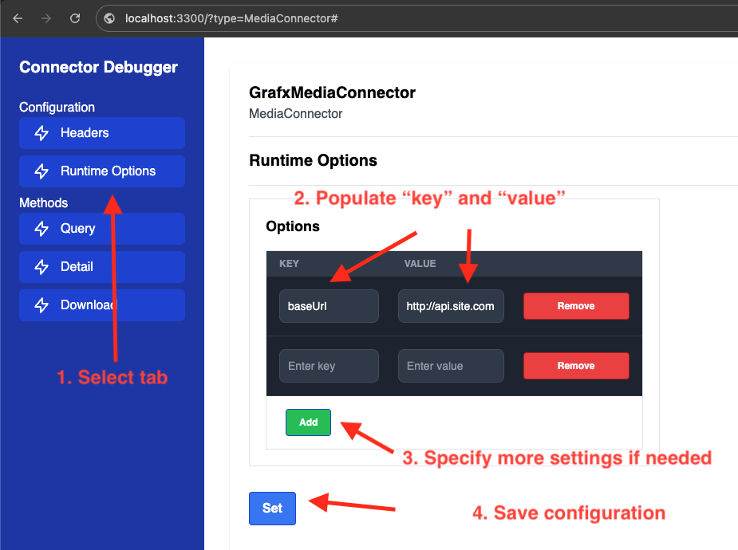
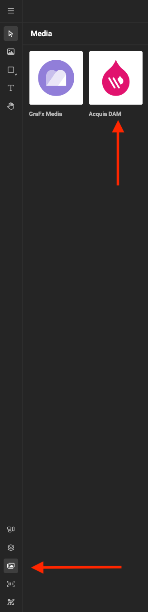
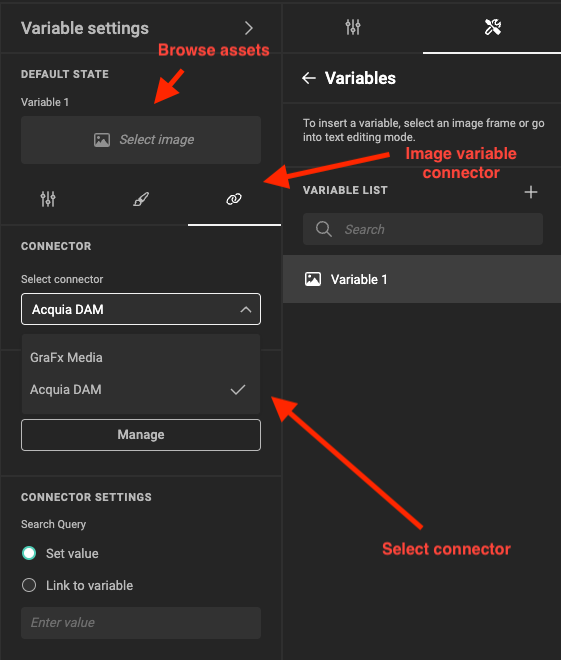
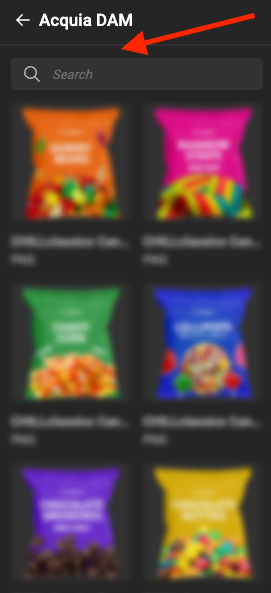
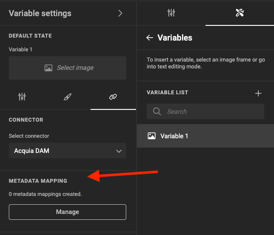
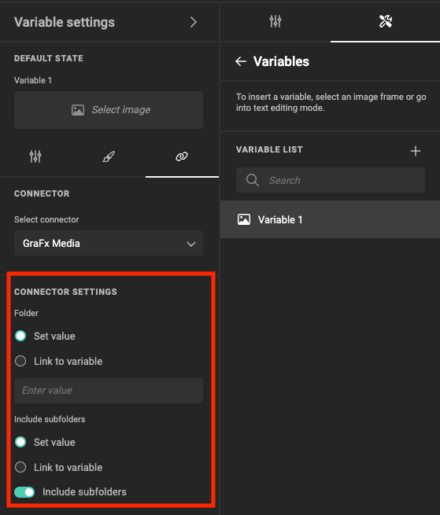

# Fundamentals

This page outlines various configuration options and environment specifics available for your custom media connector.

## Runtime settings

When creating a connector you might want to have a parts of the code to be generic. For instance, make the URL of the API service configurable, or create specific modes for different connector behaviors (such as enhanced logging). To achieve this, utilize runtime settings and propagate their values during connector's publishing. This approach enhances reusability across multiple customers and ensures flexibility.

To start using runtime settings you need to enable them in two places:

- Connector project
- Connector code

### Connector project

Within the `package.json` file of your connector project, locate the `config` section. Specify the relevant options here to ensure that only defined configurations are allowed. This step also provides an overview of runtime settings.

```json
...
"config": {
	...
	"options": {
		"baseUrl": null,
		"verbose": true,
		"logLevel": "1"
	}
}
...
```

To indicate a required option, set its value to `null`. For optional options, provide `default` value. For now we support only `string` and `boolean` types for option values

!!!Important
	Marking an option as required will prevent connector publishing unless the actual value is specified as CLI param. See `connector-cli publish -h` for more information

!!! tip
	Once you specify `runtime settings` on connector's project level, you might execute `connector-cli info` to see the infromation about them

### Connector code

Once specify `option` on connector's project level you might start using a reference to them within your connector class in the code

```typescript title="connector.ts"
import { Connector, Media } from "@chili-publish/studio-connectors";

export default class MyConnector implements Media.MediaConnector {

  private runtime: Connector.ConnectorRuntimeContext;

  constructor(runtime: Connector.ConnectorRuntimeContext) {
    this.runtime = runtime;
    console.log(this.runtime.options['baseUrl'])
    console.log(this.runtime.options['verbose'])
    console.log(this.runtime.options['logLevel'])
  }
	...
}
```

### Debug app

When you're testing your connector in the `debug` application you must specify the actual values of the runtime options in particular tab to propagate them to the connector code



## Сapabilities

By defining the capabilities of your custom connector, you communicate to the integrator application which features it supports.
This, in turn, affects the UI appearance in Studio, which adapts based on the enabled capabilities.

### Available capabilities

Here is a list of the capabilities available for Media connector:

- query
- detail
- filtering
- metadata

When setting up a new connector project, all capabilitites disabled by default. Depending on the connector’s functionality, you’ll need to manually enable them in your code.

```typescript title="connector.ts"
...
getCapabilities(): Media.MediaConnectorCapabilities {
  return {
    query: false,
    detail: false,
    filtering: false,
    metadata: false,
  };
}
...
```

!!! tip
	Once you specify `capabilities` for your connector, you might execute `connector-cli info` to see the infromation about them

#### Query and detail

Indicates that your connector is able to query assets from connector's source.

When enabled, you can see you connector in the `MediaPanel` connector's list to browse the assets.



Also connector's assets browsing becomes available for `Image Variable` connector's configuration



!!!Important
	`query` capability comes along with `detail` to be able to retreive an individual asset's details. All connector's methods `query`, `detail` and `download` should be implemented
	```typescript title="connector.ts"
		...

		query(
			options: Connector.QueryOptions,
			context: Connector.Dictionary
		): Promise<Media.MediaPage> {
			// Implementation should be provided
		}
		detail(
			id: string,
			context: Connector.Dictionary
		): Promise<Media.MediaDetail> {
			// Implementation should be provided
		}
		download(
			id: string,
			previewType: Media.DownloadType,
			intent: Media.DownloadIntent,
			context: Connector.Dictionary
		): Promise<Connector.ArrayBufferPointer> {
			// Implementation should be provided
		}
		getCapabilities(): Media.MediaConnectorCapabilities {
			return {
				query: true,
				detail: true,
				filtering: false,
				metadata: false,
			};
		}
	```

#### Filtering

When you connector supports `filtering` functionality in addition to the regular asset's browsing, you can enable this capability

```typescript title="connector.ts"
...
query(
  options: Connector.QueryOptions,
  context: Connector.Dictionary
): Promise<Media.MediaPage> {
	// Read filter value
  const filterValue = options.filter[0] ?? null
}
getCapabilities(): Media.MediaConnectorCapabilities {
  return {
    query: true,
    detail: true,
    filtering: true,
    metadata: false,
  };
}
...
```

When enabled, you will see a search field in the Medial Panel after selecting your connector assets panel



!!! Important
	`filtering` capability can be enabled only along with `query` and `detail`


#### Metadata

When your connector support so called `Metadata mapping` functionality, corresponding `metadata` capaibility can be enabled to bring a new interaction

When enabled, you will see an extra section called `Metadata mapping` in `Image variable` connector's settings panel



With this you can make you template even more dynamic, by bringing metadata of the assets from your DAM to the Studio template

### No capability

While most Media connectors typically offer both `query` and `detail` capabilities, there are cases where a highly specific connector is necessary, focusing solely on asset previews

Consider the scenario of creating assets through AI tools, for example the DALL-E.”

In this case all of you connector capabilities stays disabled and from connector's methods implementation you need to provide implementation only for `download` method

```typescript title="connector.ts"
...
  download(
    id: string,
    previewType: Media.DownloadType,
    intent: Media.DownloadIntent,
    context: Connector.Dictionary
  ): Promise<Connector.ArrayBufferPointer> {
    // Generate and return assets preview
  }
  getCapabilities(): Media.MediaConnectorCapabilities {
    return {
      query: true,
      detail: false,
      filtering: false,
      metadata: false,
    };
  }
...
```


## Query options

When building a connector, we can configure certain aspects of its functionality using `runtime settings`. These settings are established during deployment and remain fixed throughout the connector’s lifecycle

If you need to customize your connector while it’s in use (such as configuring it for an `Image Variable`), `query options` come into play.

```typescript title="connector.ts"
...

  query(
    options: Connector.QueryOptions,
    context: Connector.Dictionary
  ): Promise<Media.MediaPage> {
    // Accessing of query options values
    console.log(context['folder']); // string value
    console.log(context['includeSubfolders']) // boolean value
  }
  // Defines query options in this method
  getConfigurationOptions(): Connector.ConnectorConfigValue[] | null {
    return [{
	    type: 'text',
	    name: 'folder',
	    displayName: 'Folder'
    }, {
    	type: 'boolean',
    	name: 'includeSubfolders',
    	displayName: 'Include subfolders'
    }];
  }
...
```



!!! tip
	Once you specify `query options` for your connector, you might execute `connector-cli info` to see the infromation about them

## Logo

To demonstrate logo for your connector in Studio, you have to specify URL to it in connector's project configuration, withing `package.json` file

```json title="package.json"
...
"config": {
	"iconUrl": "https://image-cover.com"
}
...
```

!!! tip
	Once you specify `iconUrl` on connector's project level, you might execute `connector-cli info` to see the infromation about it

## HTTP request

The only way to communicate with external services from your connector's code is to use specific `runtime` fetch API. Despite of the fact that it repeats the API of `built-in` NodeJS fetch, it ensures that all additional nessassary information
will be injected during actual calling in connector's `runtime environment`

!!!Important
	You must avoid providing any authorization information in the connector's code via headers or another way. Instead consider to setup the proper authorization. See [Connector Authorization](../../authorization/index.md) page for more information of how to setup it for your connector

```typescript title="connector.ts"
import { Connector, Media } from "@chili-publish/studio-connectors";

export default class MyConnector implements Media.MediaConnector {

  private runtime: Connector.ConnectorRuntimeContext;

  constructor(runtime: Connector.ConnectorRuntimeContext) {
    this.runtime = runtime;
  }

  query(
    options: Connector.QueryOptions,
    context: Connector.Dictionary
  ): Promise<Media.MediaPage> {
    this.runtime.fetch(...)
  }
}
```

## Logging

While testing your connector in Debug App, you can log information using the built-in `console`. However, when connector is executed in Studio, the `console log` isn’t available

To address this, we’ve introduced a runtime API that allows you to view logs in both integration modes.

```typescript title="connector.ts"
import { Connector, Media } from "@chili-publish/studio-connectors";

export default class MyConnector implements Media.MediaConnector {

  private runtime: Connector.ConnectorRuntimeContext;

  constructor(runtime: Connector.ConnectorRuntimeContext) {
    this.runtime = runtime;
  }

  query(
    options: Connector.QueryOptions,
    context: Connector.Dictionary
  ): Promise<Media.MediaPage> {
    this.runtime.logError('This is a message that is going to be log in both "debug" and "Studio" execution modes')
  }
}
```

!!!Important
	Despite on the fact the method has `logError` name you can use it for the any kind of logging, not only error-case.

## Error throwing

When your connector’s code encounters an issue, it throws an exception. Intentional exception throwing may also be needed. While JavaScript includes a standard Error object, we’ve implemented a dedicated error type for more granular handling within the integration environment.

When you wanted to catch the HTTP failure in a specific manner consider to use `ConnectorHttpError`

```typescript title="connector.ts"
import { Connector, Media } from "@chili-publish/studio-connectors";

export default class MyConnector implements Media.MediaConnector {

  private runtime: Connector.ConnectorRuntimeContext;

  constructor(runtime: Connector.ConnectorRuntimeContext) {
    this.runtime = runtime;
  }

  async query(
    options: Connector.QueryOptions,
    context: Connector.Dictionary
  ): Promise<Media.MediaPage> {

    // Example: how to throw regular error
    if(context['queryValue'] === false) {
    	throw new Error('Error: "Query value must be provided')
    }

    const res = await this.runtime.fetch(...)
		// Example: How to throw http error
    if(!res.ok) {
    	throw new ConnectorHttpError(res.status, `Error: ${res.status}-${res.statusText}`)
    }
  }
}
```

Throwing of such type of error will allow Engine to show specific eror preview for the asset in canvas
