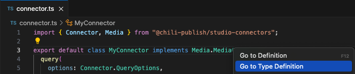
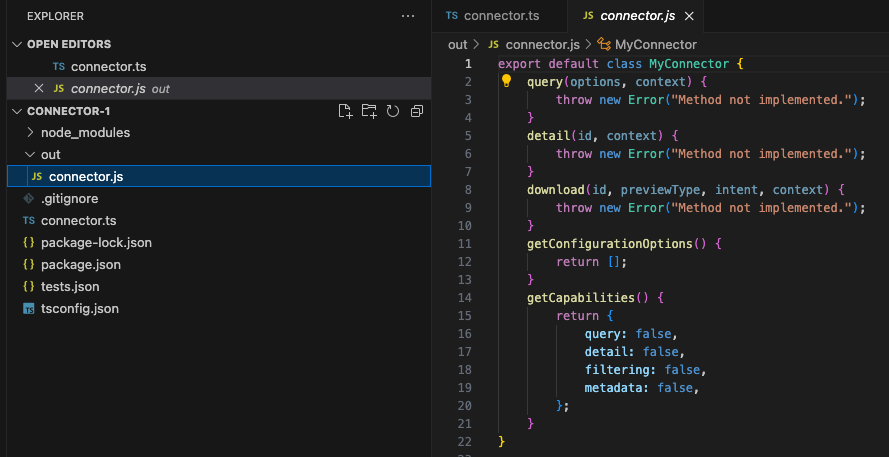
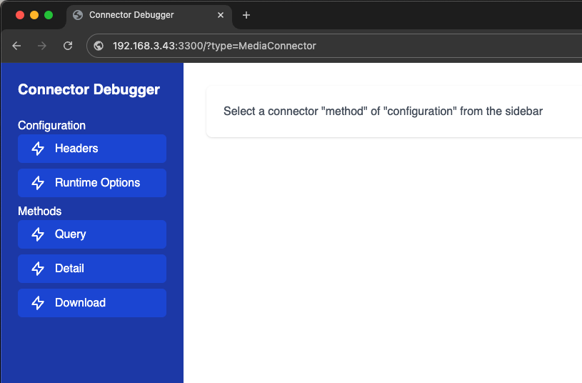
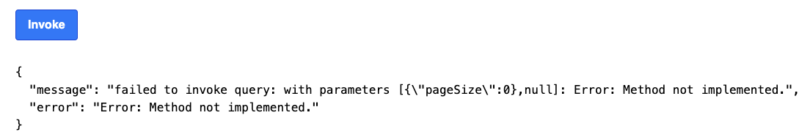
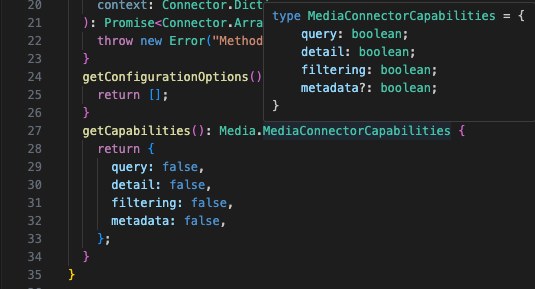

# Getting started

!!! tip
	This page provides instructions for setting up and running an instance of your Media connector in an environment without actual functionality (essentially a getting started guide). For advanced example that includes real HTTP requests, authentication, and various configuration options, please refer to the [following](../../guides/custom-media-connector/index.md) page.

## Pre-requisites

- [NodeJS and Npm](../../pre-requisites/)
- [Connector CLI](../../connector-cli/)
- Knowledge of TypeScript
- IDE
    - [Visual Studio Code](https://code.visualstudio.com/)
    - [Rider](https://www.jetbrains.com/rider/)

## Initialize the connector project

Means building the Boiler Plate. This is the basic code you'll need to get started.

```bash
connector-cli new -n <connector-name>
```

It creates a new directory `<connector-name>` and generates project files there.

!!! tip
	To instantiate connector's project in your current directory consider to use `connector-cli init -n <connector-name>` command instead.

You now have the basic code. In that code, we have defined some dependencies. To download these, execute the install command.

```bash
cd <connector-name> # if 'connector-cli new' CLI command was used
npm install
```

The result should look something like this

```bash
added 112 packages, and audited 113 packages in 5s

35 packages are looking for funding
  run `npm fund` for details

found 0 vulnerabilities

```

To check that you setup everything correctly let's try to get some information about your connector by calling following command:

```bash
connector-cli info
```

will produce following output

```bash
+0.095s connector-cli v1.x.x
+2.348s
+2.348s Framework version: 1.x.x
+2.348s Type: "media"
+2.348s Logo: There is no connector logo URL specified for this connector
+2.348s Capabilities: Connector does not have any enabled capabilities.
+2.348s Settings: Connector does not have any settings defined
+2.348s Runtime options: Connector does not have any runtime options defined
+2.348s Authentication: There is no any supported authentication defined for this connector
```

We will take a look at all of this setttings in [Advanced example](../../guides/custom-media-connector/index.md).

## Inspect the code

Now it's time to create your custom code.

This happens in the file "connector.ts". This is a TypesScript file.

```typescript title="connector.ts"
import { Connector, Media } from "@chili-publish/studio-connectors";

export default class MyConnector implements Media.MediaConnector {

  private runtime: Connector.ConnectorRuntimeContext;

  constructor(runtime: Connector.ConnectorRuntimeContext) {
    this.runtime = runtime;
  }

  query(
    options: Connector.QueryOptions,
    context: Connector.Dictionary
  ): Promise<Media.MediaPage> {
    throw new Error("Method not implemented.");
  }
	detail(
    id: string,
    context: Connector.Dictionary
  ): Promise<Media.MediaDetail> {
    throw new Error("Method not implemented.");
  }
  download(
    id: string,
    previewType: Media.DownloadType,
    intent: Media.DownloadIntent,
    context: Connector.Dictionary
  ): Promise<Connector.ArrayBufferPointer> {
    throw new Error("Method not implemented.");
  }
  getConfigurationOptions(): Connector.ConnectorConfigValue[] | null {
    return [];
  }
  getCapabilities(): Media.MediaConnectorCapabilities {
    return {
      query: false,
      detail: false,
      filtering: false,
      metadata: false,
    };
  }
}
```

The definition of what needs to be implemented, can be reached by right clicking on the interface:



!!! Important
	The name of your class does not really matter. As long as it's defined as the default class. Once deployed, CHILI GraFx will look for the default class to use.
	In the above example it's called "MyConnector". You can name it "MyAwesomeConnector"

## Building

If your code works (syntax is right, since we did not add any functionality yet), it will build.
Therefore you need to give the command to build with CLI tool

```bash
connector-cli build
```

resulting in

```bash
+0.079s connector-cli v1.x.x
+0.632s Build succeeded
```

The result of the build is a JavaScript file "connector.js", in the "out" directory.



## Debugging

To test the functionality, we provide you with a mini webserver, that will open up the result of your code in a web browser.

There you can test the implementation.

```bash
connector-cli debug
```

```bash
+0.09s connector-cli v1.x.x
+1.419s Debugger running on port 3300. Visit http://192.168.3.43:3300?type=MediaConnector for testing
```

Now open your web browser, and go to the IP of the machine (local or remote) that you are running this script on.

In the below example, we're working on a virtual machine on ip

```html
http://192.168.3.43:3300/?type=MediaConnector
```

!!! tip
	Don't forget to add '/?type=MediaConnector' to the url

And the browser tab should look like this



Click the **Query** method, and **invoke** the query. You will get the error, that is defined to be thrown in the code.



## Capabilities

Our framework supports capabilities. You need to enable them, to expose them to the end-user.

To see what is available, hover over the method, and you'll see 3 booleans that you can set.



Let's set `query` to **true**

```typescript title="connector.ts"
getCapabilities(): Media.MediaConnectorCapabilities {
  return {
    query: true,
    detail: false,
    filtering: false,
    metadata: false,
  };
}
```

## Implementation

In this part, you'll build the logic that is specific for your connector.

### Query

E.g. for the query method, we will hardcode an example.

The data structure of what needs to be returned can be found in the MediaPage definition

Since the method is defined as a Promise, we'll make it async.

```typescript title="connector.ts"
async query(
  options: Connector.QueryOptions,
  context: Connector.Dictionary
): Promise<Media.MediaPage> {
  return {
    pageSize: 1,
    data: [
      {
        id: "1",
        name: "test",
        relativePath: "test",
        type: 0,
        metaData: {},
        extension: "png",
      },
    ],
    links: {
      nextPage: "",
    },
  };
}
```

## Deploy to environment

It's time to deploy your connector to your environment.

Before you can do that, you'll need to login on your instance of CHILI GraFx.

Our CLI tool provides a way to authenticate via the browser. This way, your CHILI GraFx instance will recognize the cli tool, to be able to push the connector.

Step 1, call the login option through the CLI

```bash
connector-cli login
```

```bash
+0.08s connector-cli v1.x.x
+0.082s No access token found.
+0.385s Please visit https://login.chiligrafx-dev.com/activate?user_code=xxxx-yyyy and enter the code xxxx-yyyy to authenticate.
+0.385s Waiting for authentication... Ctrl+C to cancel.
```

Visit the url that is displayed, and confirm or enter the code.

If succesful, the command line will show this message (with your credentials)

```bash
+35.619s CLI authenticated successfully.
+35.812s User is authenticated => demo@test.com
```

When that is done, you can now publish.

```bash
connector-cli publish -e <environment> -b <base url> -n <connector name>
```

The connector is now building, and will be deployed to your environment.

```bash
+0.081s connector-cli v1.x.x
+0.082s Checking authentication information...
+0.387s User is authenticated => user@test.com
+0.389s Validating allowed domains option...
+0.389s Validating runtime options...
+0.389s Extracting package information...
+0.955s Compiling connector...
+2.782s Build full request URL...
+2.782s Creating a new connector...
+3.343s Connector "MyConnector" is created
{"id":"connector-id","name":"MyConnector"}
```

!!! Important
	Save the result `"connector-id"`, we will need it for clean up later

Now, open a template, or create a new template in GraFx Studio, and open the "Media" panel.

You should see your "MyConnector", ready to query the Media provider of your choice, and add the media to your GraFx Studio Smart Template!


!!! Important
	In order to not have a none functional Media Connector in your environment, consider to remove previously deployed connector via following command: `connector-cli remove -e <environment> -b <base url> --connectorId <connector-id>`


