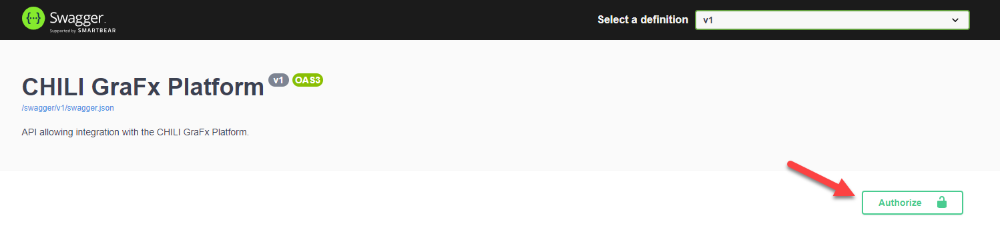

# Making API Calls

With your access token ready, you're set to call the Environment API or Platform API endpoints. To familiarize yourself with available endpoints, explore the Swagger documentation specific to your environment:

- Production: `<ENVIRONMENT NAME>.chili-publish.online/grafx/swagger/index.html`
- Sandbox: `<ENVIRONMENT NAME>.chili-publish-sandbox.online/grafx/swagger/index.html`

So if your production environment is cp-exp-321, then your Swagger documentation would be found at:

```
cp-exp-321.chili-publish-sandbox.online/grafx/swagger/index.html
```

The Swagger documentation is broken up into sections that should be pretty self explanatory if you understand how each application works in GraFx.

However, do not be overwhelmed as there are many endpoints documented. Keep in mind that basic integration will rarely use more than a twelve to fifteen.

Below is a table of the most common endpoints used by a basic integration.

| Verb   | Endpoint                                                           | Usage                                                      |
| ------ | ------------------------------------------------------------------ | ---------------------------------------------------------- |
| GET    | /api/v1/environment/{environment}/projects/{projectId}/document    | Generate a preview of a Template                           |
| GET    | /api/v1/environment/{environment}/templates/preview/tasks/{taskId} | Get task status of a preview for a Template                |
| POST   | /api/v1/environment/{environment}/projects                         | Creates a Project form a Template                          |
| DELETE | /api/v1/environment/{environment}/projects                         | Deletes a Project                                          |
| GET    | /api/v1/environment/{environment}/projects/{projectId}/document    | Gets the JSON of a Project                                 |
| PUT    | /api/v1/environment/{environment}/projects/{projectId}/document    | Save JSON to a Project                                     |
| GET    | /api/v1/environment/{environment}/projects/{projectId}/preview     | Start a task to generate a preview of a Project            |
| GET    | /api/v1/environment/{environment}/projects/preview/tasks/{taskId}  | Get task status of a preview for a Project                 |
| POST   | /api/v1/environment/{environment}/output/image                     | Starts an image output of a Project, Template, or JSON     |
| POST   | /api/v1/environment/{environment}/output/animation                 | Starts an animation output of a Project, Template, or JSON |
| GET    | /api/v1/environment/{environment}/output/tasks/{taskId}            | Get the task status of an output                           |

All endpoints share a few things in common:
- They require authorization through a Bearer token.
- They require you to supply the environment the token was created in.

What is great about the Swagger documentation it describes what it required, gives example responses with error codes, and you can supply the page with a token to test then endpoints live.

To authorize the requests, get a token as described above and then click the "Authorize" at the top of the page.



Once actived, you can pick a endpoint, click "Try it out" and get an example request with the actual response.

Here is an example request (with the token removed for brevity)

```curl
curl -X 'GET' \
  'https://sandbox1.chili-publish-sandbox.online/grafx/api/v1/environment/cp-exp-321/projects?limit=10' \
  -H 'accept: application/json' \
  -H 'Authorization: Bearer <BEARER TOKEN>'
```
