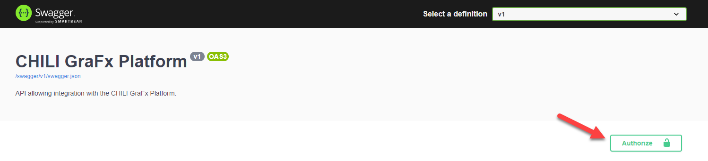

# Making API Calls

With your access token ready, you're set to call the Environment API or Platform API endpoints. To familiarize yourself with available endpoints, explore the Swagger documentation specific to your environment:

- Production: `<ENVIRONMENT NAME>.chili-publish.online/grafx/swagger/index.html`
- Sandbox: `<ENVIRONMENT NAME>.chili-publish-sandbox.online/grafx/swagger/index.html`

So if your production environment is cp-exp-321, then your Swagger documentation would be found at:

```
cp-exp-321.chili-publish-sandbox.online/grafx/swagger/index.html
```

The Swagger documentation is broken up into sections that should be pretty self explanatory if you understand how each application works in GraFx.

However, do not be overwhelmed as there are many endpoints documented. Keep in mind that basic integration will rarely use more than a twelve to fifteen.

Below is a table of the most common endpoints used by a basic integration.

| Verb   | Endpoint                                                           | Usage                                                      |
| ------ | ------------------------------------------------------------------ | ---------------------------------------------------------- |
| GET    | /api/v1/environment/{environment}/projects/{projectId}/document    | Generate a preview of a Template                           |
| GET    | /api/v1/environment/{environment}/templates/preview/tasks/{taskId} | Get task status of a preview for a Template                |
| POST   | /api/v1/environment/{environment}/projects                         | Creates a Project form a Template                          |
| DELETE | /api/v1/environment/{environment}/projects                         | Deletes a Project                                          |
| GET    | /api/v1/environment/{environment}/projects/{projectId}/document    | Gets the JSON of a Project                                 |
| PUT    | /api/v1/environment/{environment}/projects/{projectId}/document    | Save JSON to a Project                                     |
| GET    | /api/v1/environment/{environment}/projects/{projectId}/preview     | Start a task to generate a preview of a Project            |
| GET    | /api/v1/environment/{environment}/projects/preview/tasks/{taskId}  | Get task status of a preview for a Project                 |
| POST   | /api/v1/environment/{environment}/output/image                     | Starts an image output of a Project, Template, or JSON     |
| POST   | /api/v1/environment/{environment}/output/animation                 | Starts an animation output of a Project, Template, or JSON |
| GET    | /api/v1/environment/{environment}/output/tasks/{taskId}            | Get the task status of an output                           |

All endpoints share a few things in common:
- They require authorization through a Bearer token.
- They require you to supply the environment the token was created in.

What is great about the Swagger documentation it describes what it required, gives example responses with error codes, and you can supply the page with a token to test then endpoints live.

To authorize the requests, get a token as described above and then click the "Authorize" at the top of the page.



Once activated, you can pick an endpoint, click "Try it out" and get an example request with the actual response.

Here is an example request (with the token removed for brevity)

```curl
curl -X 'GET' \
  'https://sandbox1.chili-publish-sandbox.online/grafx/api/v1/environment/cp-exp-321/projects?limit=10' \
  -H 'accept: application/json' \
  -H 'Authorization: Bearer <BEARER TOKEN>'
```

## Caching with ETags

GET endpoints of the Environment API return an `ETag` response header. An ETag is a version fingerprint of the resource: it changes whenever the resource changes, and stays the same as long as the resource is untouched.

You can use the ETag to make conditional requests. Send the value back in the `If-None-Match` request header, and the API compares it with the current version:

- If the resource has not changed, the API responds with `304 Not Modified` and an empty body — reuse your cached copy.
- If the resource has changed, the API responds with `200 OK`, the full response body, and a new `ETag`.

This saves bandwidth and makes polling or frequently repeated calls significantly cheaper.

### Example flow

First request — the response carries an `ETag` header:

```curl
curl -X 'GET' \
  'https://sandbox1.chili-publish-sandbox.online/grafx/api/v1/environment/cp-exp-321/templates/<TEMPLATE ID>' \
  -H 'accept: application/json' \
  -H 'Authorization: Bearer <BEARER TOKEN>'

< HTTP/1.1 200 OK
< ETag: "5"
```

Follow-up request — send the value back in `If-None-Match`:

```curl
curl -X 'GET' \
  'https://sandbox1.chili-publish-sandbox.online/grafx/api/v1/environment/cp-exp-321/templates/<TEMPLATE ID>' \
  -H 'accept: application/json' \
  -H 'Authorization: Bearer <BEARER TOKEN>' \
  -H 'If-None-Match: "5"'

< HTTP/1.1 304 Not Modified
```

### Good to know

- ETags also update when a **related resource** changes. For example, a change to a font style refreshes the ETag of templates using it, so a cached template never hides a change in one of its dependencies.
- Weak ETags (prefixed with `W/`) are handled correctly, so conditional requests keep working when proxies or CDNs sit between your integration and the API.
- The Swagger reference documents the `ETag` and `If-None-Match` headers on the endpoints that support them.
