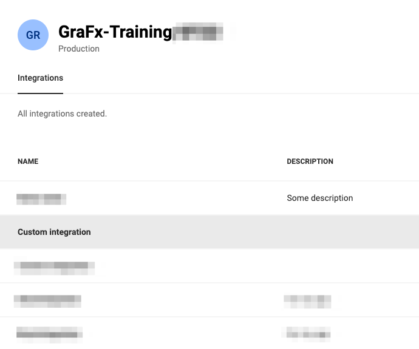
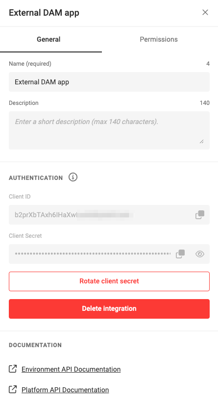
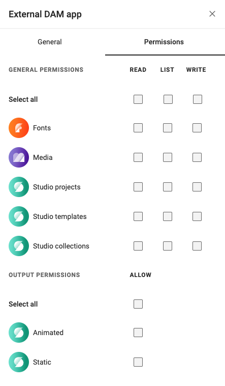

# Managing Integration

## Step 1: Accessing the CHILI GraFx Platform

Log in to your [CHILI GraFx](https://chiligrafx.com/) platform account using your provided credentials.

## Step 2: Creating a New Integration

Navigate to [Environments](https://chiligrafx.com/environments) and click the pencil icon, right of the Environment.

### Add a new Integration

Click the "Create Integration" button.

Provide a meaningful name and description for your integration to easily identify it later.

Click "Create Integration" to finish.

### Edit an existing Integration

Click an existing integration to edit its details.

## Step 3: Obtaining Integration Credentials

After saving the integration configuration, click on the integration name, to see the details panel.

When looking at the details for your integration, you will notice that there are two tabs.

### The General Tab
The `General` tab contains the information about your integration and the authentication credentials.

The CHILI GraFx platform will generate a set of credentials specifically for this integration.

These credentials include a `Client ID` and `Client Secret`. Make sure to securely store these credentials, as they we will use this information to generate our "access token" which we will then use to authorize our API requests.

### Your Environment Swagger
At the bottom of the `General` tab you will notice that there are links to the Environment API and Platform API Swagger pages for your environment that you can interactively test endpoints with **after** [generating an access token](#step-4-generating-an-access-token)

### The Permissions tab
The `Permissions` tab is where you can control the level of access your integration has to your environment.
Permissions are presented as API scopes, and will determine the access your integration has on the environment.

