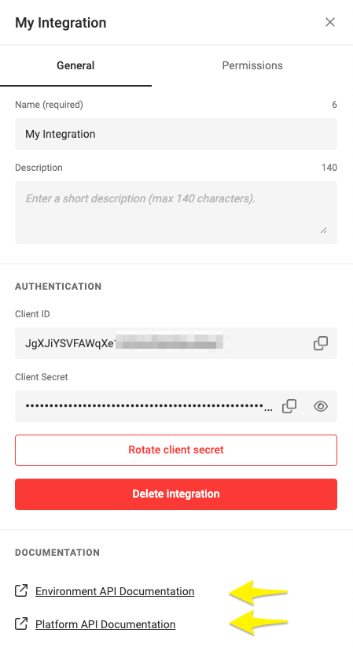

# Environment API

## Your Environment API

You can access the specific interactive Swagger for your environment API via integration setup.

{.screenshot}

## Sanbox Reference

This link serves as an example.

[Sandbox API](https://sandbox1.chili-publish-sandbox.online/grafx/swagger/index.html)

