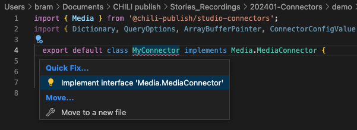
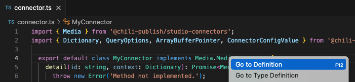
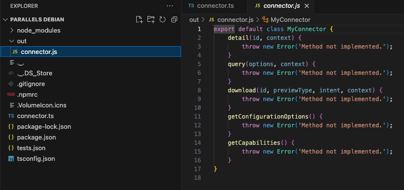
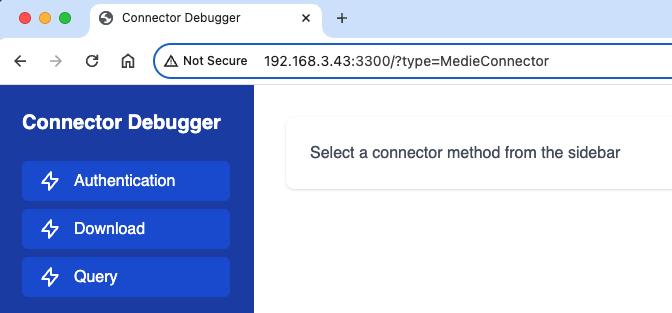
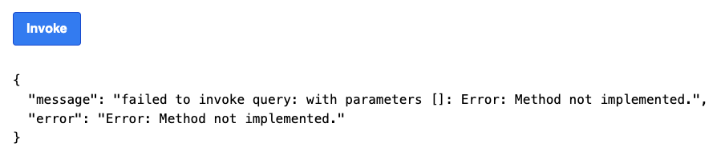
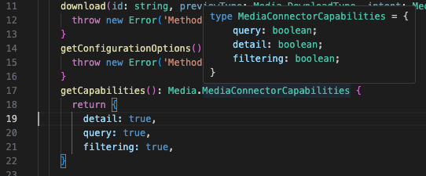
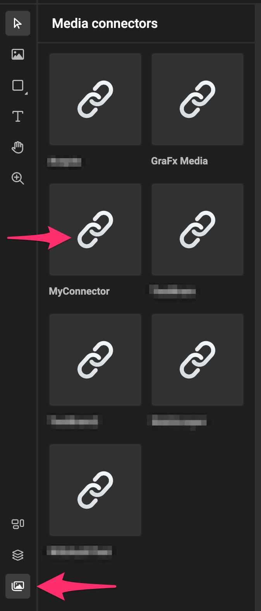

# Guide to building your own Media Connector

## Pre-requisites

See also [pre-requisites](../pre-requisites/)

- Have 'npm' installed
- Have 'nodejs' installed
- Knowledge of nodejs
- IDE
	- [Visual Studio Code](https://code.visualstudio.com/)
	- [Rider](https://www.jetbrains.com/rider/)
	
## Local install location

Before you start, choose where you want to have the local setup. This directory will hold all the files (.js) for your connector.

Go to (or make) directory, where you want to start making your connector  
e.g. "/Users/<yourname>/mediaconnector-mydam"

## Install the CLI

The CLI (Command Line Interface) is part of the tooling we offer to get you up and running.

The CLI Tool has several commands that will perform tasks like building, deploying, getting the latest files, etc.

Install the command line tools. This will help you to install, build and deploy your Media connector.

The "-g" option will make sure the command line tool is available on a "global" level, meaning also outside of your directory. In case you want to work on several connectors, you can call the tool from any directory.

``` bash
npm install -g @chili-publish/connector-cli
```

You can now execute the command (in the terminal, in the right directory)

To understand what the CLI can do, you can now execute
This will give you an overview of the available commands

``` csh
npx connector-cli
```


Initialize: Means building the Boiler Plate. This is the basic code you'll need to get started.

``` csh
connector-cli init -n "demo"
```

You now have the basic code. In that code, we have defined some dependencies. To download these, execute the install command.


``` csh
npm install
```

The result should look something like this

```csh
added 112 packages, and audited 113 packages in 5s

35 packages are looking for funding
  run `npm fund` for details

found 0 vulnerabilities

```

Now it's time to create your custom code.

This happens in the file "connector.ts". This is a typescript files.

By default, there will be no implementations. Your IDE can do this for you, to build the default interface methods.

You can fix this, by applying the quick fix "Implement interface 'Media Connector'"



The code will be added with all the functions that need to be implemented.


```typescript
import { Media } from '@chili-publish/studio-connectors';
import { Dictionary, QueryOptions, ArrayBufferPointer, ConnectorConfigValue } from '@chili-publish/studio-connectors/dist/Connector.Shared';

  export default class MyConnector implements Media.MediaConnector {
    detail(id: string, context: Dictionary): Promise<Media.MediaDetail> {
      throw new Error('Method not implemented.');
    }
    query(options: QueryOptions, context: Dictionary): Promise<Media.MediaPage> {
      throw new Error('Method not implemented.');
    }
    download(id: string, previewType: Media.DownloadType, intent: Media.DownloadIntent, context: Dictionary): Promise<ArrayBufferPointer> {
      throw new Error('Method not implemented.');
    }
    getConfigurationOptions(): ConnectorConfigValue[] {
      throw new Error('Method not implemented.');
    }
    getCapabilities(): Media.MediaConnectorCapabilities {
      throw new Error('Method not implemented.');
    }
      
  }
  
```

The definition of what needs to be implemented, can be reached by right clicking on the interfact:



!!! Important
	The name of your class does not really matter. As long as it's defined as the default class. Once deployed, CHILI GraFx will look for the default class to use.  
	
	In the above example it's called "MyConnector". You can name it "MyAwesomeConnector"

## Building

If your code works (syntax is right, since we did not add any functionality yet), it will build.
Therefore you need to give the command to build with the cli-tool "npx".

```zsh
npx connector-cli build
```

resulting in

```zsh
+0.045s connector-cli v1.0.49
+0.046s Running command: 'build' with options: {"connectorFile":"./connector.ts","options":{}}
+1.295s Build succeeded
```

The result of the build is a JavaScript file "connector.js", in the "out" directory.



## Debugging

To test the functionality, we provide you with a mini webserver, that will open up the result of your code in a web browser.

There you can test the implementation.

```sh
npx connector-cli debug
```

```sh
user@debian:~/connector1$ npx connector-cli debug
+0.045s connector-cli v1.0.49
+0.046s Running command: 'debug' with options: {"connectorFile":"./connector.ts","options":{}}
+1.416s Looking for out folder in /home/parallels/connector1/node_modules/@chili-publish/connector-cli/out/src/commands
+1.417s Looking for out folder in /home/parallels/connector1/node_modules/@chili-publish/connector-cli/out/src
+1.417s Looking for out folder in /home/parallels/connector1/node_modules/@chili-publish/connector-cli/out
+1.417s Looking for out folder in /home/parallels/connector1/node_modules/@chili-publish/connector-cli
+1.417s Detected out folder: /home/parallels/connector1/node_modules/@chili-publish/connector-cli/out
+1.419s Debugger running on port 3300
```

Now open your webbrowser, and go to the IP of the machine (local or remote) that you are running this script on.

In the below example, we're working on a virtual machine on ip [192.168.3.43:3300](http://192.168.3.43:3300/?type=MedieConnector).

!!! tip
	Don't forget to add '/?type=MediaConnector' to the url

And the webbrowser should look like this



Click the **Query** method, and **invoke** the query. You will get the error, that is defined to be thrown in the code.



## Capabilities

Our framework supports capabilities. You need to enable them, to expose them to the end-user.

To see what is available, hover over the method, and you'll see 3 booleans that you can set.



Let's set all 3 to **true**

```typescript
getCapabilities(): Media.MediaConnectorCapabilities {
  return {
	detail: true,
	query: true,
	filtering: true,
}
```

## Implementation

In this part, you'll build the logic that is specific for your connector.

### Query

E.g. for the query method, we will hardcode an example.

The data structure of what needs to be returned can be found in the MediaPage definition

Since the method is defined as a Promise, we'll make it async.

```typescript
async query(options: QueryOptions, context: Dictionary): Promise<Media.MediaPage> {

  return {
	pageSize: 1,
	data:[
	  {
		id: '1',
		name: 'test',
		relativePath: 'test',
		type: 0,
		metaData: {},
		extension: 'png'
	  }
	],
	links: {
	  nextPage: ''
	}
  }
}
```

We'll add more logic in a moment, but for now we'll go full circle to push this to your CHILI GraFx instance.

## Publish your result

It's time to publish your connector to your environment.

Before you can do that, you'll need to login on your instance of CHILI GraFx.

Our CLI tool provides a way to authenticate via the browser. This way, your CHILI GraFx instance will recognize the cli tool, to be able to push the connector.

Step 1, call the login option through the CLO

```shell
$ npx connector-cli login
+0.041s connector-cli v1.0.49
+0.042s Running command: 'login' with options: {}
+0.043s No access token found.
+0.385s Please visit https://login.chiligrafx-dev.com/activate?user_code=xxxx-yyyy and enter the code xxxx-yyyy to authenticate.
+0.385s Waiting for authentication... Ctrl+C to cancel.
```

Visit the url that is displayed, and confirm or enter the code.

If succesful, the command line will show this message (with your credentials)

```shell
+35.619s CLI authenticated successfully.
+35.812s User is authenticated => demo@test.com

```

When that is done, you can now publish.

``` zsh
npx connector-cli publish -e <environment> -b <base url> -n <connector name>
```

The connector is now building, and will be published to your environment.

```shell
+0.05s connector-cli v1.0.49
+0.051s Running command: 'publish' with options: {"connectorFile":"./connector.ts","options":{"overwrite":false,"environment":"cp-dyx-217","baseUrl":"https://aaa.test.com/grafx","name":"MyConnector"}}
+0.418s User is authenticated => user@test.com
+0.418s Building connector...
+1.665s Build succeeded -> /tmp/file_1706217866012_3433.js
+1.666s Failed to extract version from *
+1.714s Deploying connector -> https://www.test.com/grafx/api/experimental/environment/cp-aaa-yyy/connectors
+2.16s Connector "MyConnector" is published
```

Now, open a template, or create a new template in GraFx Studio, and open the "Media" panel.

You should see your "MyConnector", ready to query the Media provider of your choice, and add the media to your GraFx Studio Smart Template!


