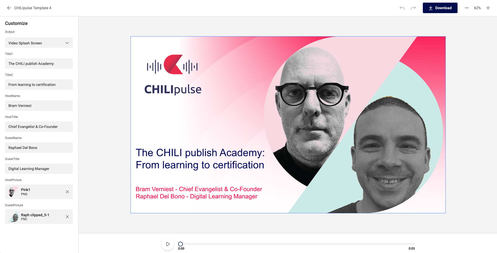

# Integrate Studio UI

## Introduction

**Making Smart Templates**

To make Smart Templates in GraFx Studio, you'll need a "template designer seat." Once your template is ready, it moves to the stage where end users can interact with it, specifically in "[My Projects](/GraFx-Studio/guides/create-projects/)." This area is where templates come to life, allowing end users to consume and customize them to fit their needs.



**In your webportal**

Moreover, this end user interface isn't limited to just the CHILI GraFx environment; it's designed for broader application and can be seamlessly integrated into custom web portals. 

This flexibility opens up numerous possibilities for customizing and enhancing the user experience. For detailed instructions on integrating the end user interface into your web portal, refer to the guide below.

## Token

!!! warning
	Before you start, take note on how to generate a token.

Since you don't want to pass secure credentials, your server side code will need to generate a token.

[This page](/CHILI-GraFx/guides/integrations/#step-4-generating-an-access-token) explains how.

## Quick start

On [this page on Github](https://github.com/chili-publish/studio-ui?tab=readme-ov-file#studio-ui), you can get started in no time to have your own GraFx Studio UI integrated.

- Define a `<div>` on your page
``` html
<div id="studio-ui-container"></div>
```
- Inject the JavaScript
```html
<script src="https://studio-cdn.chiligrafx.com/studio-ui/latest/bundle.js"></script>
```
- Define custom logic and credentials (examples can be found on [Github](https://github.com/chili-publish/studio-ui?tab=readme-ov-file#studio-ui))

All information can be found here: [see all details on Github](https://github.com/chili-publish/studio-ui?tab=readme-ov-file#studio-ui)

## Advanced integration

If the basics don't cover your needs, this more [advanced page](https://github.com/chili-publish/studio-ui/blob/main/documentation/advanced-integration.md) explains all in more detail.
