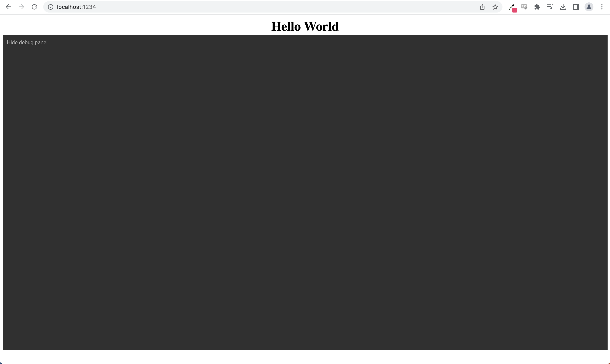

# Section 02: Loading the Editor

---

## Creating our editor `<div>`

The first step to displaying our editor is to create a `<div>` element on our page that our JavaScript will target to create the editor `<iframe>`. We can simply add a basic `<div>` element to our `index.html` file. We need to give the created div element an `id` attribute so that we give our JavaScript an identifier to locate the element with. I will use "studio-editor" for the id.
```html
<body>
  <h1>Hello World</h1>
  <div id="studio-editor"></div>
  <script type="module" src="./index.js"></script>
</body>
```

So now that we have created the editor div we can switch over to our `index.js` file and use the Studio SDK to actually load the GraFx Studio Editor!

First we will create a function called `initEditor` to load the editor. All this function will do will is use the Studio SDK to create the editor at the `<div>` we specify.

```javascript
function initEditor() {
  const SDK = new StudioSDK({
    editorId: "studio-editor"
  });

  SDK.loadEditor();
  window.SDK = SDK;
}
```

We first start by creating a constant named `SDK` that is the instance of a new StudioSDK. When we create the the instance we need pass some information over. For now, all we need to pass is the `editorId` property which is the `id` of the `<div>` we created in our HTML file. For this course we used `id="studio-editor"` so we will just pass that value.

Next we tell the StudioSDK to actually load the editor in with the `loadEditor()` method.

And finally we bind the SDK to the Window object so that we can access it later in other functions by calling `window.SDK`.

So our final `index.js` file will look something like this.
```javascript
import StudioSDK from "@chili-publish/studio-sdk";

function initEditor() {
  const SDK = new StudioSDK({
    editorId: "studio-editor"
  });

  SDK.loadEditor();
  window.SDK = SDK;
}

initEditor();
```

Now, if our webserver is still running we can see that it will refresh when we save our JavaScript file and a blank editor should appear!


### Making our page look better
_This section assumes a basic knowledge of some CSS, this section will not explain the CSS in depth but [web.dev](https://web.dev/learn/css/) has great information for learning if you are interested. If not you can simply just copy the final HTML with the styling._

Let's add some basic styling to our integration since our editor isn't very user friendly at the moment. To do this we are simply going split our `index.html` in to two sections. A top panel that will have our integration buttons and text, and then the editor that will take up the rest of the page.

We will wrap our `<h1>` in a `<div>` with a couple properties
- a `height` of `5vh`
- Setting the `display` to `flex` so we have an inline panel
- `justify-content: space-evenly` to space all the items in the div evenly apart
- `align-items: center` to center the items vertically in the div
```html
<div style="height: 5vh; display: flex; justify-content: space-evenly; align-items: center;">
  <h1>Hello World</h1>
</div>
```

The editor `<div>` will get a `height` property of `90vh`
```html
<div style="height: 90vh" id="studio-editor"></div>
```


We can save our file and the web browser should refesh. Now our editor is a little more visible. The editor still does not show much because we have not loaded a document yet, but we will soon when we use the DocumentController in section 4.


##### The final index.html
```html
<body>
  <div style="height: 5vh; display: flex; justify-content: space-evenly; align-items: center;">
    <h1>Hello World</h1>
  </div>

  <div style="height: 85vh" id="studio-editor"></div>

  <script type="module" src="./index.js"></script>
</body>
```
