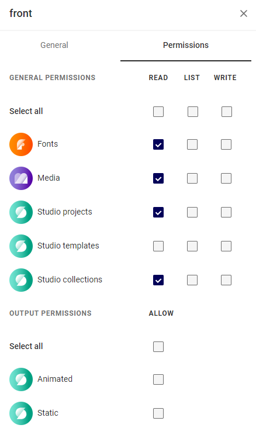

# Section 03: Authenticating Connectors

### What is a Connector?
GraFx Studio has the ability to pull in data from various sources. Most commonly you will pull in data from you GraFx environment but our studio actually provides you with an easy framework to pull in data from your sources. This framework is known as the GraFx Connector framework.

A connector in the literal sense is an implementation of a set of capabilities and methods needed by GraFx Studio to interact with an external resource management system. If you define how your system can provide those capabilities in the connector, then GraFx Studio can talk to your system to get resources as well. For now, we are going to configure out integration to talk to the GraFx Environment API using the built-in `Grafx-Media` connector to load images from our GraFx environment and the `GraFx-Fonts` connector to load fonts from our GraFx environment.

## Creating a Readonly Integration

Follow the instructions in the [integration guide](/GraFx-Developers/grafx-studio/integration-overview/04-managing-integrations-and-authentication/) to create an integration.

Make sure to set limited permissions:



Once you have your integration, copy the client ID and secret and move to the next part.

## Generating Our Token

Unless you have an application and server setup to provide a token, we are going to store our token generate logic in `index.js`.

!!! danger "Kinda Bad Idea"

        Usinng your client ID and secret on the frontend is considered a bad idea. In production, this should be handled on the backend.

        Ironically, in this instance the Integration is readonly, so we do not care if users steal our authentication and make more tokens.

        However, it is still a bad idea, because in the future someone could change the permissions without realizing the client secret and ID are not secret.

In your `index.js` add a new function `generateToken` with the logic as shown below, but replace <CLIENT_ID> and <CLIENT_SECRET> with your credentials from the integration.

```js
async function generateToken() {
    try {
        const response = await fetch(
            "https://integration-login.chiligrafx.com/oauth/token", {
                method: "POST",
                headers: {
                    "Content-Type": "application/json",
                },
                body: JSON.stringify({
                    grant_type: "client_credentials",
                    audience: "https://chiligrafx.com",
                    client_id: <CLIENT_ID>,
                    client_secret: <CLIENT_SECRET>,
                }),
            },
        );

        // Check if the status is not 200 (OK), and if so, throw an error
        if (!response.ok) {
            const errorBody = await response.text(); // or response.json() if the server sends JSON error details
            throw new Error(
                `Server responded with status ${response.status}: ${errorBody}`,
            );
        }

        const data = await response.json();

        return data.access_token
    } catch (error) {
        console.error("Error fetching auth token:", error);
        throw error; // Re-throw the error to be handled by the caller
    }
}
```
## Authenticate Studio Engine

In your `index.js` you just added a new function, but we need to make two more changes:

- Change the `initEditor` function to async
- Import WellKnownConfigurationKeys
- Set two values on `SDK` variable for the authoration token and environment API url

To do this, we update our function with the below making sure to replace `<ENVIRONMENT>` with the detailes for your GraFx Studio environment.

```javascript
import StudioSDK, {WellKnownConfigurationKeys} from "@chili-publish/studio-sdk";

async function generateToken() {
    // ... code from above
}
  
async function initEditor() {

  const token = await generateToken();
  const environmentAPI = window.SDK.utils.createEnvironmentBaseURL({type: "production", environment: "<ENVIRONMENT>"});

  if (token == null) {
    throw new Error("Token is null or undefined");
  }

  const SDK = new StudioSDK({
    editorId: "studio-editor"
  });

  SDK.loadEditor();
  window.SDK = SDK;

  SDK.configuration.setValue(WellKnownConfigurationKeys.GraFxStudioAuthToken, token);
  SDK.configuration.setValue(WellKnownConfigurationKeys.GraFxStudioEnvironmentApiUrl, environmentAPI);
}

initEditor();
```
