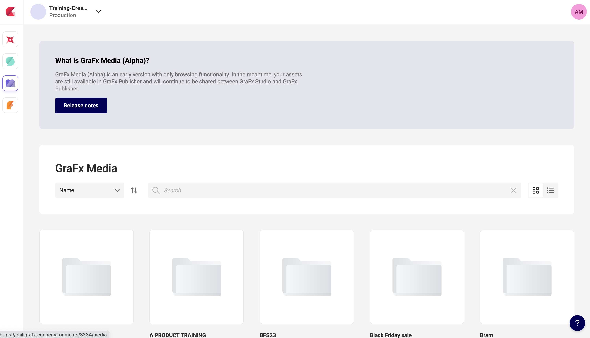
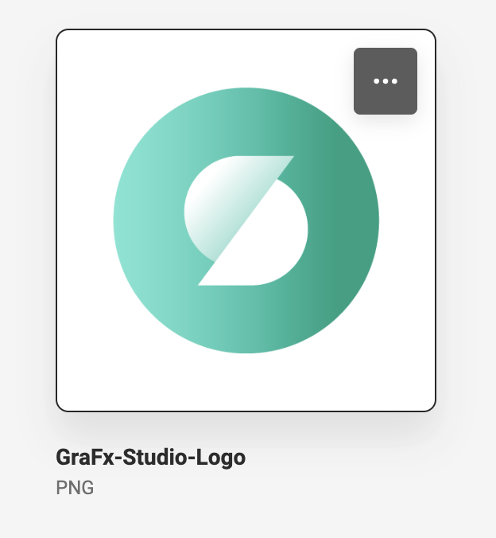
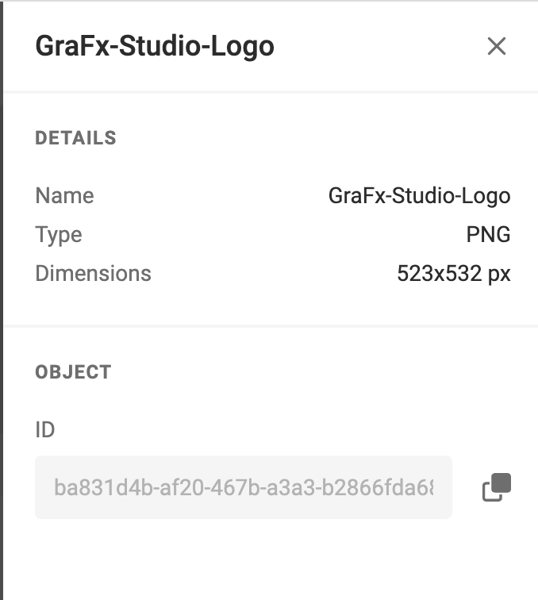

# Section 5: Working with the Media Connector

### Actually loading an image frame

Now, for this course we are going to simply find an asset on our environment and load it in to an image frame. So first we will need to find an image on our environment that we can use. Navigate to your environment at [https://chiligrafx.com/](https://chiligrafx.com/)

Click on the GraFx Media icon on the left hand panel to load up the available assets on your environment. If your environment has assets, you should see some folders you can browse through to find assets.



Once you have found an asset you want to display in an image frame, you can click the `...` button to bring up the option to view asset details.



In the asset details panel, you will see the ID for the asset. Copy this ID, we will use it to tell our GraFx Media connector which asset we want to use for our image frame.



Make note of that asset ID, this is how we will inform our GraFx Media connector which asset we want to use. For this course, we will just create a simple button, that when pressed will replace the image frame on the document with


### Setting the asset for an image frame
Let's create a function to update the image on our document to a new image we provide it. We will be using a [FrameController]() method to find our image frame in the document and then the ConnectorController to update the image.

We will start with our `updateImage` function in the `index.js` file

```javascript
window.updateImage = async function(frameName, assetID) {
  const frameID = (await window.SDK.frame.getByName(frameName)).parsedData.id
  await window.SDK.frame.setImageFromConnector(frameID, 'grafx-media', assetID);
}
```

Next, we need to create a button in our `index.html` that when pressed will call the SDK function to update the image frame in our document to the new asset ID we provide.

```html
<button onclick="updateImage('image-frame', 'YOUR ASSET ID')">Update Image</button>
```

This button will call our `updateImage` function and provide it with the two things it needs, the name of the image frame in the document we want to update, and the asset ID we want to update that image to.
