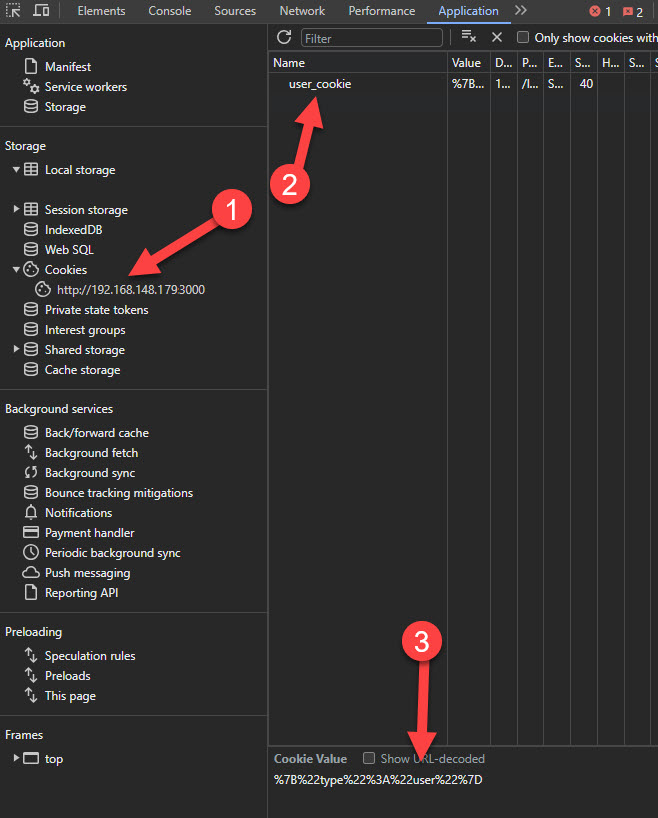

# Section 4: Handling User Sessions With Cookies

In this section, we will demonstrate how to manage user sessions through cookies when handling user authentication on your application. Typically, a production application would authenticate users by verifying credentials or implementing a complex OAuth flow. For simplicity, our example will authenticate users when they click the login buttons.

**Objectives**

- Create two authentication endpoints: `/login/admin` and `/login/user`. 
- Generate cookie to track user session type (admin or user).
- Create a utility file for organization.

## 1. Add Our Paths

Let's modify our `server.js` to include our authentication endpoints:

```js linenums="1" hl_lines="11 12 13 15 16 17"
import { serve } from "@hono/node-server";
import { Hono } from "hono";
import * as fs from "fs";

const app = new Hono();
app.get("/", async (context) => {
  const loginPage = await fs.promises.readFile("public/login.html", "utf8");
  return context.html(loginPage);
});

app.post("/login/user", async (context) => {
  // Logic will be added here
});

app.post("/login/admin", async (context) => {
  // Logic will be added here
});

serve(app);
```

With the paths in place, let's proceed to define the cookie logic.

??? question "Why use a cookie?"

    Okay, imagine you're at a party with two types of guests, VIPs and Regulars. To quickly know who's who, you get a stamp on your hand when you enter—VIPs get a star and Regulars get a smiley face. This way, the party organizers can easily see what you can do at the party without asking you every time. A cookie on a website does the same thing; it's like a hand stamp for your computer that tells the website if you're a regular user or an admin, so it knows what you can see and do on the site.

## 2. Importing Cookie Helpers

For cookie manipulation, we will use Hono's [cookie helpers](https://hono.dev/helpers/cookie). Import them as follows:

```js linenums="1" hl_lines="4"
import { serve } from "@hono/node-server";
import { Hono } from "hono";
import * as fs from "fs";
import { getCookie, setCookie, deleteCookie } from "hono/cookie";

const app = new Hono();
app.get("/", async (context) => {
    const loginPage = await fs.promises.readFile("public/login.html", "utf8");
  return context.html(loginPage);
});

app.post("/login/user", async (context) => {

});

app.post("/login/admin", async (context) => {

});

serve(app);
```

## 3. Determining Our Cookie Structure

There are many ways to structure our cookie. This is just an example project, so we are not going to focus too much on the best architectural decisions. We are going to keep things simple.

Our cookie will have a simple structure as defined by this TypeScript definition (TypeScript only used to show the structure):

```ts
type Cookie = {
  type: "admin" | "user"
}
```

The type field signifies the user's role.

## 4. Implementing Cookie Logic

Let's add the logic to set a cookie on the /login/admin endpoint:

```js
app.post("/login/admin", async (context) => {

  const cookie = {
    type: "admin"
  };

  const options = {
    secure: false,
    maxAge: 720,
    httpOnly:false,
    path: "/"
  };

  setCookie(context, "user", JSON.stringify(cookie), options);
  
  return context.json({success:true}, 200);
});
```

However, this logic will be very similar for the `login/user` path, with the only change being the cookie `type` value. So, instead of duplicating our code we are going to separate this logic into it's own function.

Our final code will look like:

```js linenums="1" 
import { serve } from "@hono/node-server";
import { Hono } from "hono";
import * as fs from "fs";
import { getCookie, setCookie, deleteCookie } from "hono/cookie";

const app = new Hono();
app.get("/", async (context) => {
    const loginPage = await fs.promises.readFile("public/login.html", "utf8");
  return context.html(loginPage);
});

app.post("/login/user", async (context) => {
  return setUserCookie(context, "user");
});

app.post("/login/admin", async (context) => {
  return setUserCookie(context, "admin");
});

function setUserCookie(context, type) {
  const cookie = {
    type: type 
  };

  const options = {
    secure: false,  // Should be true in production for HTTPS
    maxAge: 720,    // Cookie expiry time in seconds
    httpOnly: false,
    path: "/"
  };

  setCookie(context, "user", JSON.stringify(cookie), options);
  
  return context.json({success:true}, 200);
}

serve(app);
```

??? question "Need help understanding this code?"

    First, we're setting up our gear:

    ```js
    import { serve } from "@hono/node-server";
    import { Hono } from "hono";
    import * as fs from "fs";
    import { getCookie, setCookie, deleteCookie } from "hono/cookie";
    ```

    - Hono: This is a lightweight framework that helps us set up routes for our web application, kinda like laying down paths in a video game for the player to follow.
    - fs (File System): This lets us work with files on our server. Think of it like having the ability to open and read notes from your locker.
    - Cookie Helpers (getCookie, setCookie, deleteCookie): These are special tools that make it easier to work with cookies.

    Imagine our website is a club with two special doors: one for regular users and one for admin users (the club managers).

    - When a regular user tries to come in through the `/login/user` door by pressing a button, we're like the bouncer who checks their ID and then gives them a hand stamp (that's the cookie) that says "user." This tells us what they can access inside the club.
    - Similarly, when an admin user wants to enter through the `/login/admin` door, we check their ID and give them a hand stamp that says "admin." This lets them go into the VIP areas because they have more access.

    Now, the magic part is the setUserCookie function:
    
    ```js
    function setUserCookie(context, type) {
      const cookie = {
        type: type 
      };

      const options = {
        secure: false,  // Should be true in production for HTTPS
        maxAge: 720,    // Cookie expiry time in seconds
        httpOnly: false,
        path: "/"
      };

      setCookie(context, "user", JSON.stringify(cookie), options);

      return context.json({success:true}, 200);
    }
    ```

    - Making the Cookie:
    
    ```js
          const cookie = {
        type: type 
      };
    ```

    We create a "cookie" that's really just a small note saying either "user" or "admin." This note is what we're going to give the browser so it remembers who the person is.
    
    - Setting the Rules:
    
    ```js        
    const options = {
      secure: false,  // Should be true in production for HTTPS
      maxAge: 720,    // Cookie expiry time in seconds
      httpOnly: false,
      path: "/"
    };
    ```

    The options are like the rules for the hand stamp. We tell it things like it's okay to show the stamp in public (`secure: false`), but for real clubs, you'd want to keep that hidden. We also say the stamp lasts for 720 seconds (that's 12 minutes), after which it fades away (`maxAge: 720`), and that the user can't use a special light to see the stamp details (`httpOnly: false`), though usually, we'd want to keep that private too.
    
    - Applying the Stamp:

    ```js
    setCookie(context, "user", JSON.stringify(cookie), options);
    ```

    We then use our special `setCookie` tool to apply the stamp. We tell it who to stamp (the person coming in), what the stamp looks like (the "cookie" note we made), and what the rules are (our options).
    
    - Welcome Message:

    ```js 
    return context.json({success:true}, 200);
    ```

    Lastly, we send a message back saying "Welcome to the club!" (`return c.json({success:true}, 200);`). The 200 is like giving a thumbs up, saying everything went smoothly.

    So every time a user or admin comes to the club, we quickly check who they are, give them the right hand stamp, and let them enjoy their time. This way, we don't have to keep checking their ID every time they want to do something new on the website, making the whole experience smoother and more fun.

## 5. Move setUserCookie

To maintain a clean and modular structure in our `server.js`, we're going to relocate the `setUserCookie` function. This function is better categorized as a utility and should be placed in a separate file.

**Step 1: Create the Utility File**

Start by creating a new file named `utility.js` in your project directory.

=== "Linux/macOS"

    ```sh
    touch utility.js
    ```

=== "Windows (PowerShell)"

    ```powershell
    ni utility.js
    ```

**Step 2: Transfer the Function**

Next, cut the `setUserCookie` function from `server.js` and paste it into `utility.js`. Modify the function definition in `utility.js` by prefixing it with `export` to make it a module:

```javascript
export function setUserCookie(context, type) {
  // ... function body remains unchanged ...
}
```

**Step 3: Update Imports**

In `utility.js`, import the necessary `setCookie` function at the top of the file:

```javascript
import { setCookie } from "hono/cookie";
```

Since `setUserCookie` is now in `utility.js`, you can remove its import from `server.js`, as it's no longer used directly there.

Your `utility.js` file should now have the following content:

??? abstract "utility.js content
    
    import {setCookie} from "hono/cookie";

    export function setUserCookie(context, type) {
      const cookie = {
        type: type 
      };

      const options = {
        secure: false,
        maxAge: 720,
        httpOnly:false,
        path: "/"
      };

      setCookie(context, "user", JSON.stringify(cookie), options);
      
      return context.json({success:true}, 200);
    }

**Step 4: Integrate the New Utility Module**

Finally, integrate the utility module into `server.js` by adding the following import statement:

```javascript
import { setUserCookie } from "./utility.js";
```

With this change, `server.js` will now correctly reference the `setUserCookie` function from its new location, keeping your codebase organized and maintainable.

## 6. 🧪Testing Our Cookie

**Restart the Server**

Just like in the previews parts of this guide, you want to make sure to restart your server.

1. If the server is running, stop it using Ctrl + C.
2. Start or restart the server with:

```SH
node server.js
```

**Verify your Setup**

1. Visit `http://localhost:3000` in your browser.
2. You should see "Admin" and "User" login buttons.
3. Click one of the buttons and verify the page refreshes.
4. Use the browser's Developer Tools (Application tab) to check for the set cookie.



??? failure "Cookie not showing?"

    If the cookie does not appear after implementing the steps in the documentation, here are some troubleshooting steps to consider:

    **Check for Cookie Settings:**
       - Ensure that cookies are turned on in your browser.
       - Check if you are testing in a private tab with no extensions enabled.

    **Check Server Response:**
       - Ensure the server is running and responding to requests.
       - Confirm that the `/login/admin` or `/login/user` endpoints are correctly hit by inspecting network requests in the browser's developer tools.

    **Verify Endpoint Logic:**
       - Make sure that the `setUserCookie` function is being called within the endpoint logic.
       - Confirm that there are no errors being thrown in the server console or in the browser console that could prevent the cookie from being set.

    **Review Cookie Options:**
       - Ensure the `maxAge` option is set correctly; an incorrect value could cause the cookie to expire immediately.
       - Check that the `secure` option is consistent with your testing environment, it should be `false` if testing over HTTP.

    **Inspect HTTP Headers:**
       - Using the browser's developer tools, inspect the response headers to see if the `Set-Cookie` header is present and correctly formatted.

    **Confirm Browser Settings:**
       - Make sure that the browser is not set to block cookies from localhost or the domain you are using.
       - Check if any browser extensions (such as ad blockers or enhanced privacy modes) are interfering with cookie setting.
       - Test in a private tab with no extensions enabled.
