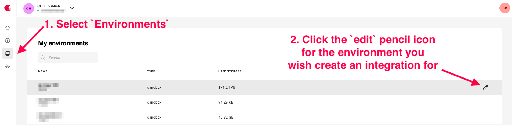

# Managing Integrations and Authentication

Utilizing default connectors and interacting with the Environment API necessitates the creation of integrations. An integration functions as a specialized user within your environment, facilitating the association of all user projects under a single set of credentials. This guide outlines the essential steps and considerations for setting up integrations, ensuring secure authentication processes.

## Creating Integrations

Navigate to [Environments](https://chiligrafx.com/environments) and click the pencil icon, right of the Environment.



### Add a new Integration


Click the "Create Integration" button.


Provide a meaningful name and description for your integration to easily identify it later.

Click "Create Integration" to finish.

### Edit an existing Integration

Click an existing integration to edit its details.


## Authentication

After saving the integration configuration, click on the integration name, to see the details panel.

When looking at the details for your integration, you will notice that there are two tabs.

### The General Tab
The `General` tab contains the information about your integration and the authentication credentials.

The CHILI GraFx platform will generate a set of credentials specifically for this integration.

These credentials include a `Client ID` and `Client Secret`. These credentials are the keys to your digital kingdom and must be guarded with utmost diligence. Exposure of these details can lead to unauthorized access to your environment. It is paramount to store these credentials securely, preferably in a key store or as environment variables, to mitigate the risk of leaks.

!!! danger

    Tokens, especially those with comprehensive permissions, pose a significant security risk if mishandled. Tokens cannot be invalidated and will have their permissions until they expire. It's imperative to manage these tokens with extreme caution to prevent unauthorized access.


### The Permissions tab
The `Permissions` tab is where you can control the level of access your integration has to your environment.
Permissions are presented as API scopes, and will determine the access your integration has on the environment.


Integrations necessitate two distinct types of users, each requiring different permissions:

1. **Read-only Permissions Integration**: Essential for use in the Studio Editor Engine within your custom UI. This integration type ensures that users can only view and not modify content.
2. **All Permissions Integration**: Required for full interaction with the Environment API. Tokens generated with all permissions should be handled with care and never exposed to the front-end.

## Generating an Access Token

To utilize the Environment API or to authenticate the Media and Font Connectors in when loading the Editor Engine, you need an access token.

To get an access token we simply make a POST request to our auth server located at `https://integration-login.chiligrafx.com/oauth/token` and provide a couple fields. If all goes as intended, you will receive an access_token in your response.

Here are some examples for making this request


=== "cURL"
    ``` SH
    curl --location \
    --request POST 'https://integration-login.chiligrafx.com/oauth/token' \
    --header 'content-type: application/x-www-form-urlencoded' \
    --data-urlencode 'audience=https://chiligrafx.com' \
    --data-urlencode 'grant_type=client_credentials' \
    --data-urlencode 'client_id=<CLIENT_ID>' \
    --data-urlencode 'client_secret=<CLIENT_SECRET>'
    ```
=== "Python"
    ```python
    import requests

    endpoint = 'https://integration-login.chiligrafx.com/oauth/token'
    client_id = '<YOUR CLIENT ID>'
    client_secret = '<YOUR CLIENT SECRET>'

    resp = requests.post(
        url=endpoint,
        headers={
            "content-type": "application/json"
        },
        json={
            "grant_type": "client_credentials",
            "audience": "https://chiligrafx.com",
            "client_id": client_id,
            "client_secret": client_secret,
        }
    )

    if resp.status_code == 200:
        print(resp.json()["access_token"])
    else:
        raise Exception(f"{resp.text}")
    ```
=== "Node v18+"
    ```javascript
    const client_id = '<YOUR CLIENT ID>'
    const client_secret = '<YOUR CLIENT SECRET>'

    fetch('https://integration-login.chiligrafx.com/oauth/token', {
    method: "POST",
    headers: {
        'Content-Type': 'application/json'
    },
    body: JSON.stringify({
        'grant_type': 'client_credentials',
        'audience': 'https://chiligrafx.com',
        'client_id': client_id,
        'client_secret': client_id
    })
    })
    .then(response => response.json()
    .then(data => console.log(data)))
    ```
=== "Go"
    ```go
    package main

    import (
        "bytes"
        "encoding/json"
        "fmt"
        "net/http"
    )

    type AuthResponse struct {
        Token		string  `json:"access_token"`
        Expiration	int 	`json:"expires_in"`
        Type	    string  `json:"token_type"`
        Scope		string  `json:"scope"`
    }

    func main() {
        posturl := "https://integration-login.chiligrafx.com/oauth/token"

        body := []byte(`{
            "grant_type": "client_credentials",
            "audience": "https://chiligrafx.com",
            "client_id": "<YOUR CLIENT ID>",
            "client_secret": "<YOUR CLIENT SECRET>"
        }`)

        r, err := http.NewRequest("POST", posturl, bytes.NewBuffer(body))
        if err != nil {
            panic(err)
        }

        r.Header.Add("Content-Type", "application/json")

        client := &http.Client{}
        res, err := client.Do(r)
        if err != nil {
            panic(err)
        }

        defer res.Body.Close()

        response := &AuthResponse{}
        derr := json.NewDecoder(res.Body).Decode(response)
        if derr != nil {
            panic(derr)
        }

        if res.StatusCode != 200 {
            panic(res.Status)
        }

        fmt.Println("Token:", response.Token)
    }
    ```
=== "Java"
    ```Java
    // This expects a ResponseType class to be defined with the response JSON properties
    // `access_token`, `expires_in`, `scope`, and `token_type`
    Map<String, Object> body = new HashMap<>();
    body.put("grant_type", "client_credentials");
    body.put("audience", "https://chiligrafx.com");
    body.put("client_id", client_id);
    body.put("client_secret", client_id);

    BodyBuilder requestBuilder;

    try {
      requestBuilder = RequestEntity.method(HttpMethod.POST, new URI("https://integration-login.chiligrafx.com/oauth/token"));
    } catch (URISyntaxException e) {
      log.error("Invalid URI: {}", url);
      log.error(e);
      throw new InvalidRequestException("Invalid URL");
    }

    requestBuilder.contentType(MediaType.APPLICATION_JSON);
    RequestEntity<Object> requestEntity = requestBuilder.body(body);

    ResponseEntity<ResponseType> responseEntity = restTemplate.exchange(
      requestEntity,
      new ParameterizedTypeReference<ResponseType>() {}
    );
    if (!responseEntity.getStatusCode().is2xxSuccessful()) {
      // The error handler built into the RestTemplate should handle 400 and 500 series errors.
      throw new RestClientException(
        "API returned " + responseEntity.getStatusCode()
      );
    }

    log.info("Got response: {}", responseEntity.getBody());
    ```

!!! note

    The authentication endpoint caches tokens. A new token is usually generated around 1 hour before the current token expires.

!!! danger

    Integrations that generate tokens with more than read-only permissions should never be leaked to the front-end. A common security mistake is to send tokens with write permissions to the front-end for loading the Editor Engine. Doing this puts your data at risk and may cost you unwanted renders.


The access token is issued with an expiration offset. You can find this in the `expires_in` JSON property of the response. Ensure your application refreshes it's token when necessary. You simply repeat the process generate a new token, but keep in mind that this endpoint will cache tokens up until 1 hour before the expiration time.

## Making Environment API Calls

With the access token in hand, you can now include it in the headers of your API request as a:
`Authorization: Bearer <YOUR ACCESS TOKEN>`

See the [Making API Calls](/GraFx-Developers/grafx-studio/environment-api/environment-api-quickstart/04-making-api-calls/) to get up to speed on using these tokens.

