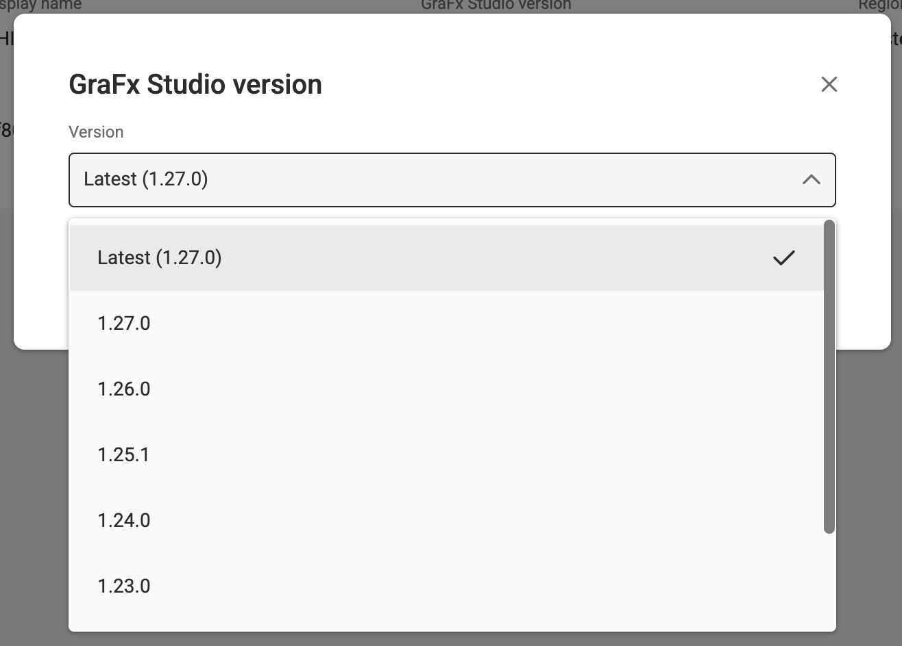

# Versioning Your Integration

This chapter provides a comprehensive guide to managing the lifecycle of your GraFx Studio integration. You will learn how to pin your environment to specific versions, synchronize your integration code with the platform, and develop a sustainable update strategy for production deployments.

## Why Versioning Matters

Versioning gives you control over when and how updates are applied to your GraFx Studio integration. Without a deliberate versioning strategy, automatic updates can introduce unexpected behavior changes, break existing templates, or disrupt production workflows.

By understanding and implementing proper version management, you ensure stability and compatibility for your production environments while retaining the flexibility to adopt new features and bug fixes at your own pace.

---

## How Versioning Works

Every GraFx Studio environment is associated with a specific version. This setting determines which version of the following components are used on the GraFx Platform:

- **Studio SDK** — The core development kit for building integrations
- **Studio Engine** — The rendering and processing engine
- **Template Designer Workspace** — The interface for template creators
- **Studio UI** — The end-user workspace for document editing

While multiple components make up GraFx Studio, in practice you only need to consider the **Studio SDK version**. The other components are automatically aligned with the SDK version you select.

### Configuring Your Environment

You have two options for configuring which version your environment uses:

1. **Latest (Default):** The environment automatically updates to the newest version as soon as it is released.
2. **Pinned:** The environment remains fixed on a specific version (e.g. `1.26`) until an environment administrator manually updates it.

The version displayed in environment settings as "GraFx Studio version" represents the SDK version, with all other components automatically matched.


When set to "latest," updates happen automatically as new versions are released. Environmental administrators can also pin the version to a specific release when greater control is required.

!!! info "Everyone on Your Team Should Be on the Same Page"

    Make sure everyone on your team is aligned on your versioning strategy. Misaligned expectations between designers and developers can lead to inaccessible templates and frustrated users.

---

## Understanding the Version Number

GraFx Studio follows [Semantic Versioning](https://semver.org/) in the format `major.minor.patch` for example: `1.26.4`.

| Segment         | Example | Who Controls It | Description                                                                |
| --------------- | ------- | --------------- | -------------------------------------------------------------------------- |
| **Major.Minor** | `1.26`  | You             | The version you select in environment settings or load in your integration |
| **Patch**       | `.4`    | Platform        | Automatically managed; contains bug fixes and security updates             |

In practice, you only need to consider the `major.minor` portion. The `patch` segment is automatically managed in environment settings and cannot be changed manually. The platform applies patch updates to your selected minor version as they become available.

!!! info "Some GraFx Studio Fixes Are Engine-Based and Don't Require Updates"

    Not all bug fixes require a patch update. Some fixes are purely in the engine, which is loaded automatically from the current version without regard to the patch version. So you may see a bug fix without any requirement to update your GraFx Studio version.

### Compatibility Rules

Understanding compatibility is critical for preventing data loss and workflow disruptions.

**Backwards Compatibility (Supported)**

Templates and Projects are backwards compatible with respect to the minor version. Content saved in an older version can always be opened in a newer version.

_Example:_ A template saved in version `1.26` can be opened in version `1.27`.

**Forwards Compatibility (Not Supported)**

Templates and Projects are **not** forwards compatible. Content saved in a newer version cannot be opened in an older version.

_Example:_ A template saved in version `1.27` cannot be opened in version `1.26`.

!!! danger "Version Incompatibility Alert"

    If you upgrade your environment (or run on "latest") and save a template, that template becomes permanently inaccessible to any integration running an older SDK version. **There is no rollback mechanism** for documents saved in a newer version. Plan your version upgrades carefully.

**SDK Compatibility**

The SDK versions are not guaranteed to be forwards compatible, but in practice they often are. However, you should not rely on this behavior for production systems. Always test your integration against the specific version you intend to deploy.

---

## Guidance for Designers

Because GraFx Studio is not forwards compatible, template designers must be aware of version implications in their daily work.

### The Rollback Problem

When you save a template in a newer minor version, that template cannot be opened in environments running older versions. This creates a one-way gate:

- If your environment runs on "latest" and you actively save templates, those templates are continuously updated to the newest version.
- If you later need to pin to an older version (for stability, testing, or other reasons), any templates saved during the newer version period will become inaccessible.

### Best Practices for Designers

1. **Know your version update plan.** If you have access to change the version of your production environment, coordinate with your development team to understand when and how updates are planned.
2. **Coordinate with your development team.** Understand when version upgrades are planned and avoid saving critical templates immediately before a rollback might be needed.
3. **Test in staging first.** If you have a staging environment, use that environment for testing new functionality. This allows you to test in the latest version without permanently locking your production templates to that version.

---

## Guidance for Integrators

As an integrator, you are responsible for ensuring your application code stays synchronized with the environment configuration. This section covers the technical details of loading the correct SDK or UI version.

### Using Studio UI

If you use [Studio UI](https://github.com/chili-publish/studio-ui), the pre-built end-user workspace, you must load the CDN resource that matches your environment version. The minor version of the SDK loaded is the same as the minor version of Studio UI you specify.

**CDN URL Structure**

```
https://studio-cdn.chiligrafx.com/studio-ui/{major}.{minor}/latest/es-module/bundle.js
```

The `latest` path segment in the URL automatically handles the patch version, ensuring you always receive the most recent bug fixes for your selected minor version.

!!! info "Understanding GraFx Studio UI and SDK Patch Versions"

    The patch version of the Studio UI is not directly related to the patch version of the GraFx Studio SDK. The Studio UI is updated independently of the SDK, and its patch version is managed separately.

    In practice, the patch version of the Studio UI is not relevant to your integration. You should always load the latest available version of the Studio UI, regardless of the patch version of the SDK you are using.

**Example: Loading Version 1.26**

```html
<script
  type="module"
  src="https://studio-cdn.chiligrafx.com/studio-ui/1.26/latest/es-module/bundle.js"
></script>
```

**Loading the Absolute Latest Version**

To always load the most recent version of Studio UI (matching an environment set to "latest"):

```html
<script
  type="module"
  src="https://studio-cdn.chiligrafx.com/studio-ui/latest/es-module/bundle.js"
></script>
```

!!! info "Loading the Absolute Latest Version"

    Only use the absolute latest URL if your environment is also configured to run on "latest." Mismatched versions between your integration and environment will cause problems.

### Using the Studio SDK Directly

If you are building a custom interface using the Studio SDK, you must manage your `package.json` dependencies to match your target environment version.

**Pinning to a Specific Minor Version**

Use the tilde (`~`) operator to install the latest patch version within a specific minor version:

```json
{
  "dependencies": {
    "@chili-publish/studio-sdk": "~1.26.0"
  }
}
```

This configuration means:

- ✅ `1.26.0`, `1.26.1`, `1.26.4` — Allowed (same minor version)
- ❌ `1.27.0` — Not installed (different minor version)

This is recommend to be used if your GraFx environment is configured to run on a specific version.

**Allowing Minor Version Updates (Use with Caution)**

Use the caret (`^`) operator to allow updates to newer minor versions:

```json
{
  "dependencies": {
    "@chili-publish/studio-sdk": "^1.26.0"
  }
}
```

This configuration means:

- ✅ `1.26.0`, `1.27.0`, `1.28.0` — Allowed
- ❌ `2.0.0` — Not installed (different major version)

This is useful if your GraFx environment is configured to run on the "latest" and you want your integration to automatically use the latest minor version.

---

## Environment Version Management via API

Whether you use Studio UI or the Studio SDK directly, the version in your integration code should match the version configured in environment settings.

Failure to maintain synchronization may result in designers building templates in an environment running a newer version than your integration supports, thus making those templates unable to load in your application.

To keep environments in sync programmatically, use the Environment API to read the configured version and load the corresponding resources dynamically.

### Reading the Current Version

Retrieve the active version for an environment:

```http
GET /api/v1/environment/{environment}/settings
```

**Response:** Returns the `sdkVersionPublic` field containing the `major.minor` version (e.g., `"1.26"` or `"latest"`).

Use this value to:

- Dynamically construct your Studio UI CDN URL
- Validate that your installed SDK version matches the environment
- Display version information to users

### Reading Available Versions

To build a version selector UI or validate supported versions, retrieve all available options:

```http
GET /api/v1/environment/settings/available-sdk-versions
```

**Response Structure:**

```typescript
interface VersionInfo {
  sdkVersion: string; // Full version (e.g., "1.26.4")
  engineVersion: string; // Corresponding engine version
}

type AvailableVersionsResponse = {
  /** The current latest release */
  latest: VersionInfo;

  /** Dynamic keys for each available version (e.g., "1.21", "1.26") */
  [version: string]: VersionInfo;
};
```

Important notes about this response:

- The `latest` entry always exists and contains the most recent `major.minor.patch` version.
- Each entry includes both the full SDK version (with patch number) and the corresponding engine version.
- The engine version can be useful for advanced output workflows that need to target specific rendering behavior.

### Updating the Environment Version

To change the version programmatically:

```http
PATCH /api/v1/environment/{environment}/settings
```

**Request Body:**

```json
{
  "sdkVersionPublic": "1.26"
}
```

You can also set the version to `"latest"` to always use the most recent release:

```json
{
  "sdkVersionPublic": "latest"
}
```

!!! warning "Do Not Specify Patch Versions"

    Do not include the patch number in your request (e.g., `"1.26.4"`). Specifying a patch version will result in an error. The platform manages patch versions automatically.

---

## Choosing a Versioning Strategy

Before implementing version management, consider these questions:

1. **How often do you want to update?** Monthly? Quarterly? Only for critical fixes?
2. **How will you test your integration with new versions?** Do you have staging environments, staging integration app, or automated tests?
3. **How do you plan to deploy updates to production?** What is your rollback plan if issues arise?

Your answers will guide whether you should run on "latest" or pin to specific versions.

### Strategy A: Running on "Latest"

This is the default setting and the simplest approach.

| Advantages                                                  | Disadvantages                                                                          |
| ----------------------------------------------------------- | -------------------------------------------------------------------------------------- |
| Immediate access to new features                            | No control over when changes occur                                                     |
| Automatic bug fixes and security patches                    | Higher risk of unexpected behavior in production                                       |
| Zero maintenance overhead                                   | Templates saved become incompatible with older versions in the situation of a rollback |
| Integration and environment stay synchronized automatically | Difficult to reproduce issues across different versions                                |

**Recommendation:** Use "latest" for development, sandbox, and testing environments and applications where stability is less critical than access to new features.

### Strategy B: Pinning a Version

Pinning locks your environment to a specific `major.minor` version until you explicitly upgrade.

| Advantages                                        | Disadvantages                                              |
| ------------------------------------------------- | ---------------------------------------------------------- |
| Guaranteed stability and predictable behavior     | Requires a plan and effort to update                       |
| Time to test updates before production deployment | May miss important features or bug fixes until you upgrade |
| Ability to coordinate upgrades across teams       | Must track new releases and plan updates                   |
| Reproducible environment for debugging            | Risk of falling too far behind                             |

**Recommendation:** Use pinned versions for production environments where stability and predictability are paramount.

#### Implementation Approaches

When pinning a version, you have two fundamental approaches for managing the relationship between your integration and environment:

**Approach 1: Environment Controls Version**

In this approach, the environment administrator sets the GraFx Studio version, and the integration adapts by reading the environment's configured version via the environment API.

How it works:

- Environment administrators control version updates through the environment settings
- Your integration reads the current version using `GET /api/v1/environment/{environment}/settings`
- For Studio UI integrations, dynamically construct the CDN URL based on the retrieved version
- For Studio SDK integrations, verify that your installed SDK version matches the environment version

Benefits:

- Environment administrators can manage versions without requiring integration deployments
- Developers don't necessarily need to be involved in routine version updates
- Simpler deployment process for version changes
- Clear separation of concerns between environment management and integration code

Considerations:

- Your integration must be designed to handle version retrieval and validation
- You still need to test that your integration works with newer versions before environment administrators upgrade
- Requires robust error handling if version mismatches occur

**Approach 2: Integration Controls Version**

In this approach, the integration code explicitly sets the GraFx Studio environment version via the API as part of its deployment process.

How it works:

- Your integration code includes the desired GraFx Studio version as a configuration value
- During deployment or initialization, the integration calls `PATCH /api/v1/environment/{environment}/settings` to set the environment version
- The environment version is treated as part of your integration's infrastructure-as-code

Benefits:

- Ensures version changes are tested alongside integration code updates
- Version updates are tied to your standard deployment and testing process
- Guarantees that the environment version matches what your integration expects
- Clear audit trail of version changes through your deployment history

Considerations:

- Requires integration deployment for any version update
- Must handle the edge case of well-meaning administrators manually changing the environment version

#### Handling the Manual Version Change Edge Case

When your integration controls the version, you need to prepare for situations where someone with environment administrator access manually changes the GraFx Studio version outside of your deployment process. This can cause your integration to malfunction or fail to load templates correctly.

You can handle this in three ways:

**1. Limit Access and Training**

The simplest approach is preventative:

- Restrict environment administrator roles to only those who understand your versioning strategy
- Train administrators to never manually change the GraFx Studio version
- Document the versioning approach clearly in your team's workflows

**2. Periodic Version Verification and Correction**

Implement a monitoring system that detects and corrects version drift.

Consider running this check:

- On application startup
- Periodically (e.g., every 15 minutes) via a scheduled task
- Before critical operations

**3. Template Version Validation**

If your integration workflow includes synchronization, template uploads, or updates, validate template versions before processing.

This approach:

- Prevents processing templates that would fail to load
- Provides clear error messages about version incompatibility
- Protects against silent failures due to version mismatches

**Choosing the Right Approach**

For most organizations, the first approach (limiting access and training) is often sufficient.

Whichever approach you take, **having a documented update plan is essential**. Your update plan should include:

- A schedule for reviewing and adopting new GraFx Studio versions
- Testing procedures for validating new versions
- Communication protocols for coordinating between designers, developers, and administrators
- Rollback procedures (understanding you cannot roll back template versions, but can roll back environment versions)
- Documentation of your chosen version control approach

---

## How to Pin Your Environment Version

Follow these steps to pin your environment to a specific version:

**Step 1: Navigate to Settings**

Open the settings page for the environment you want to configure.


**Step 2: Locate Version Settings**

In the General Settings section, find the "GraFx Studio version" field. By default, it displays "latest." Click the pencil icon to edit.


**Step 3: Select Your Version**

In the modal that appears, select your desired `major.minor` version from the dropdown list, or choose "latest" to return to automatic updates.



---

## Lifecycle and Maintenance Policies

### Patch Update Policy

We only apply patch updates (bug fixes and security updates) to the **most recent minor release**. If you are pinned to an older version (e.g., `1.24`) and a bug is discovered, the fix will only be applied to the current version (e.g., `1.26`).

**Implication:** To receive bug fixes, you must upgrade to the latest minor version. Older versions are effectively frozen once a new minor version is released.

!!! warning "Delaying Updates Can Lead to More Work"
If you delay updating to the latest minor version too long, you may end up in a situation where you are reporting an issue that is fixed in the latest version. If the difference in versions is significant, the effort required to upgrade can be substantial.

    We suggest updating to the latest minor version at least quarterly to avoid this situation.

### One-Year Grace Period

We support each minor version for up to **one year** after its release. This provides a reasonable window to plan and execute upgrades while ensuring you don't fall too far behind.

After one year, older versions may be removed and unsupported, and we cannot guarantee continued functionality or support.

### Template and Document Compatibility

Templates and Projects created in a newer version cannot be opened in older versions. This is a fundamental architectural constraint, not a policy choice. Plan your version strategy with this limitation in mind.

---

## Recommended Update Workflow

For production environments, we recommend the following process:

```
┌─────────────────────────────────────────────────────────────────
│  1. MONITOR
│     Subscribe to release notes and track new GraFx Studio
│     versions. Evaluate new features and bug fixes.
└─────────────────────────────────────────────────────────────────
                                  │
                                  ▼
┌─────────────────────────────────────────────────────────────────
│  2. TEST IN STAGING
│     Pin a staging environment to the new version. Deploy your
│     integration code with the matching SDK/UI version.
└─────────────────────────────────────────────────────────────────
                                  │
                                  ▼
┌─────────────────────────────────────────────────────────────────
│  3. VERIFY
│     Run automated tests and manual verification. Confirm that
│     testing templates render correctly and all integration
│     features work as expected.
└─────────────────────────────────────────────────────────────────
                                  │
                                  ▼
┌─────────────────────────────────────────────────────────────────
│  4. DEPLOY TO PRODUCTION
│     Update your production integration code which also updates
│     the environment version via API.
└─────────────────────────────────────────────────────────────────
                                  │
                                  ▼
┌─────────────────────────────────────────────────────────────────
│  5. COMMUNICATE
│     Notify designers and stakeholders of the version change.
│     Document any behavior changes or new features available.
└─────────────────────────────────────────────────────────────────
```

!!! info "Staging Integration App"

    While we recommend a staging environment for testing, it is not required. You can also test using a copy of your integration application that is configured to use the latest version instead of the pinned version.

    Just be careful not to accidentally save templates or projects created in the latest version to your production environments that you care about opening in the older version.

---

## Summary

Effective version management requires balancing stability against access to new features. Key takeaways:

- **Understand compatibility:** Templates saved in newer versions cannot be opened in older versions. This is irreversible.
- **Synchronize integration and environment:** Your SDK or UI version must match your GraFx environment Grafx Studio version.
- **Use "latest" for development, pinned versions for production:** This gives you the best of both worlds.
- **Plan updates proactively:** Don't wait until you're forced to upgrade. Regular, planned updates are less disruptive than emergency migrations.
- **Communicate with your team:** Ensure designers, developers, and administrators all understand and follow your versioning strategy.

By following the guidance in this chapter, you can maintain a stable, predictable integration while still benefiting from ongoing improvements to GraFx Studio.

---

## Frequently Asked Questions

### If I pin my environment to version 1.26, will I still receive hotfixes if version 1.27 has already been released, or do I need to upgrade to 1.27 to get them?

You need to upgrade to 1.27 to receive security hotfixes and bug fixes. Once a new minor version is released, we only apply patches to the latest minor version. Older versions remain frozen at their final patch level.

For example, if you're pinned to version `1.26` and we release `1.27`, any subsequent security fixes or bug patches will only be applied to `1.27` (and later versions). Version `1.26` will receive no further updates.

**Implication:** This policy makes it essential to maintain a regular update schedule. Falling too far behind means missing important security patches. We recommend reviewing new versions quarterly at minimum, and upgrading within the one-year grace period to ensure you're not running outdated, potentially vulnerable software.

---

### Is there a way to programmatically check if a template is compatible with the current environment version before attempting to open it?

Unfortunately, there is no official API endpoint for checking template compatibility at this time.

**Workaround:** You can read the template JSON directly to extract the version information. However, this is not a supported approach, as we do not guarantee the JSON structure to remain stable across versions. If you rely on this method, be prepared to update your code if the structure changes.

Example of the workaround approach:

```javascript
// Not officially supported - use at your own risk
async function getTemplateVersion(templateJson) {
  // Template JSON may contain version information
  // Structure is subject to change without notice
  const version = templateJson?.sdkVersion;
  return version;
}
```

We recognize this is a valuable capability for integration developers. **Please open a feature request** if you would like to see an official template compatibility check API added to the platform.

---

### Can I set up a webhook or notification to be alerted when a new minor version of GraFx Studio is released so I can begin my testing cycle?

Unfortunately, there is no webhook or notification system for version releases at this time.

**Current Alternatives:**

- Subscribe to the GraFx Studio release notes and documentation updates
- Periodically poll the `/api/v1/environment/settings/available-sdk-versions` endpoint to detect when new versions appear

We understand that automated notifications would significantly improve version management workflows. **Please open a feature request** if you would like to see this capability added to the platform.

---

### Regarding the "One-Year Grace Period," what happens to an environment if it is still pinned to a version that expires? Is it automatically forced to "latest"?

The behavior for expired versions is currently undefined. We cannot guarantee what will happen when a pinned version reaches end-of-life.

**Best Practice:** Treat the one-year grace period as a deadline, not a suggestion. Establish a regular update cadence that ensures you upgrade well before your current version expires:

- **Recommended:** Update within 3 months of a new version release
- **Maximum:** Update before the one-year grace period expires
- **Risk:** Allowing versions to expire may result in unexpected behavior, service interruptions, or forced upgrades at inopportune times

Set calendar reminders tied to your current version's release date to ensure you don't miss the window. For example, if you pinned to version `1.26` released in March 2025, plan your upgrade to `1.27` or later no later than July 2025.

---

### How can I test a new version without affecting my production templates?

The safest approach is to use a dedicated staging or testing environment.

If you don't have a separate environment available, consider:

- Requesting a sandbox or development environment from your account manager.
- Running a copy of your integration application that is configured to use the latest version instead of the pinned version.
- Coordinating a maintenance window for testing directly in production during low-usage periods.

---

### What happens if someone manually changes my environment version while my integration is running?

The impact depends on how your integration handles versioning:

**If using Studio UI from CDN:**

- Your integration will continue loading the version specified in your HTML/JavaScript
- Templates saved by designers in the environment will be created in the newer version, potentially becoming incompatible with your integration

**If using Studio SDK:**

- Your installed SDK version remains unchanged
- API calls may work (if forwards compatible) or fail (if breaking changes exist)
- Templates created in the environment may not load in your integration

**Prevention and Detection:**

Implement one or more of the strategies outlined in the "Handling the Manual Version Change Edge Case" section:

- Restrict administrative access and train administrators
- Implement periodic version verification to detect and correct drift
- Validate template versions before processing to reject incompatible templates

**Recovery:**

If you detect an unauthorized version change:

1. Assess impact: Determine if any templates were saved in the newer version
2. Decide on action: Either upgrade your integration to match, or revert the GraFx environment version (understanding templates saved in the newer version will become inaccessible)
3. Communicate: Inform designers about the situation and any templates that may be affected

---

### Can I maintain multiple production environments on different versions?

Yes, each GraFx environment has its own independent version setting. This can be useful for:

- **Phased rollouts:** Migrate customers or teams gradually to new versions
- **A/B testing:** Compare behavior across versions
- **Customer-specific stability:** Pin mission-critical customer environments while keeping others on latest
- **Regional deployments:** Different regions can update on different schedules

**Important Considerations:**

- **Integration compatibility:** Your integration code must handle connecting to environments with different versions
- **Maintenance overhead:** Managing multiple versions increases complexity and testing burden
- **Support lifecycle:** All environments must upgrade within the one-year grace period
