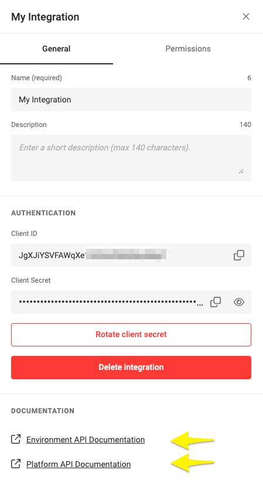

# Integrate CHILI GraFx apps

To communicate with CHILI GraFx, use these two APIs. You can learn more about the role of each API below.

- [Platform API](https://api.chiligrafx.com/swagger/index.html)
- [Environment API](https://sandbox1.chili-publish-sandbox.online/grafx/swagger/index.html)

Client side

- [GraFx Studio SDK](https://chili-publish.github.io/studio-sdk/index.html)

## Platform API
The CHILI GraFx Platform API allows you to manage CHILI GraFx Platform resources.

Some example use cases are:

- User management
- Environment creation
- Buy (Render pack) add-ons

## Environment API

**You can access the specific interactive Swagger for your environment API via integration setup**

Through the **GraFx Environment API** you can manage your CHILI GraFx environment.

Some example use cases are:

- Adding Smart Templates
- Adding Template Designer seats (later)
- Generating Output

The Environment API contains endpoints related to several apps.

| Ust this API	   	   	    | for this App |
|-------------------|-------------|
| Platform API  	| CHILI GraFx (platform)|
| Environment API	| GraFx Studio |
| Environment API	| GraFx Media |
| Environment API	| GraFx Fonts |

### Authorization

Certain endpoints require authentication and authorization to access. If you have not properly authorized, the API will respond with an error.

- If you don't have the app in your subscription
- If you have the app, but you don't have access to a certain resource

Error codes

| Code	   	   	    | Meaning     |
|-------------------|-------------|
| 200		     	| Ok   |
| 500		     	| Server dead   |
| 404		     	| Function not found   |

You can find out more about generating credentials in our [Integration Guide](/CHILI-GraFx/guides/integrations/)

# Overview per application

## CHILI GraFx

- [Getting Started](/CHILI-GraFx/integration/)
- [Platform API Swagger](https://api.chiligrafx.com/swagger/index.html)

## GraFx Studio

- [SDK Getting Started](/GraFx-Studio/integration/getting-started/)
- [SDK Reference](https://chili-publish.github.io/studio-sdk/index.html)

## GraFx Publisher

- [REST API Reference](https://chilipublishdocs.atlassian.net/wiki/spaces/CPDOC/pages/1413560/REST+API+Endpoints){target="_blank"}
- [Javascript API](https://chilipublishdocs.atlassian.net/wiki/spaces/CPDOC/pages/1412075/Getting+started+with+your+JavaScript+integration){target="_blank"}
- [Getting Started](https://chilipublishdocs.atlassian.net/wiki/spaces/CPDOC/pages/1412012/CHILI+API+Guide){target="_blank"}

## GraFx Media

- [Environment API Swagger](https://sandbox1.chili-publish-sandbox.online/grafx/swagger/index.html)

## GraFx Fonts

- [Environment API Swagger](https://sandbox1.chili-publish-sandbox.online/grafx/swagger/index.html)
