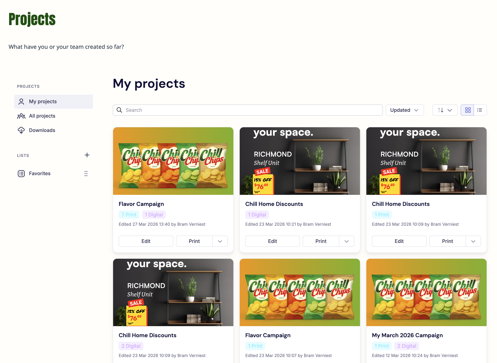

# Manage your projects

All saved projects are accessible from the **Projects** page. This page gives you an overview of your own work and, depending on your permissions, the work of other users in your organization.

!!! note
    The page name may differ depending on how your portal is configured. This documentation uses "Projects" as the default.

## My projects

The **My projects** tab shows all projects you have created. Each project card displays:

- A preview carousel of the project's layouts (see [Project card previews](#project-card-previews))
- The project name
- The number of print and digital layouts included
- The date and author of the last edit
- **Edit** and **Print/Download** action buttons

Use the **search bar**, **sort**, and **filter** controls to find projects quickly.

{.screenshot-full}

## Project card previews

Each project card shows a carousel you can page through, so you can recognize a project without opening it. The carousel works the same in grid and list view, in **My projects**, **All projects**, and your lists.

- If the template has a main visual, it is shown first, followed by one slide for each layout in the project.
- If the template has no main visual, the carousel starts with the layout previews.
- If no visual or preview is available, the card shows a single fallback image without carousel controls.

Only the layouts included in the project are shown. While a layout preview is still being generated, the card shows the main visual greyed out with a loading indicator. If a preview could not be generated, the template image is shown in its place.

## All projects

The **All projects** tab shows projects created by other users in your organization. Which projects are visible depends on your user group and the access permissions configured by your admin.

## Downloads

The **Downloads** tab shows all output files you have requested. When a file is ready, the status updates and you can download it from this page.

A download that produces several files at once appears as a single entry with the total number of files it contains. Use **Download all** to get every file in that entry as one ZIP file.

## Lists

Lists let you organize projects into groups for easier navigation. A **Favorites** list is available by default.

To add a project to a list, click **Add to list** on the project card and select the list. Projects can be added to multiple lists.

To create a new list, click the **+** button next to the Lists section in the sidebar. You can rename or delete lists you have created. Deleting a list does not delete the projects — they remain available in My projects and any other lists they belong to.

## What you can do from a project card

From any project card, you can:

- **Edit** — reopen the project in the editing experience to make changes
- **Print / Download** — produce output (see [Download and order output](../output-and-download/))
- **Add to list** — organize the project into a list
- **Context menu (...)** — access additional options such as duplicate or rename
