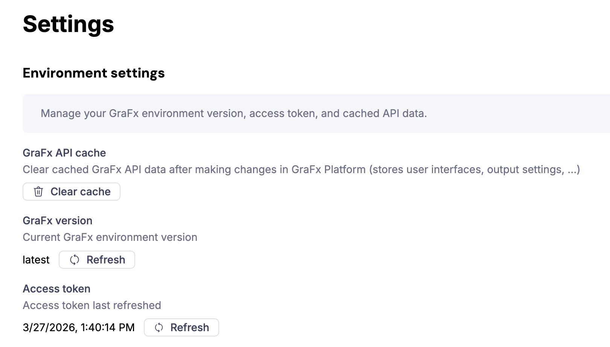

# Connect the extension to CHILI GraFx

This guide explains how to connect the CHILI GraFx extension to your CHILI GraFx environment using an integration.

## Before you start

- You need tenant admin access to the GraFx Experience admin console, with the CHILI GraFx extension enabled.
- You need access to **Integrations** in CHILI GraFx to create or retrieve credentials.

## Step 1: Create an integration in CHILI GraFx

In CHILI GraFx, go to **Integrations** and create a new integration for GraFx Experience. This generates a **Client ID** and **Client Secret**.

See the [Integrations concept](/CHILI-GraFx/concepts/integrations/) for details on creating integrations and setting the correct permissions.

Note down the Client ID and Client Secret — you will need them in the next step.

## Step 2: Enter the credentials on the GraFx Authentication page

In the admin console, open **Installed Extensions** and click **Authentication** (key icon) on the GraFx row. This opens the **GraFx Authentication** page.

The page holds the connection details for your CHILI GraFx environment. Required fields are marked with a red asterisk.

| Field | What to enter |
|---|---|
| Enable GraFx Studio integration | Turns the connection on or off |
| Environment ID | The identifier of your CHILI GraFx environment |
| Environment API base URL | The base URL of your environment's Environment API |
| Auth URL | The endpoint used to request access tokens |
| Client ID | The Client ID of the integration from Step 1 |
| Client Secret | The Client Secret of the integration from Step 1 (masked) |

The page also has optional fields for the Studio UI CDN URL, the Studio UI SDK URL, and the editor link.

Click **Save Authentication**. When you save, GraFx Experience checks the environment against your CHILI GraFx subscription. If the Environment ID is not valid, an error message is shown and the previous values are kept.

## Step 3: Verify the connection

Open the extension's **Settings → Environment settings**.

- Under **GraFx version**, click **Refresh** to load the version your environment runs on.
- Under **GraFx API cache**, click **Clear cache** to load the latest user interfaces and output settings from CHILI GraFx.

If the connection is successful, the GraFx Studio user interfaces and output settings from your environment are available when you configure templates in the extension.

{.screenshot-full}

## Refreshing after changes in CHILI GraFx

The extension does not automatically pick up changes made in CHILI GraFx. Use **Environment settings** to apply them:

- **Integration permissions changed** — click **Refresh** under **Access token** to re-authenticate with the updated permissions.
- **User interfaces or output settings changed** — click **Clear cache** under **GraFx API cache**.

## Subscription sync

GraFx Experience reads your CHILI GraFx subscription each time you save the GraFx authentication, and keeps it in sync every hour after that. Changes to your subscription in CHILI GraFx reach GraFx Experience within about an hour.
