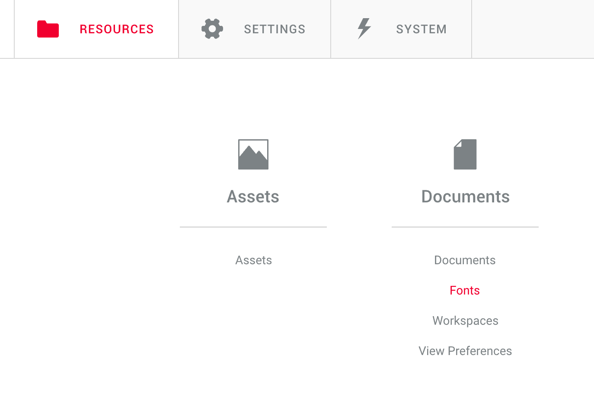
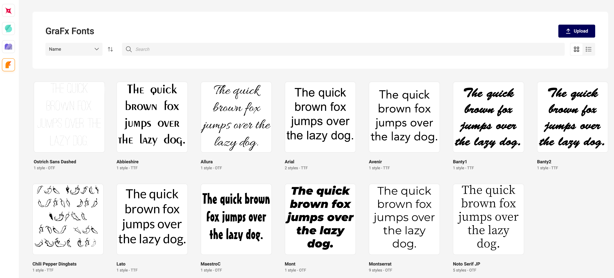

# Fonts in GraFx Publisher

With the introduction of GraFx Fonts, a new way of working is introduced to handle fonts in GraFx Publisher and GraFx Studio.

We've kept this separation to ensure that existing templates in GraFx Publisher continue to function as expected.

## GraFx Publisher

Single file fonts are used, not font families. To make these fonts available for use, you should upload them within the GraFx Publisher application.

## GraFx Studio

A new approach is used, which supports font families. For fonts to work within this application, please upload them in the GraFx Fonts repository.

It's important to note that fonts uploaded to the GraFx Fonts application are exclusively available for use in GraFx Studio. We've kept this separation to ensure that existing templates in GraFx Publisher continue to function as expected. 

Any fonts needed for GraFx Publisher templates should be uploaded within the GraFx Publisher application.