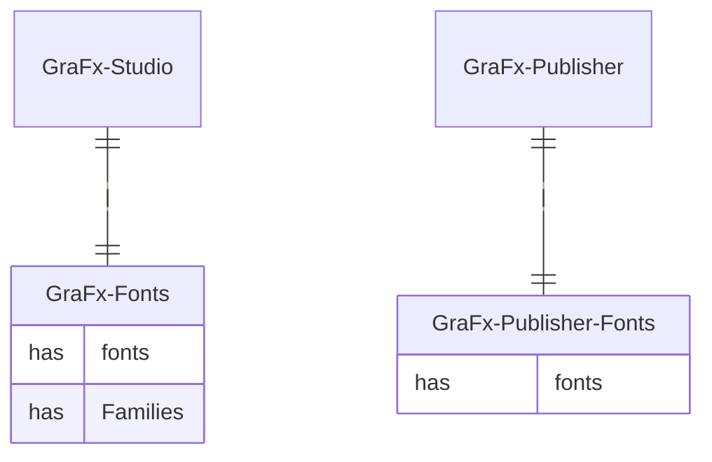

# Fonts in GraFx Publisher

With the introduction of GraFx Fonts, a new way of working is introduced to handle fonts in GraFx Publisher and GraFx Studio. Fonts uploaded to the GraFx Fonts application are exclusively available for use in GraFx Studio. We've kept this separation to ensure that existing templates in GraFx Publisher continue to function as expected. 

For information on how to work with fonts in GraFx Publisher, please see [CHILI publisher Fonts Documentation](https://chilipublishdocs.atlassian.net/wiki/spaces/CPDOC/pages/1413922/Fonts) for more information.

Any fonts needed for GraFx Publisher templates should be uploaded within the GraFx Publisher application.

