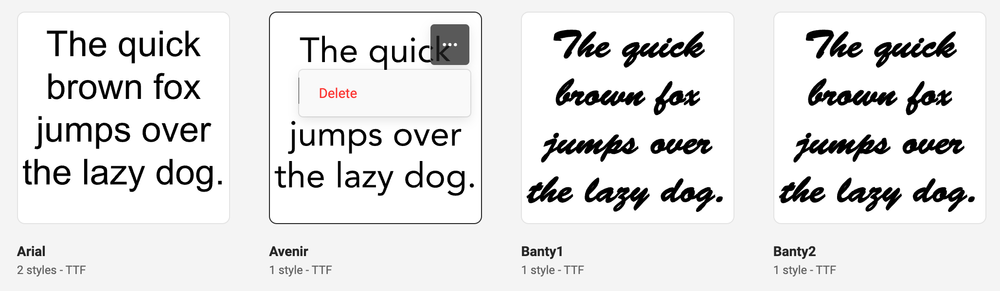
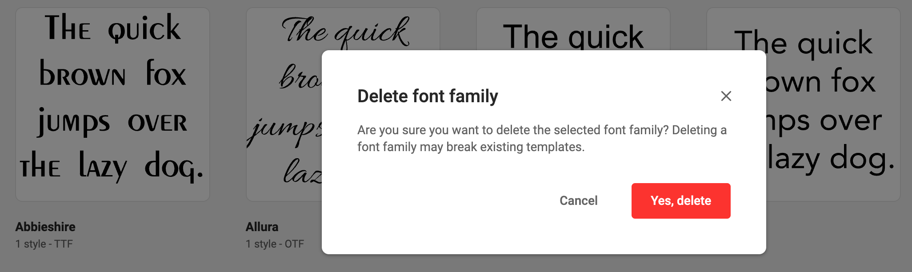
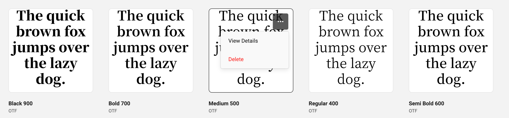
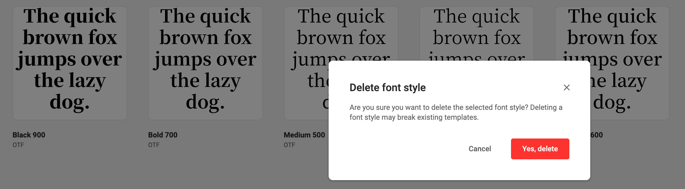

# Manage fonts

## Adding fonts

See [Upload Fonts](/GraFx-Fonts/guides/upload-fonts/)

## Removing Font Families

At the top level (Font Families) click the "..." icon of a family, and choose "Delete".

{.screenshot-full}

A confirmation will be asked before you delete the font family. Deleting a font family might break existing templates.

{.screenshot-full}

## Remove a Font Style

At the top level, click a font to see its styles.

At the styles level, click the "..." icon, and choose "Delete"

{.screenshot-full}

Confirm to delete the style. As with the font family, deleting even a single style might break existing templates.

{.screenshot-full}
