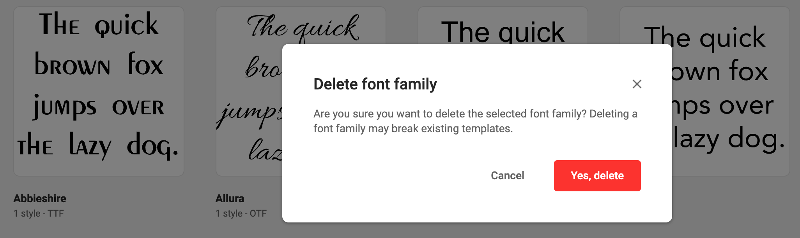

# Manage fonts

## Adding fonts

See [Upload Fonts](../upload-fonts/)

## Removing Font Families

At the top level (Font Families) click the "..." icon of a family, and choose "Delete".

A confirmation will be asked before you delete the font family. Deleting a font family might break existing templates.

## Remove a Font Style

At the top level, click a font to see its styles.

At the styles level, click the "..." icon, and choose "Delete"

Confirm to delete the style. As with the font family, deleting even a single style might break existing templates.

