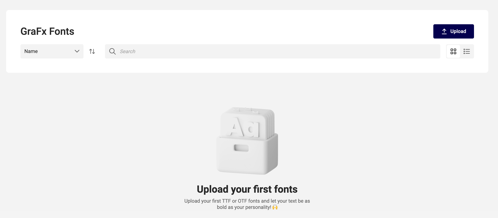
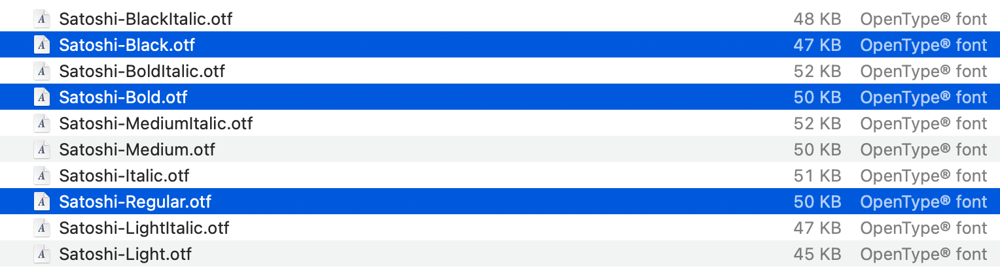
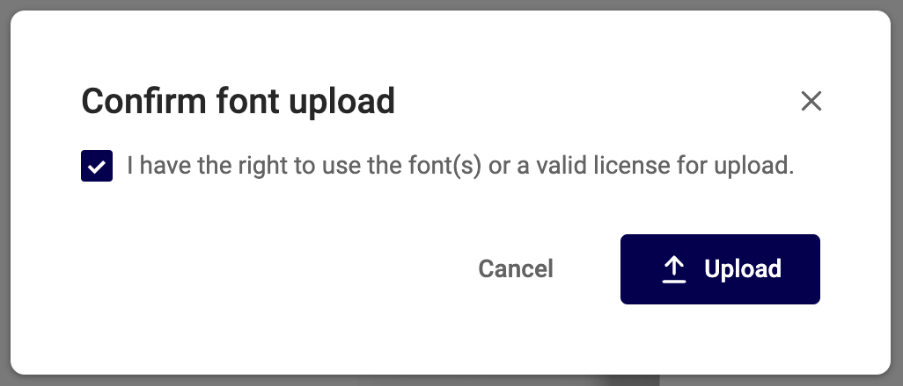
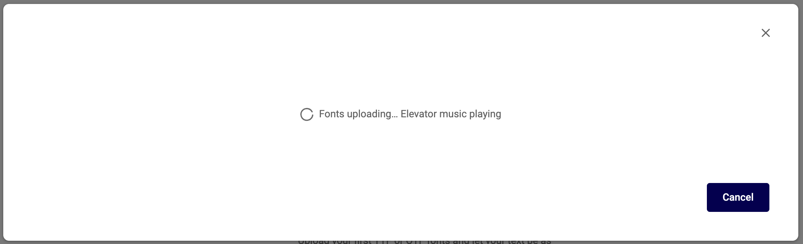
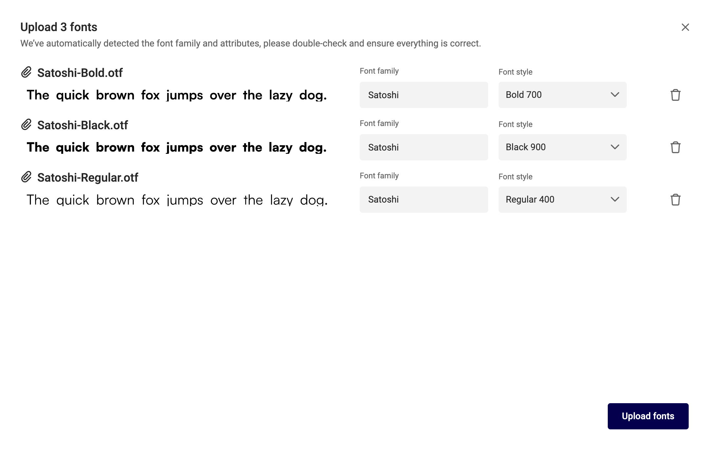
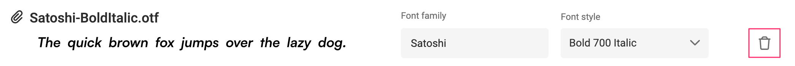
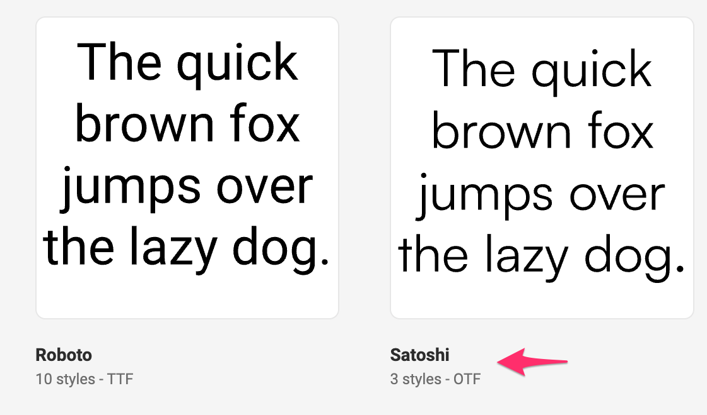
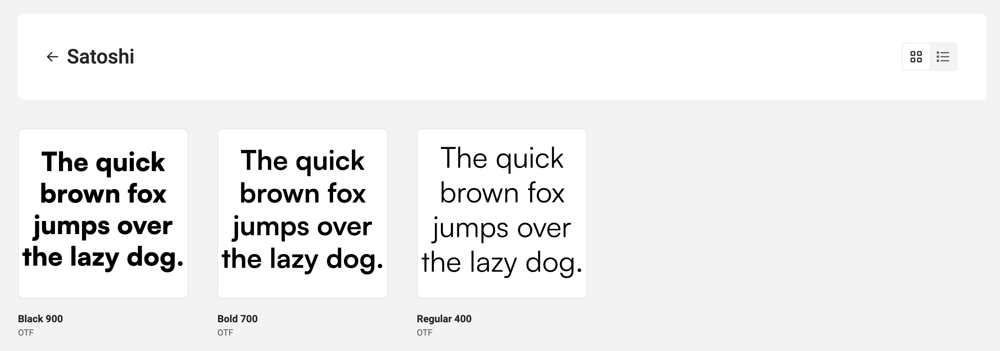
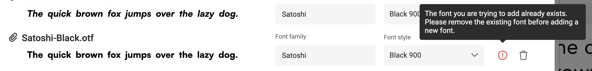
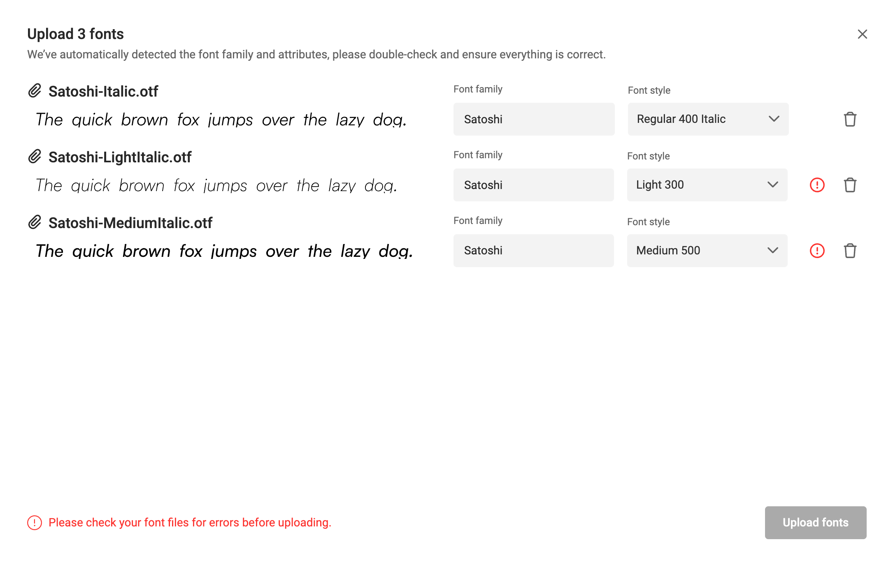

# Upload fonts

## License

Adding fonts to CHILI GraFx requires a valid license. Before uploading, check your font supplier (foundry) if you have a valid license to use your font's for your application.

## Adding font to GraFx Fonts

Click the upload button

Select 1 or more files to upload

Confirm you have the license.

Listen carefully while uploading.

GraFx Fonts will read the metadata from the font files, als suggest the categorization of the fons according the family and [style](https://en.wikipedia.org/wiki/Font#Characteristics).

At this moment in the upload process, you can still choose to NOT upload a specific font to the GraFx Fonts application.

Click the waste bin next to the font (style) you wish NOT to upload.

## Upload ready

After you confirmed the upload, your font family will appear in the list.

Click the font family to see its contents (the font styles).

## Warnings

### Duplicates

When GraFx Fonts detects a duplicate, you'll see a warning icon.

You can choose to delete (not to upload) the font, or categorize it differently.

Two criteria are used to check if a font style is unique

	- Font family (eg. Satoshi)
	- Style (eg. Regular Italique)
	
When the combination of the family and style is already available, GraFx Fonts will mark the upload as duplicate.

### Metadata wrong

When uploading a font, GraFx Fonts will read the metadata. When the information in the metadata is not correct, this might be confusing.

E.g. Uploading a font with the name "SatoshiRegularItalic.otf" you would imagine the font to look "regular" and "_Italic_". However, CHILI GraFx might suggest to use a regular style, because the _Italic_ meta data was not present.

You can choose to follow the suggestion (if not duplicate) or you can change the style based on your information.

Once uploaded, the new metadata will be used in GraFx Studio to categorize the font.

In the example below, the _italic_ was not encoded correctly for 2 out of 3 fonts. And therefore also marked as duplicates, since the non-italic version was available in the repository.

