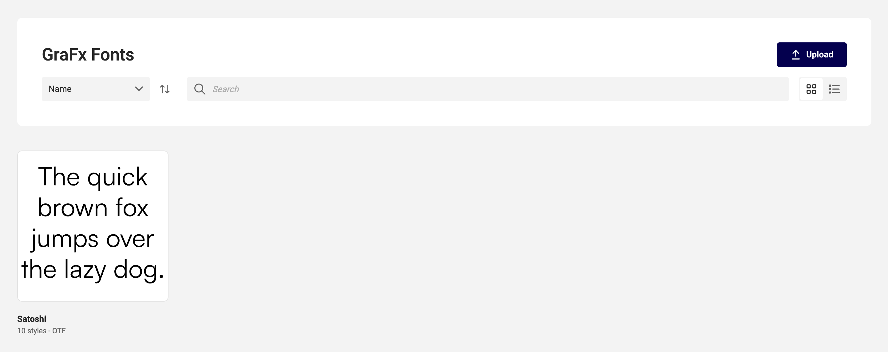
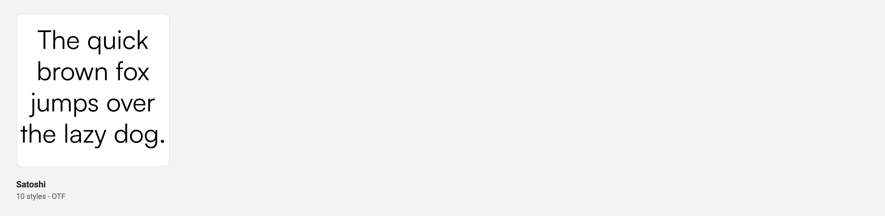
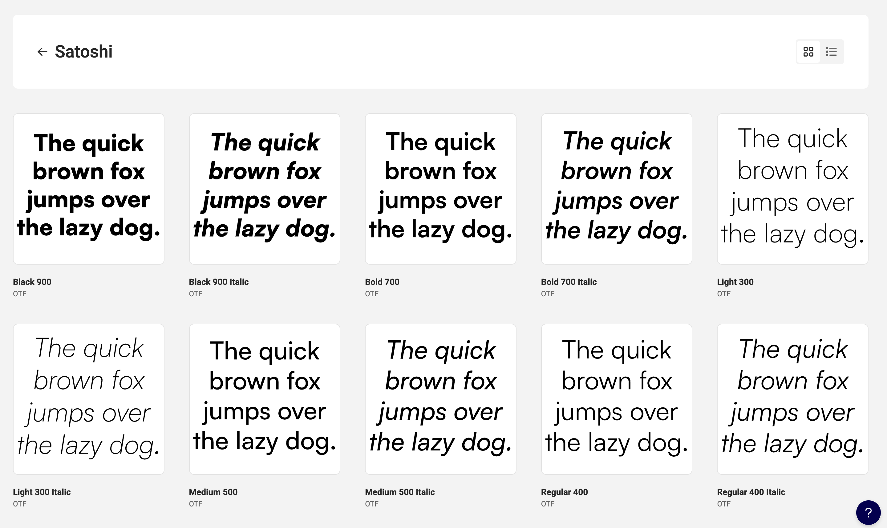

# Application elements of GraFx Fonts

When opening GraFx Fonts, you see the action banner and below all font families.

## Action banner

The area of the application where you interact with the contents. You can search, sort and change the view.

### Sort Field

Select the field you want to sort the contents below on

### Sorting order

Select the order of sorting (ascending or descending)

### Search field

Search on the name of the font

### Upload button

Upload font families. (You can upload 1 or more at the same time)

### View

View the contents in a grid or list view

## Font families

The list of font families show the fonts grouped in families.

### Font family

Below the family, the amount of styles is indicated.

Click on the font, to see the styles in the family.

