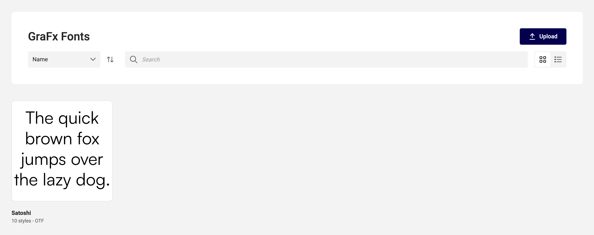
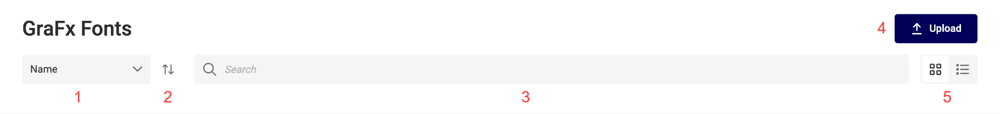
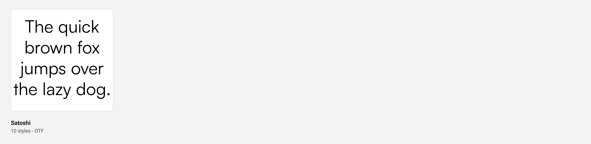
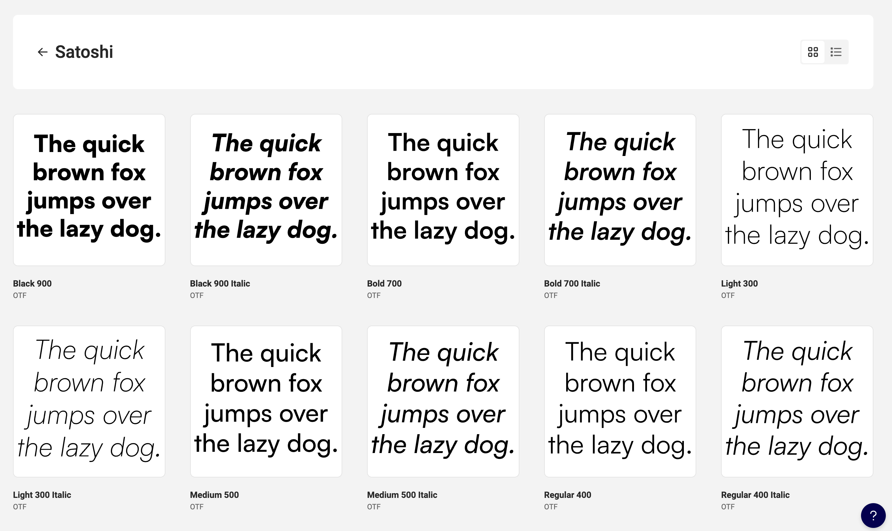

# Application elements of GraFx Fonts

When opening GraFx Fonts, you see the action banner and below all font families.

{.screenshot-full}

## Action banner

The area of the application where you interact with the contents. You can search, sort and change the view.

{.screenshot-full}

1
**Sort Field:** 
Select the field you want to sort the contents below on

2
**Sorting order:** 
Select the order of sorting (ascending or descending)

3
**Search field:** 
Search on the name of the font

4
**Upload button:** 
Upload font families. (You can upload 1 or more at the same time)

5
**View:** 
View the contents in a grid or list view

## Font families

The list of font families show the fonts grouped in families.

### Font family

{.screenshot-full}

Below the family, the amount of styles and the [Font type](/GraFx-Fonts/overview/supported-font-types/) is indicated.

Click on the font, to see the styles in the family.

{.screenshot-full}
