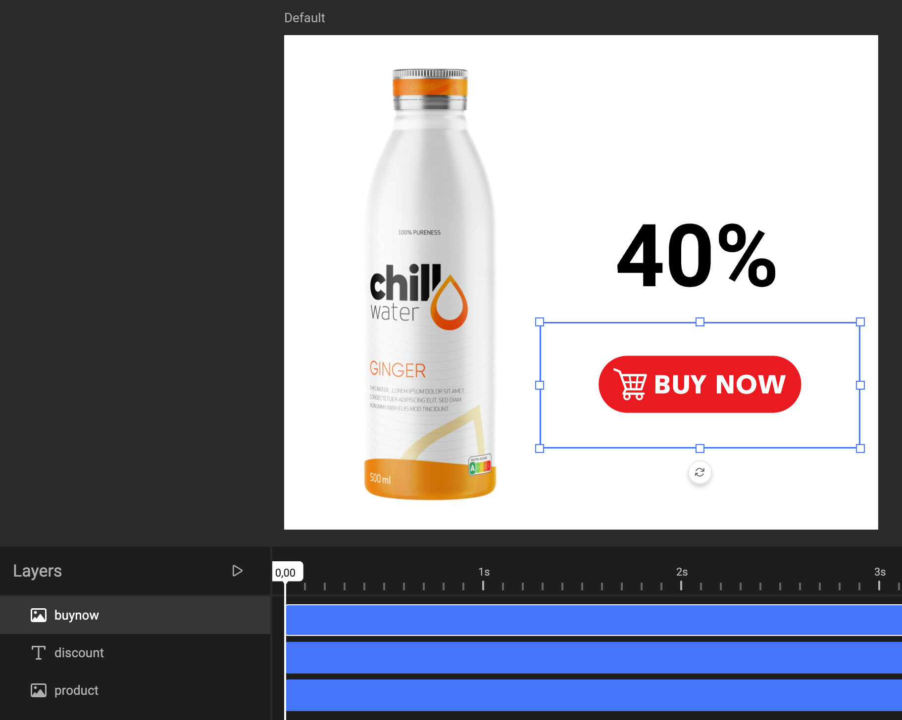
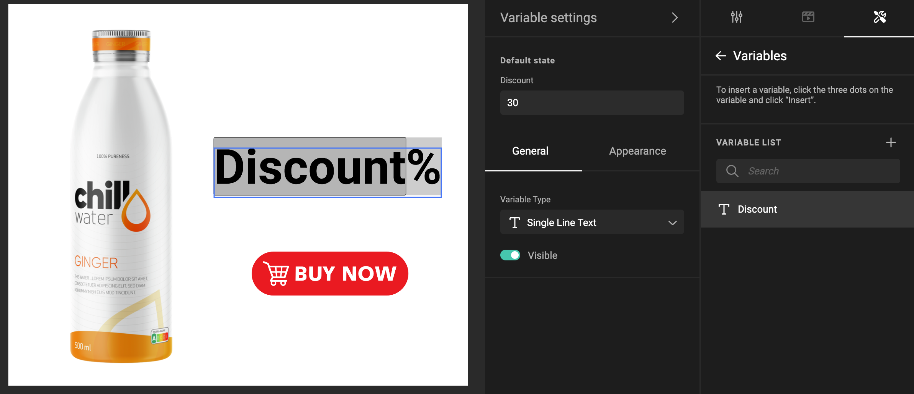
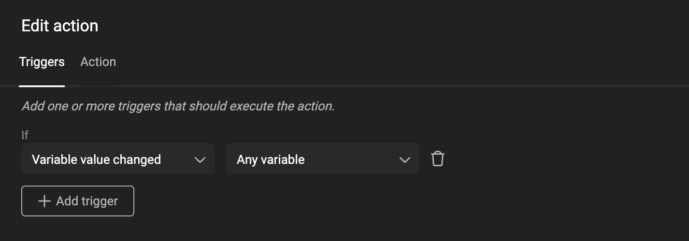
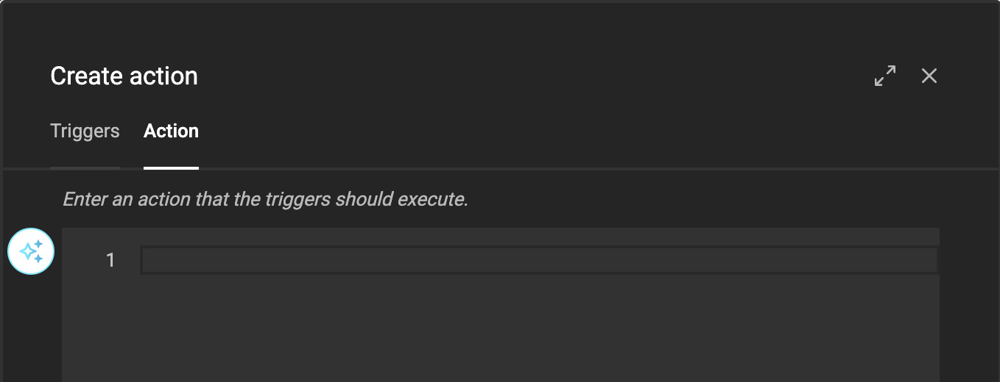
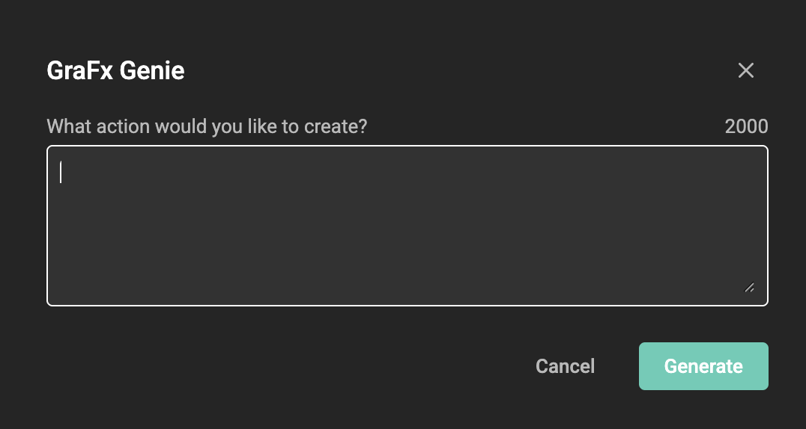
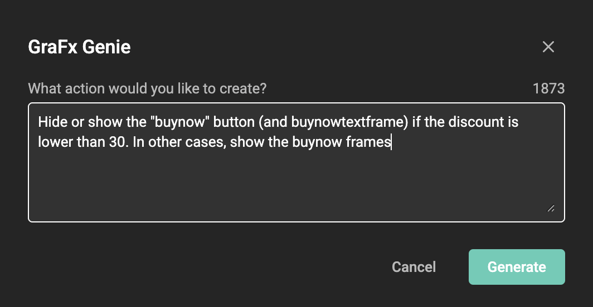
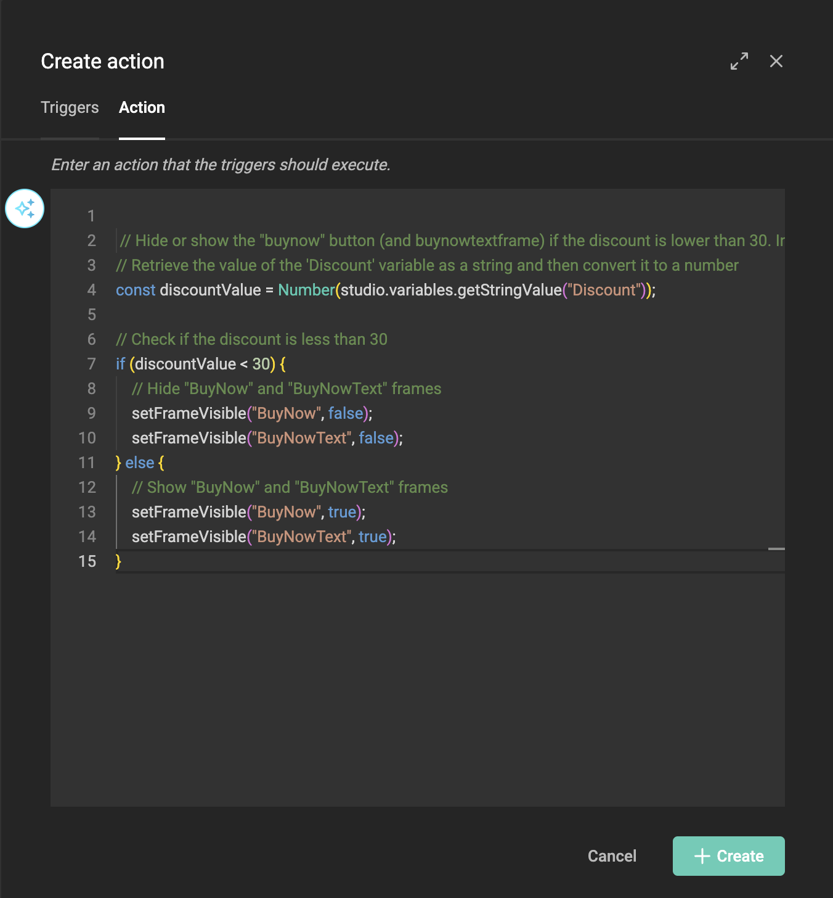

<!--
  GraFx Genie capability page — follows the GraFx Genie hub pattern:
  1. What it is  2. How GraFx Genie helps  3. Where to find it (links out)
-->

# GraFx Genie Actions

## What it is

In GraFx Studio, **Actions** are the JavaScript scripts that turn a template into a Smart Template. For example: showing an extra asset when a discount drops below a threshold, or adjusting a layout when a value changes. **GraFx Genie for Actions** writes that script for you.

## How GraFx Genie helps

Writing Actions normally means writing JavaScript. With GraFx Genie, you describe the behavior you want in plain language, and GraFx Genie generates the Action script. It knows the template's context, such as your variable and frame names, so the result fits your template. You stay in control: review the suggested script, tweak it, or ask a developer colleague to take a look for the final touches.

## Example

You have a retail template. A template variable field allows the users of the template to enter a discount percentage. When the discount drops below, say, 30%, you (as a template designer) want to show an extra asset to highlight the steep discount.

A template variable makes sure a user can change the discount.

Now, let's make an Action that will be triggered when a template variable value changes.

To create the Action, click on the Action tab.

You can now ask GraFx Genie to write the script for you. Click on the GraFx Genie icon.

Ask GraFx Genie what functionality you need in your Smart Template.

GraFx Genie will now suggest a JavaScript you can use to perform the functionality.

As you see, GraFx Genie knows about the context. Without specifying that discount is a template variable name, it will understand and use this information to write the script.

If you're not 100% convinced, you can still tweak the script, or ask a developer colleague to take a look for the final touches.

## Where to find it

GraFx Genie for Actions is part of **GraFx Studio**, alongside the Actions that power Smart Templates:

- [Actions](/GraFx-Studio/concepts/actions/): what Actions are and how triggers use them.
- [Create Actions](/GraFx-Studio/guides/actions/create/): the step-by-step guide to building an Action.
