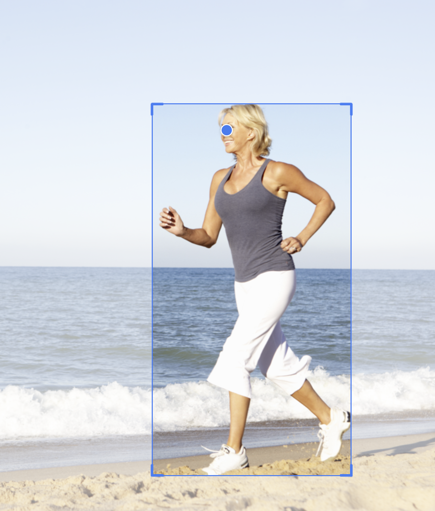
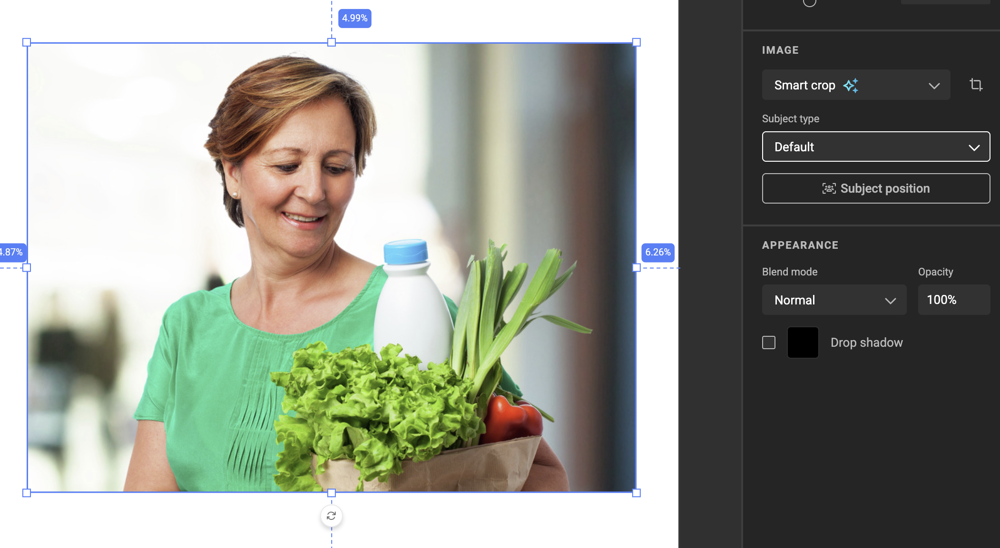
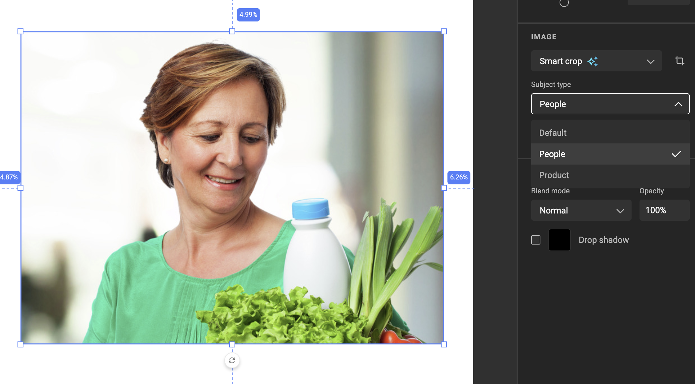
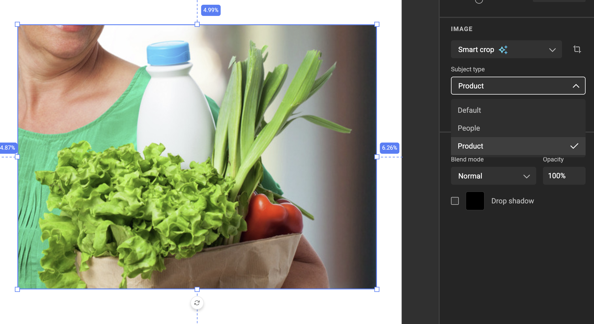

# GraFx Genie Smart Crop

Smart Crop is the GraFx Genie capability that positions an image inside a frame automatically, keeping the most important part of the picture in view whatever the frame's size or aspect ratio. One source image can become a social post, a banner, and a print ad, each correctly framed, without manual cropping for every variant.

Smart Crop works across GraFx Media, GraFx Studio, and the platform settings. The step-by-step guide for each is linked below.

## The Full Picture

From upload to output, this is how Smart Crop works:

1. An image is uploaded to GraFx Media, or comes from an external DAM system connected through a media connector.
2. GraFx Genie analyzes it and stores two pieces of metadata on the asset: a **Subject Area** and a **Point of Interest**.
3. The asset is placed into an image frame in a GraFx Studio Smart Template.
4. The frame's fit mode is set to **Smart Crop**.
5. GraFx Genie positions the image so the subject stays in view, respecting the frame's size and aspect ratio.
6. Optionally, a **Subject Position** (where the subject should sit inside the frame) and a **Subject type** are chosen on the frame.
7. The stored metadata is used wherever the template is rendered: on screen, in output, and through the API.

## Where to manage Smart Crop

| You want to… | Do it in | Page |
|---|---|---|
| Review or adjust the Subject Area and POI of an asset | GraFx Media or GraFx Studio | [Set the Subject Area & POI](/GraFx-Media/guides/smart-crop-subject-area/), [Image frames: Smart Crop](/GraFx-Studio/guides/image-frame/#smart-crop) |
| Review or adjust the Subject Area and POI of an external DAM asset | GraFx Studio | [Image frames: Smart Crop](/GraFx-Studio/guides/image-frame/#smart-crop) |
| Turn on Smart Crop for a frame, set the Subject Position, pick a subject type | GraFx Studio | [Use Smart Crop on an image frame](/GraFx-Studio/guides/smart-crop/) |
| Define the list of subject types for the environment | Platform settings | [Manage subject types](/CHILI-GraFx/guides/manage-subject-types/) |

## Key terms

| Term | What it means |
|---|---|
| **Subject Area** | The boundary around the most important element in an image. Stored on the asset. |
| **Point of Interest (POI)** | The exact focus point inside the Subject Area (for example, a person's eyes). Stored on the asset. |
| **Subject Position** | The area *inside the frame* where the subject should appear. Set on the frame in GraFx Studio. Not the same as the Subject Area. |
| **Subject type** | A category (such as *person* or *product*). Each subject type stores its own Subject Area and POI on the asset. |
| **Default** | The Subject Area and POI detected automatically on upload. Always present; used when no subject type is selected. |
| **Fit mode** | How an image fits its frame: Fit, Fill, Smart Crop, or Manual. See [Crop modes](/GraFx-Studio/concepts/crop/). |

## How GraFx Genie detects the subject

When an image is uploaded, GraFx Genie Vision examines it and sets the Default Subject Area and Point of Interest. GraFx Genie recognizes people and a range of contextual objects, and places the Point of Interest on the most relevant feature. For a person, that means detecting the eyes.

!!! info "Set once, never changed automatically"
    GraFx Genie sets the Subject Area and POI when the image is first processed, and never updates them automatically afterwards. Improvements to GraFx Genie's detection only apply to newly uploaded assets.

## Rules of Smart Crop

Smart Crop follows a clear order of priorities to produce consistent, predictable results:

- **The frame is always filled completely.** The image is scaled and positioned so there are never any empty edges.
- **The Point of Interest always stays inside the Subject Position.** The spot you mark as essential is guaranteed to remain visible.
- **As much of the Subject Area as possible is kept inside the Subject Position.** If the Subject Area is too large to fit entirely, Smart Crop crops into it as little as possible, and never at the expense of the Point of Interest.

When the image still has room to move after these rules are satisfied, the frame's **Subject alignment** setting decides which way the subject leans within the Subject Position. See [Subject alignment](/GraFx-Studio/guides/smart-crop/#subject-alignment).

## Smart Crop versions

To keep existing templates stable, each image frame remembers the Smart Crop version it was built with, so improvements to the algorithm never change how existing templates look. When a newer version is available for a frame, you can apply it from the GraFx Studio workspace. See [Applying a new Smart Crop version](/GraFx-Studio/guides/smart-crop/#applying-a-new-smart-crop-version).

## Subject types

A single image can hold more than one Subject Area and Point of Interest, grouped under a **subject type**, for example *person* or *product*. The same photo can then crop to the person for a social ad and to the product for a catalog page, without duplicating the asset or rebuilding the frame.

- Subject types are defined centrally on the environment by an admin. See [Manage subject types](/CHILI-GraFx/guides/manage-subject-types/).
- The **Default** type is detected automatically on upload and is used when no subject type is selected on an image frame.
- On an image frame with Smart Crop active, the template designer selects which subject type to apply. See [Select a Subject type](/GraFx-Studio/guides/smart-crop/#select-a-subject-type).
- Per-type Subject Areas and POIs are set from the media detail view. See [Subject type](/GraFx-Media/guides/smart-crop-subject-area/#subject-type).

Switching the **Subject type** dropdown on an image frame re-runs Smart Crop against the Subject Area and POI stored for that type. The frame stays the same, but what's inside it changes:

*Default* keeps the full scene, *People* centers on the person, and *Product* zooms in on the grocery bag, all from the same source asset and the same frame.

## Best practices

- Place the Point of Interest precisely on the feature that matters most (for a person, the eyes).
- Keep the Subject Area fitting closely around the primary subject.
- Remember that the Subject Area and POI are stored on the asset: changing them affects **every** template that uses the image.

## When automatic cropping isn't enough

Smart Crop handles most cases, but some images, such as lifestyle photos, need manual fine-tuning:

- **Subject Position** lets you control where the subject lands in a specific frame (for example, to the left when text sits on the right). See [Use Smart Crop on an image frame](/GraFx-Studio/guides/smart-crop/).
- **Manual Crop Override** lets you lock a hand-tuned crop for one image in one frame and layout, while every other image keeps using Smart Crop. The override is stored per image, layout, and frame combination. See [Manual Crop Override](/GraFx-Studio/concepts/manual-crop-override/).

!!! warning "Handle with care"
    Manual adjustments might produce results that differ from the original automated detection.
