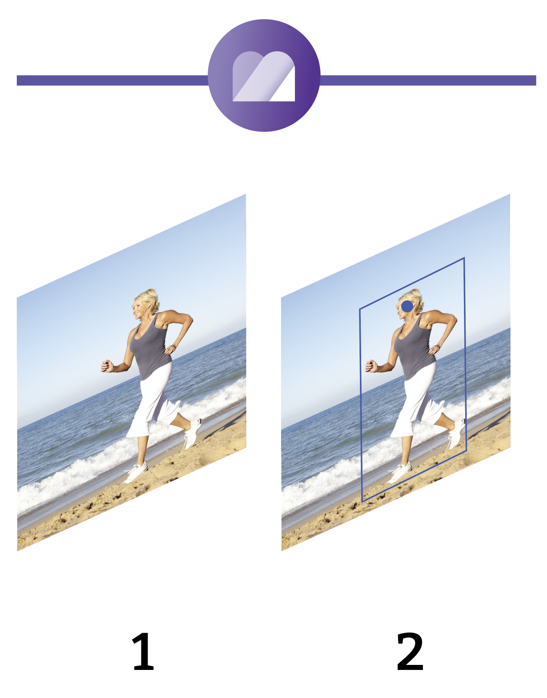

# GraFx Genie: Smart Crop

Your AI assistant, **GraFx Genie**, helps recognize subjects in the assets you upload. The metadata of each asset can then be used to position it accurately in your template and final output.

## The Full Picture

Smart Crop works seamlessly across both GraFx Media and GraFx Studio.

1. The asset is stored in GraFx Media.
2. The asset is augmented with Subject Area and Point of Interest metadata.
3. The asset is imported into the Smart Template.
4. An image frame is added in the Smart Template.
5. The asset is placed in the image (filled by default).
6. Fill mode is set to "Smart Crop".
7. Text or other graphical elements are added to your design.
8. If text overlaps the image, adjustments can be made.
9. You define the subject area where the focus should be.
10. Smart Crop repositions the image according to the defined subject area.

## Upload

After upload, GraFx Genie identifies the subject in your image and determines two key elements:
- **Subject Area**
- **Point of Interest**

## Subject Area

The subject area is the boundary around the most important element in the image.

## Point of Interest

The Point of Interest is the specific point within the subject area where the focus should be placed. This information helps GraFx Genie ensure that the focus remains on the intended area during output generation.

## GraFx Studio

In GraFx Media, the AI assistant sets these elements. From now on, the metadata is used during template creation in GraFx Studio.

See: [Smart Crop in GraFx Studio](../../../GraFx-Studio/concepts/genie-smart-crop/)