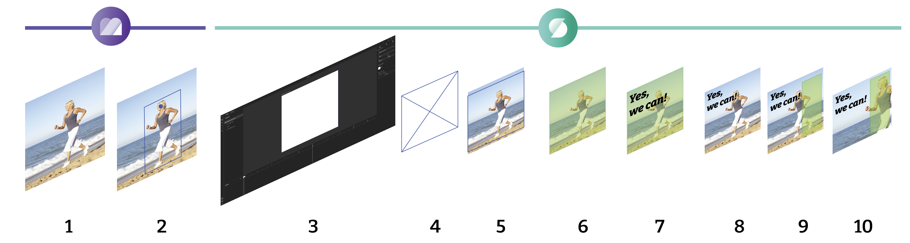

# GraFx Genie: Smart Crop

Your AI Assistant **GraFx Genie** will help to recognize subjects in the assets you upload.

The meta data of the asset, can then be used to position the asset in your template and final output.

## The full picture

Smart Crop covers GraFx Media and GraFx Studio

1. The asset in GraFx Media
2. The asset, augmented with Subject Area and Point of Interest
3. The Smart Template
4. An image frame in the Smart Template
5. The asset placed in the image (Filled by default)
6. Set Fill mode to "Smart Crop"
7. Add text (or other graphical elements) to your design
8. The text overlaps the image (not the intended outcome)
9. Define the subject area where the focus of the placed image should be positioned
10. Smart Crop will reposition the image in line with the Subject Area

## Upload

After upload (step 1), GraFx Genie will find the subject in your image (step 2), and define 2 elements

- Subject Area
- Point of Interest

## Subject Area

The subject area is the frame around the subject recognized as the most important element in the image.

## Point of Interest

The Point of Interest, is the point in that subject area, where the focus should be.

This Point of Interest will assist the AI assistant (GraFx Genie) during output generation, to make dure the focus is always on this point.

## GraFx Studio

In GraFx Media, the AI assistent sets these elements. From now on, the meta data can be used during Template Creation with GraFx Studio.

See: [Smart Crop in GraFx Studio](../../../GraFx-Studio/concepts/genie-smart-crop/)