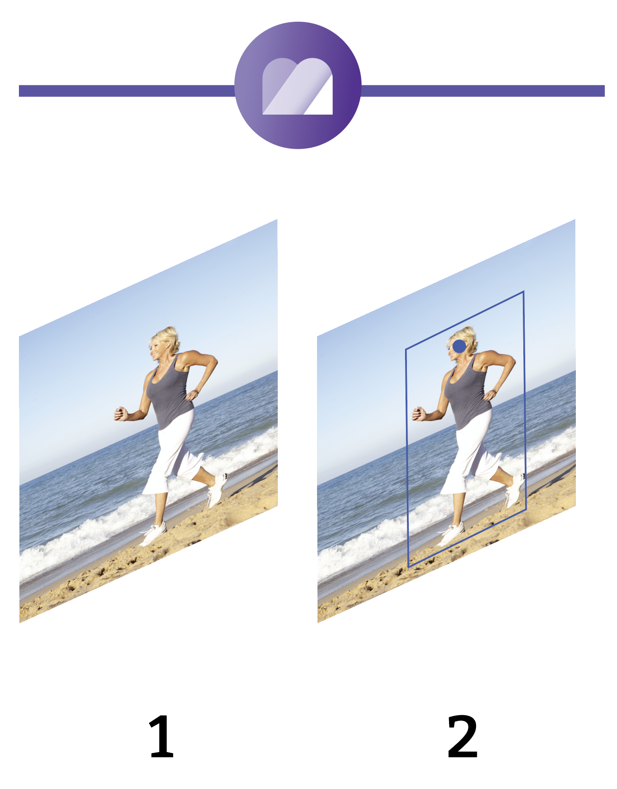

# Smart Crop in GraFx Media

Smart Crop starts in GraFx Media. When you upload an image, GraFx Genie recognizes the subject and stores two pieces of metadata on the asset. That metadata is then used to position the image accurately in your templates and final output.

- The **Subject Area** is the boundary around the most important element in the image.

- The **Point of Interest** is the specific point within the Subject Area where the focus should be placed.

## Read more

- [Smart Crop](/GraFx-Genie/concepts/smart-crop/): the full concept in the GraFx Genie section, covering how cropping works, the rules, subject types, and versions.
- [Set the Subject Area & POI](/GraFx-Media/guides/smart-crop-subject-area/): the step-by-step guide for reviewing and adjusting the metadata in GraFx Media.
