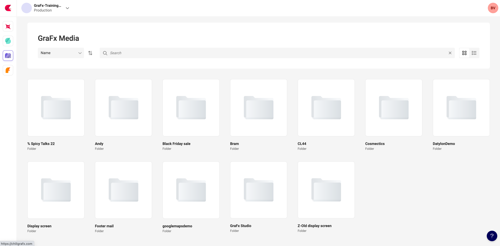
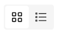
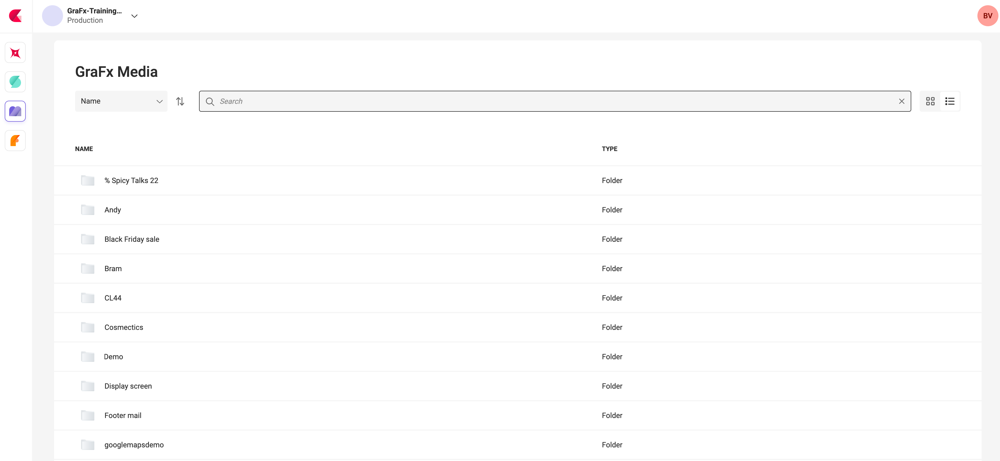
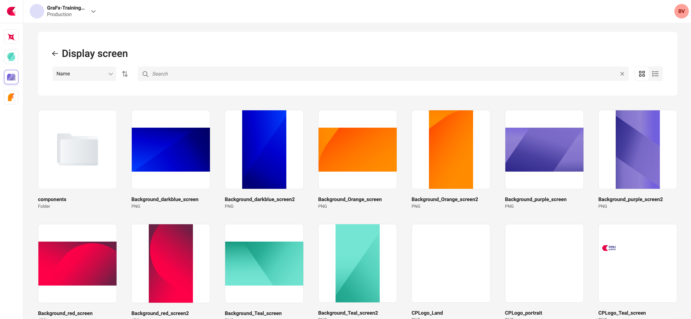
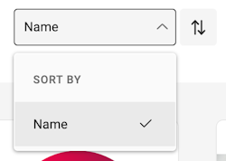
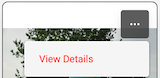
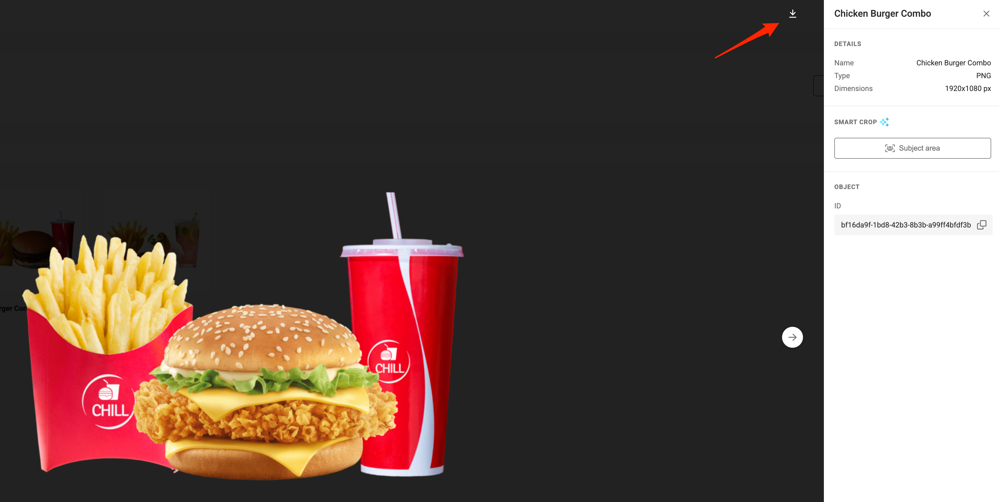

# Browsing GraFx Media

<iframe width="690" height="388" src="https://www.youtube.com/embed/c-ZVrb1i48M?controls=1&mute=0&showinfo=0&rel=0&autoplay=0&loop=0" title="YouTube video player" frameborder="0" allow="accelerometer; autoplay; clipboard-write; encrypted-media; gyroscope; picture-in-picture; web-share" referrerpolicy="strict-origin-when-cross-origin" allowfullscreen></iframe>

[Getting Started with GraFx Studio — full course](https://www.youtube.com/playlist?list=PLOzpLl2aXHcM)

## Browse

Initially, the top-level directory structure is shown. The default view is by grid.

The slider next to the search bar allows switching between grid and list view.

A single click on a folder will bring you one level down, and show the folder contents.

## Sort

In front of the search bar, you can select the field and order how the assets will be sorted.

## Details

Click on the asset or "view details" under the three dots menu "...", to show the details and meta-data.

Available details:

- Preview of the assets
- Filename
- File type
- Dimensions
- [Smart Crop](../smart-crop-subject-area/)
- Object ID

The Object ID is the unique reference of the asset in the environment. This is the reference to refer to the asset, when an Integration refers to the asset.

You can download the original through the down-arrow in the top right of the asset window.