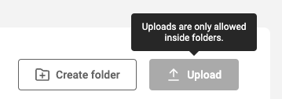
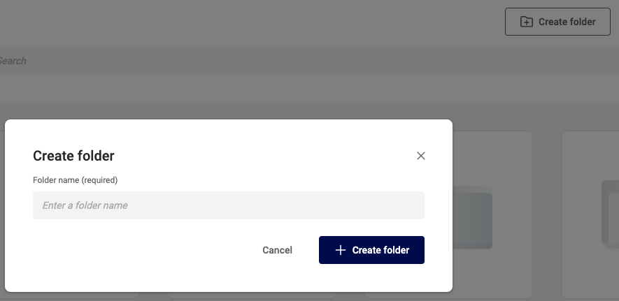
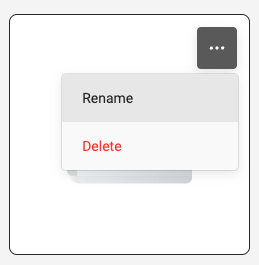
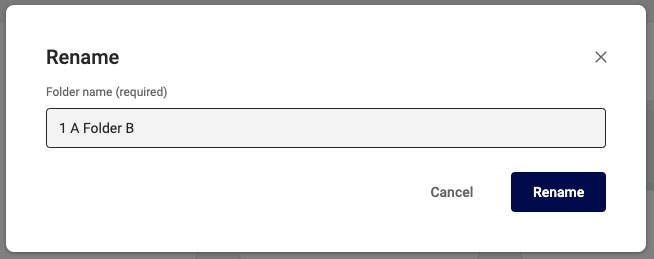
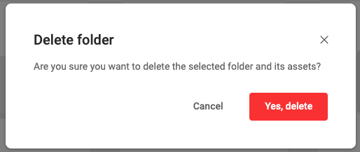

# Manage Folders in GraFx Media

## Introduction

GraFx Media is used to store your assets you will use in [GraFx Studio](/GraFx-Studio/) and [GraFx Publisher](/GraFx-Publisher/).

Assets are arranged in folders and subfolders.

Assets can be uploaded in a folder, not on the root level of GraFx Media.

## Add a folder

Click the "Create folder" button, and enter a folder name.

## Rename a folder

Hover the mouse over a folder, and click on the "..." menu.

Choose the "Rename" option.

Confirm in the dialog box.

## Delete a folder

Hover the mouse over a folder, and click on the "..." menu.

Choose the (red) "Delete" option.

Confirm your delete action, by clicking the "Yes, delete" button.

All contents of the folder will be deleted.

