# Set Subject Area for Smart Crop

To understand the concept, see [**Smart Crop**](../../concepts/genie-smart-crop/).

## Feature Channel

<iframe width="690" height="388" src="https://www.youtube.com/embed/SvH4A9fZHyg?si=ckTWvi_LvsxRA_wn&controls=1&mute=1&showinfo=0&rel=0&autoplay=0&loop=1" title="YouTube video player" frameborder="0" allow="accelerometer; autoplay; clipboard-write; encrypted-media; gyroscope; picture-in-picture; web-share" referrerpolicy="strict-origin-when-cross-origin" allowfullscreen></iframe>

[All feature videos](https://www.youtube.com/playlist?list=PLLHtQ1R6R-B_m7XAVySM9OjbbUscsgBOH)

## Selecting an Asset

In **GraFx Media**, select an uploaded asset to view its details.

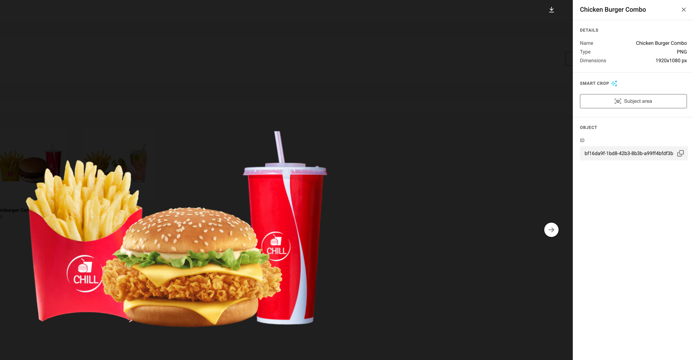{.screenshot}

## Setting the Subject Area

Click **Set Subject Area** to define or adjust the focal area of your image.

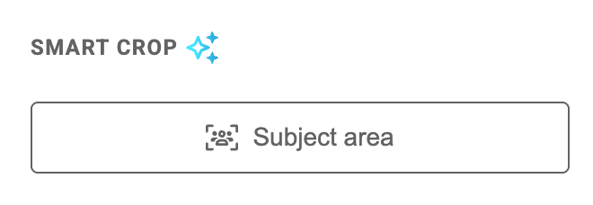{.screenshot}

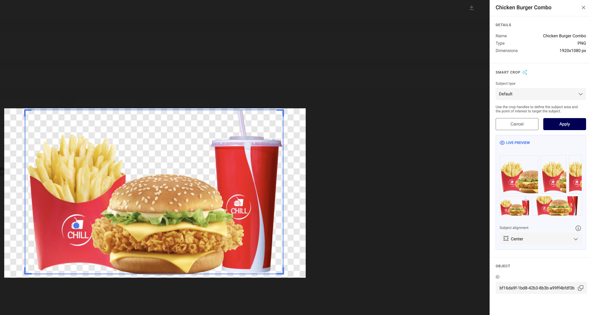{.screenshot}

A default **Subject Area** and **Point of Interest (POI)** are automatically detected upon upload. If these match your needs, no further action is required.

## Manual Override

If you want the image to focus on a different Point of Interest (POI).

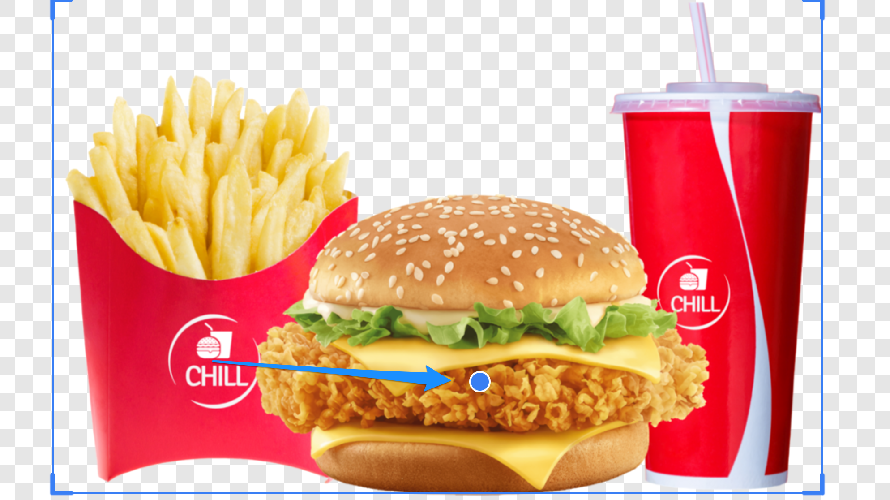{.screenshot}

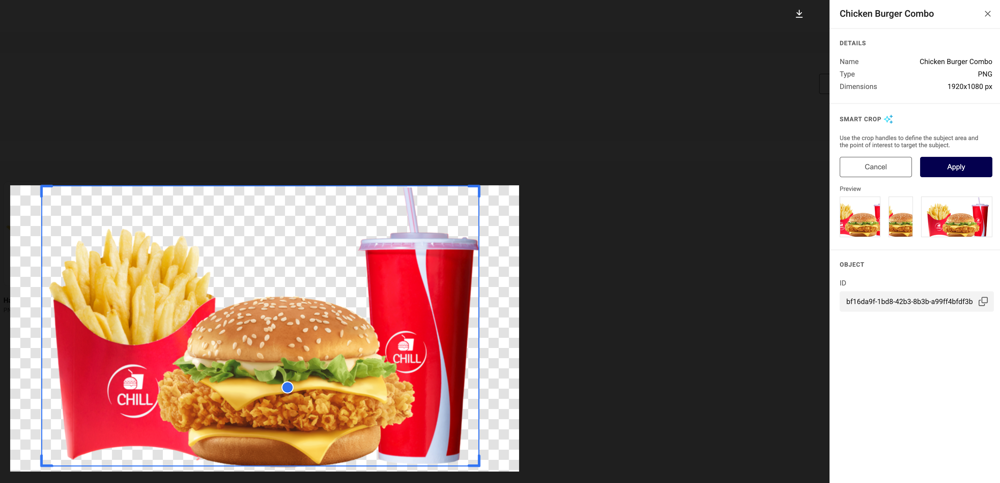{.screenshot}

If you want the image to focus on a different subject, you can manually adjust the Subject Area.

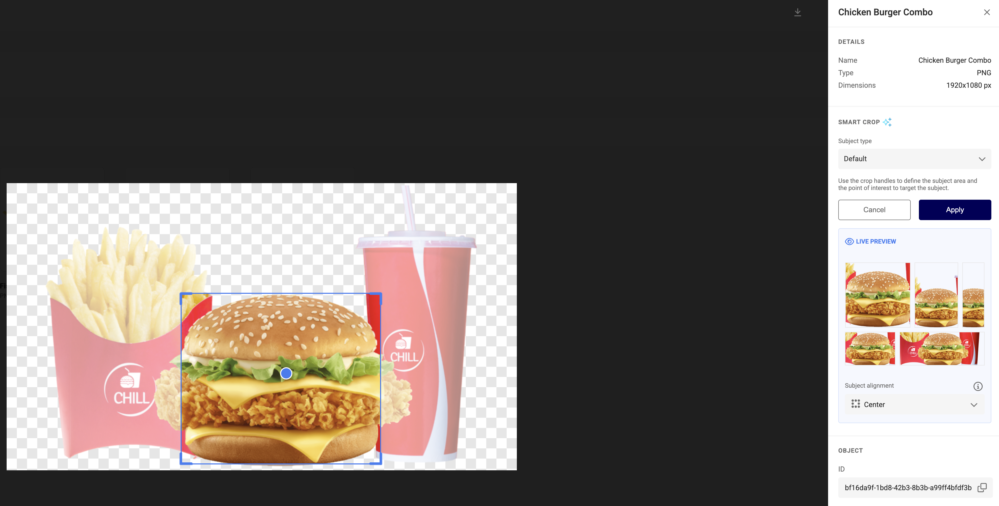{.screenshot}

In both cases, the preview images show the effect of your choice across 5 different aspect ratios.

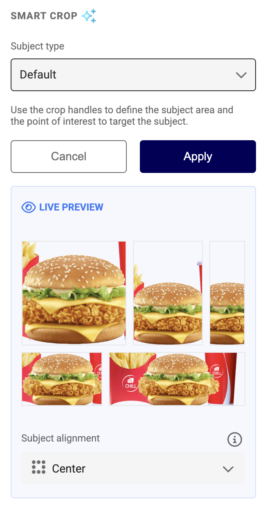{.screenshot}

Hit "Apply" to save the new Subject Area and POI.

!!! warning "This affects every template using the asset"
    The Subject Area and Point of Interest are stored on the asset itself, not on a template. Changing them updates how the asset is cropped everywhere it is used — in all templates that already reference it, not just new ones.

## Subject alignment

Grouped with the live previews is a **Subject alignment** dropdown. It controls where the subject sits within a frame's Subject Position when Smart Crop has room to move the image, and lets you preview that effect right here while setting the Subject Area and Point of Interest.

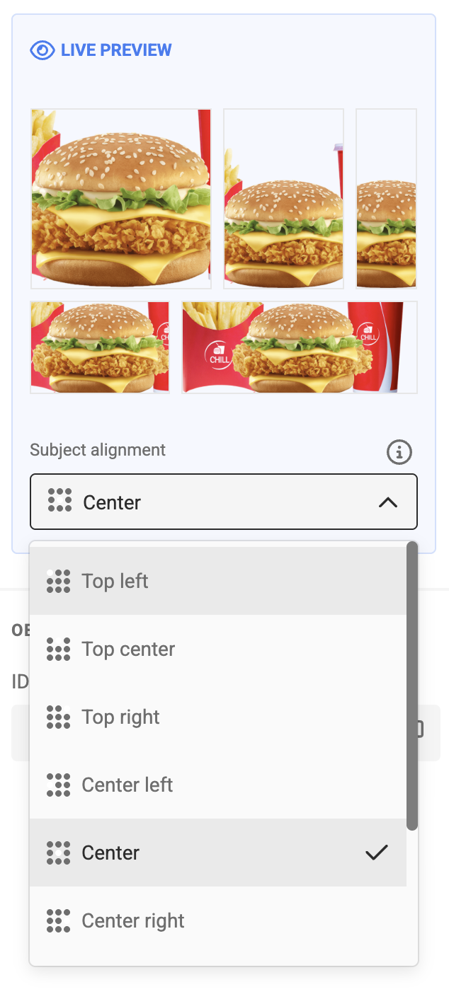{.screenshot}

Choose from a 3×3 grid of positions:

- **Top left**, **Top center**, **Top right**
- **Center left**, **Center** (the default), **Center right**
- **Bottom left**, **Bottom center**, **Bottom right**

The subject moves only as far as the image allows: once there is no more image to reveal on that side, it cannot shift further.

!!! info "Preview aid, not an asset property"
    In GraFx Media this setting is part of the live preview box — it shows how alignment would affect the crop, but it is not saved on the asset. The alignment that actually applies is set per image frame in GraFx Studio — see [Subject alignment](/GraFx-Studio/guides/smart-crop/#subject-alignment).

## Subject type

A **subject type** is a classification assigned to an image — for example *person*, *product*, or *logo* — that tells GraFx Genie what kind of subject the image contains. Subject types let you store a different Subject Area and Point of Interest per type, so the same asset can be cropped differently depending on the intent.

Subject types are defined centrally by environment admins. See [Manage Subject Types](/CHILI-GraFx/guides/manage-subject-types/) for how the list is configured.

### Set a Subject Area per subject type

When defining the Subject Area on a media detail view, a **Subject type** dropdown appears alongside the area controls. It lists **Default** plus every subject type defined on the environment.

- **Default** is the Subject Area and POI detected automatically on upload. This is what Smart Crop uses when no subject type is selected on the image frame.
- Selecting a custom subject type (for example *People*) loads the Subject Area and POI stored for that type, if any. Adjust and **Apply** to save a variant specific to that type.

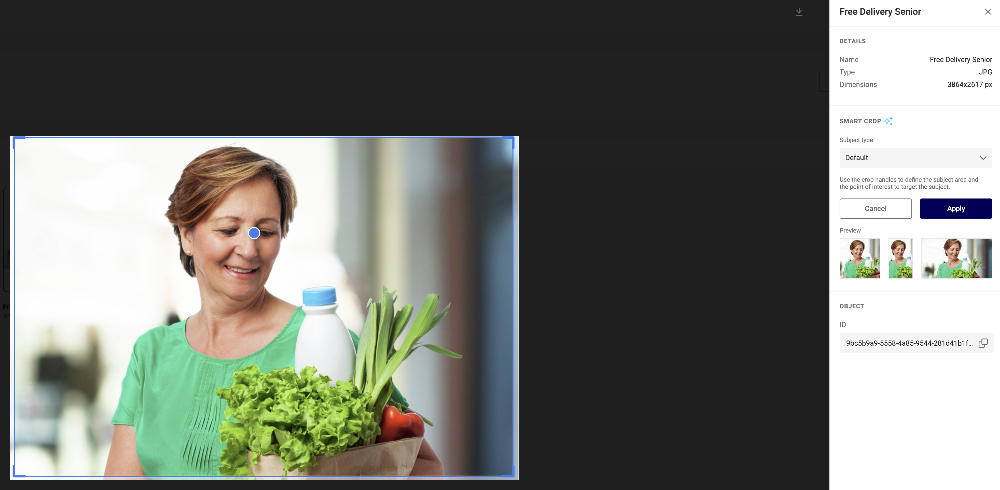

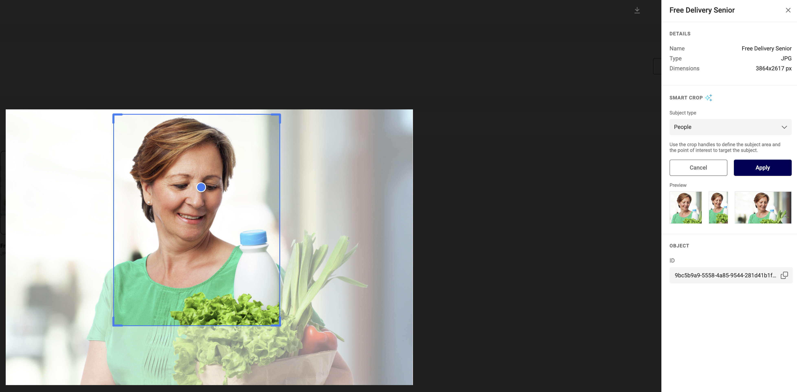

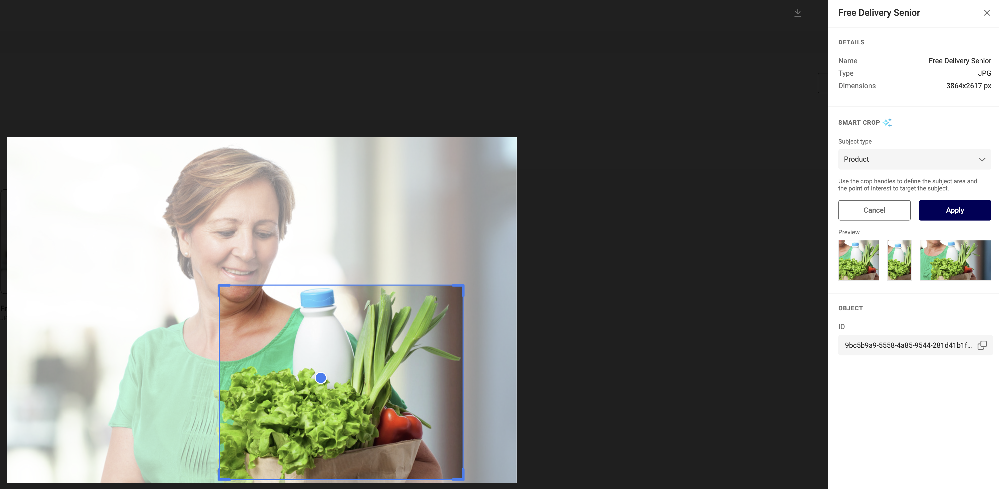

Switching between subject types in the dropdown shows the stored values for each — in the example above, *Default* keeps the full scene, *People* tightens around the person, and *Product* zooms in further on the face. *Cancel* discards any unapplied changes as before.

!!! info "Where this is available"
    The **Subject type** dropdown is available on the media detail view of both GraFx Media assets and third-party assets browsed through a media connector inside GraFx Studio.
