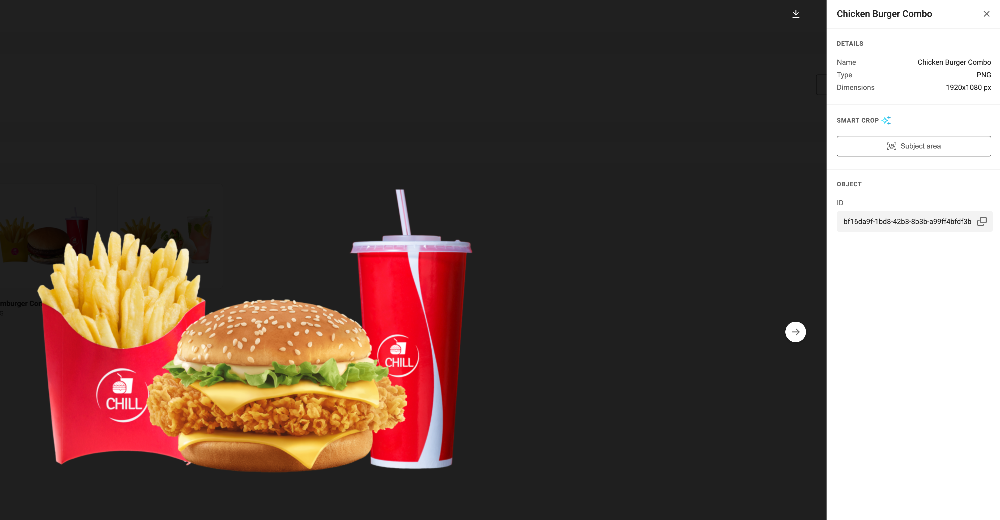

# Set Subject Area for Smart Crop

To understand the concept, see [**Smart Crop**](../../concepts/genie-smart-crop/).

## Selecting an Asset

In **GraFx Media**, select an uploaded asset to view its details.

## Setting the Subject Area

Click **Set Subject Area** to define or adjust the focal area of your image.

A default **Subject Area** and **Point of Interest (POI)** are automatically detected upon upload. If these match your needs, no further action is required.

## Manual Override

If you want the image to focus on a different subject, you can manually adjust the Subject Area and the Point of Interest (POI) directly on the asset.

Changes are applied immediately, no saving is required.