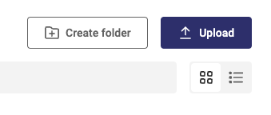

# Uploading media in GraFx Media

## Introduction

GraFx Media is used to store your assets you will use in [GraFx Studio](/GraFx-Studio/) and [GraFx Publisher](/GraFx-Publisher/).

Assets are arranged in folder and subfolders.

Assets can be uploaded in a folder, not on the root level of GraFx Media.

{.screenshot-full}

## Uploading

Go to the folder where you want to upload new assets.

Click the "Upload" button.

{.screenshot}

Select 1 or more files from your local system.

Choose one of the [supported](/GraFx-Media/overview/filetypes/) file types.

After the upload is done, you'll see a preview of the file(s).

Generating the preview can take a few seconds.