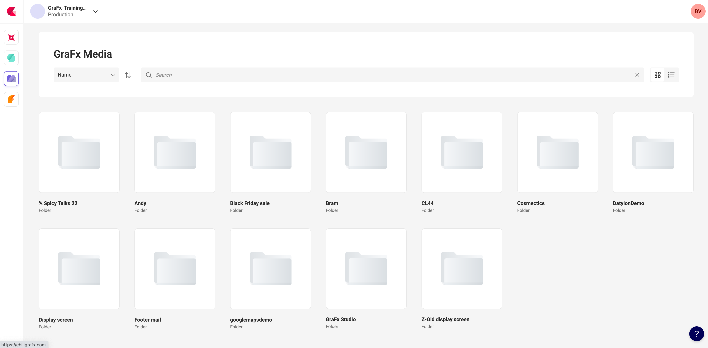
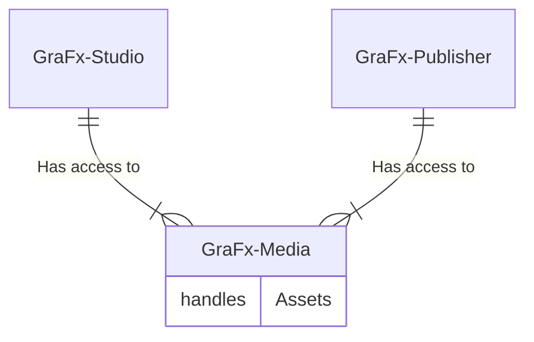

# Introduction

GraFx Media is the central repository to store your assets to be used in your Smart Templates.

GraFx Media uses the same repository for GraFx Publisher and GraFx Studio. This facilitates maintaining brand consistency throughout all your output.

## Media for all editors

