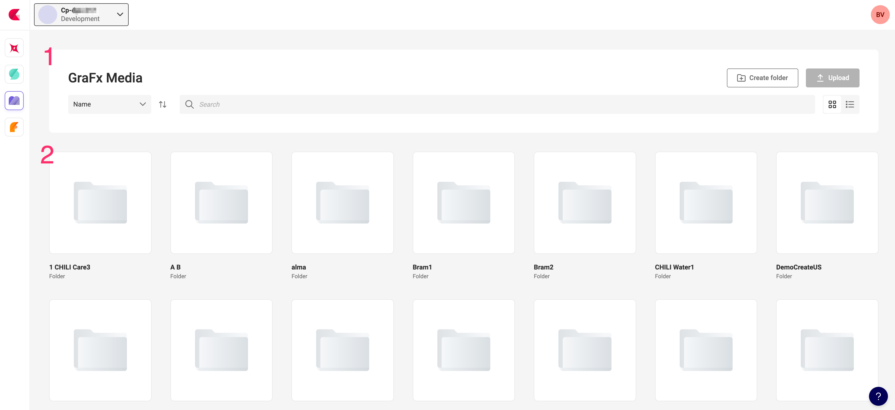
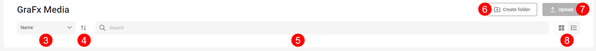

# Viewing assets in GraFx Media

When opening GraFx Media, you see the action banner (1) and below all top level folders (2).

### 1 Action banner

The area of the application where you manipulate the contents. You can search, sort and change the view.

### 2 Folders and media

Similar to what you're used to in any OS, a view on the folders and their contents.

## Action banner

### 3 Sort Field

Select the field you want to sort the contents below

### 4 Sorting order

Select the order or sorting (ascending or descending)

### 5 Search field

Search on the name or ID of an asset

### 6 Create folder

Add a (sub)folder at the current location

### 7 Upload button

Upload an asset to the current location

### 8 View

View the contents in a grid or list view