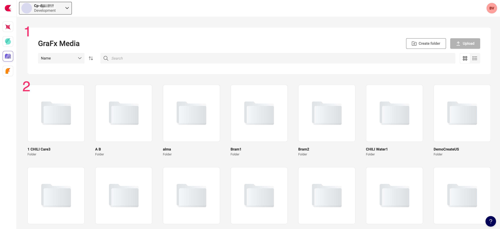
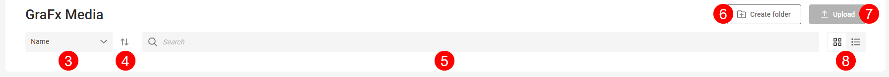

# Viewing assets in GraFx Media

When opening GraFx Media, you see the action banner (1) and below all top level folders (2).

{.screenshot}
 

1
**Action Banner:**
The area of the application where you interact with the contents. You can search, sort and change the view.

2
**Folders and Media:**
Similar to what you're used to in any OS, a view on the folders and their contents.

## Action banner

{.screenshot-full}
 

3
**Sort Field:**
Select the field you want to sort the contents below

4
**Sorting order:**
Select the order or sorting (ascending or descending)

5
**Search field:**
Search on the name or ID of an asset

6
**Create folder:**
Add a (sub)folder at the current location

7
**Upload button:**
Upload asset(s) to the current location. (You can upload 1 or more at the same time)

8
**View:**
View the contents in a grid or list view
