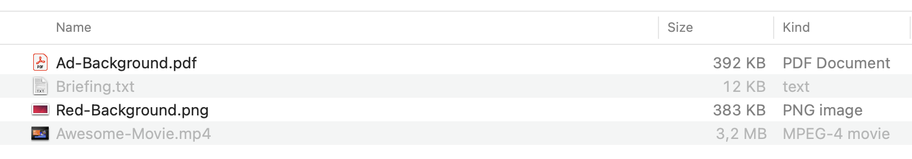
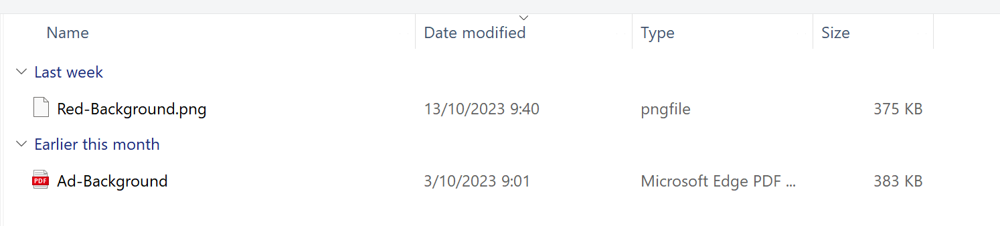

# Supported file types

GraFx Media is used to support your assets for both smart template editors.

Below is a list of supported file types.

	- .eps
	- .jpg
	- .pdf
	- .png
	- .psd
	- .tif
	- .ai
	
Your upload window will only allow supported file types. The other files will be grayed out (OSX) or not shown (Windows).

## PDF assets

When you use a PDF as an asset in a Smart Template, its vector content is kept on PDF output. The PDF is not flattened.

See [Embedded PDF assets](/GraFx-Studio/guides/output/pdf/#embedded-pdf-assets) for what is and is not carried over.
