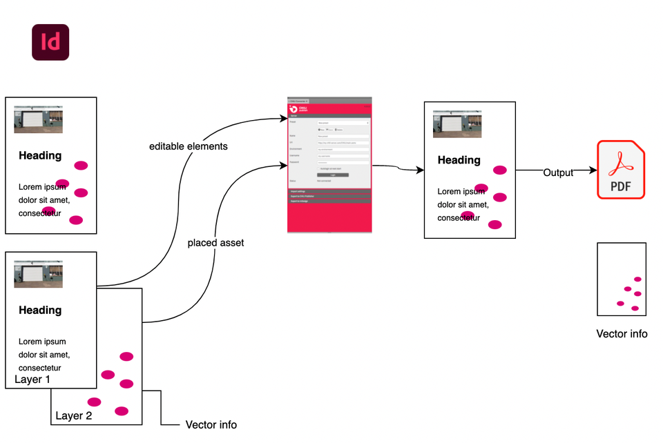
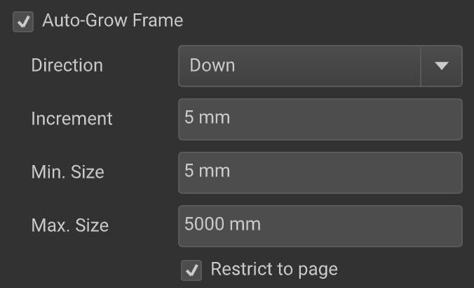
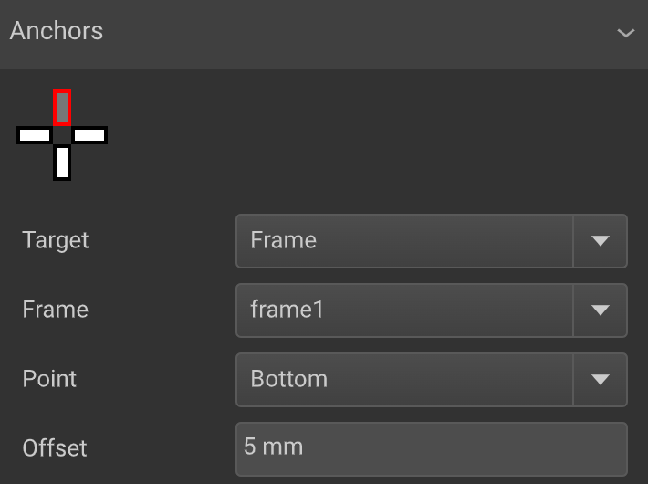
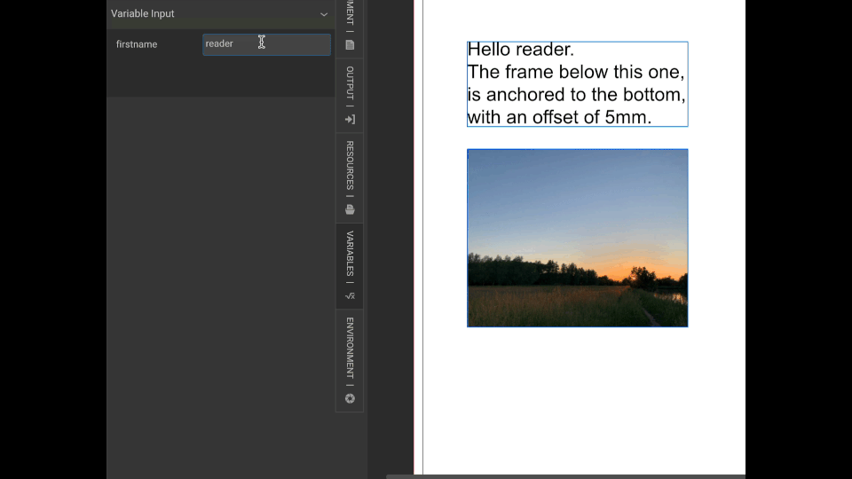
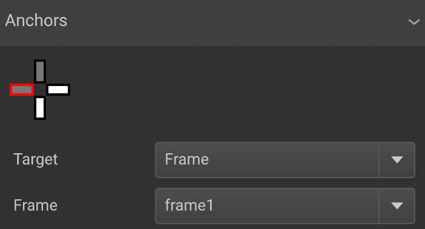

[1](https://chilipublishdocs.atlassian.net/wiki/spaces/CPDOC/pages/1442021405/Smart+er+templates+are+less+complex)

[Folder settings](https://chilipublishdocs.atlassian.net/wiki/spaces/CPDOC/pages/1413921/Library+Settings)

[Blank doc templates](https://chilipublishdocs.atlassian.net/wiki/spaces/CPDOC/pages/1413923/Blank+Doc.+Templates)

# Smart(er) Templates

A smart template is a digital design that automates the creation of multiple document variants from a single template. 

It integrates business logic and automation to facilitate efficient customization, while ensuring consistency and accuracy across various outputs. This concept is especially useful in producing personalized assets quickly and uniformly, significantly saving time and resources.

## GraFx Publisher: Simplifying Template Building

GraFx Publisher is a template building engine that enables the creation of multiple document variants from one smart template. The key is to maximize the smart template's potential without overcomplicating it.

## The Formula: B(ATS){*}

For those not fond of [regex](https://en.wikipedia.org/wiki/Regular_expression), here's what B(ATS){*} means:

- **B**uild template
- **A**dd 1 type of logic
- **T**est
- **S**implify
- **{***} Repeat until satisfied

### Build Your Template

Your smart template journey likely begins on your desktop. If not, proceed to "Build your template".

**Conversion**

The challenge isn't the conversion itself, but what you convert. Simplifying before conversion aids in achieving simplicity. For instance, combining thousands of vector elements used in a background into one vector layer increases simplicity.

Imagine a design with a few thousand vector elements, used as a background. When converting, these elements will be converted to vector elements, to be calculated individually to show in your browser.

If these elements remain static background items — they do not change with any variant — you can increase simplicity by combining all these elements into 1 layer and place this layer as an asset.

The GraFx Publisher Converter will do this for you, for the selected layer.

## Build Your Smart Template

With your document ready, it's time to make it smarter using GraFx Publisher. This involves adding logic to the document.

### Add Logic

Adding logic is central to GraFx Publisher, enabling a smart template to produce various outputs. For example, a campaign for CHILL water could use a database to feed different outputs, flavors, etc., to the template.

#### Example

Consider frames that auto-grow and are anchored to each other, creating multiple calculations.

Frame1 will auto-grow, according to more content added

Frame2 is anchored, to Frame1, and will refer to its bottom coordinates.

So, when more content is added, Frame1 grows, and Frame2 will move down.

These are 3 calculations to be coordinated.

- Variables
- Auto-grow
- Anchoring

Each layer of logic will add complexity, and make the document “heavier” to calculate the output.

!!! Tip
	Add 1 layer at a time, and test before adding more complexity

### Test

After adding a layer of automation logic, test it thoroughly with various variable content.

How can you test? That will differ according to your setup. If your setup allows the interaction with an end-user to fill in the variable, look for challenging variable content. What is the shortest word, what is the longest variant?

Maybe your setup contains a datasource, that will auto populate the variables. It’s best then to check the shortest and longest variable. Does the datasource contain special characters?

!!! Tip
	Check variable input with a pre-set of test content (long, short, special characters)

### Simplify

Consider simplification before adding more logic. For example, unnecessary anchors can be removed to save processing time.

E.g. You can add a frame anchor to the left and bottom of another frame. 

In the picture, you see Frame2 is anchored to 2 targets.

Frame2 is anchored to the bottom, where the top of Frame2 is anchored to the bottom of Frame1, with an offset of 5mm.

Frame2 is anchored to the left side of Frame1, without offset.

There’s nothing wrong with this setup, but the left of Frame1 never changes. So, the second anchor of Frame2 is unnecessary. And it would mean a 4th calculation, where only 3 are necessary.

This is a easy simplification, than can save processing time. 

Even when it only saves a few microseconds, this would be multiplied by 

- Amount of outputs (1 digital / 2 print)
- Amount of records in a Data Source (e.g. 1M)

This add up to: 5 microseconds x 2 million = 10 million microseconds = 166 minutes.

!!! Tip
	Think volume when you create your template. Bigger variant runs, bigger savings

### Repeat {*}

Continue the process of adding logic, testing, and simplifying. Regular improvement is key.

## Template Building: An Inexact Science

Templates are created by humans, leading to creative and diverse solutions. Following the BATS approach helps in achieving the best outcome. Document each step for easy backtracking.

## Cost Weight

Features in a template have different impacts on complexity. Understanding the "tax" of each feature helps in balancing complexity and testing needs.

!!! Warning
	There is no exact weight nor cost, since it will always depend on the context and your specific situation.

| Tax Level       | Features |
|-----------------|----------|
| Low Tax         | Swatches, Image frames, Simple vector objects, Text frames, Simple variables |
| Medium Tax      | Text in shapes, Complex variables, Actions |
| Heavier Tax     | Snippets, Alternate Layouts, Complex Actions, Anchors, Dynamic Layouts, Logic/Actions triggering other logic, Transparency effects |

> **Warning:** Combining multiple "Low Tax" features can also increase complexity.
