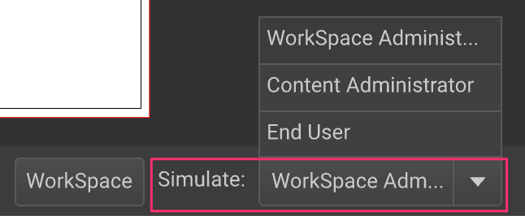
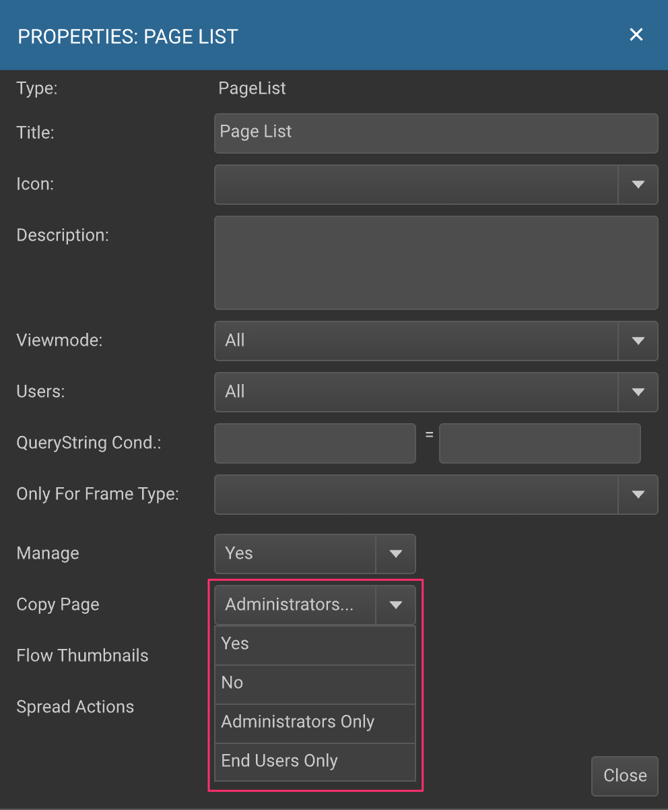

# User Levels in GraFx Publisher Editor

## Overview
GraFx Publisher's Editor is a dynamic environment for Smart Template Designers. It offers capabilities to:

- Create designs (from scratch)
- Template Design: Apply business logic

!!! note "Template Design"

    When talking about "Template Design" we refer to the concept of applying business rules to a document.
    By applying business rules (constraints, visibility rules, variables, ...) you convert the static document into a Smart Template, and prepare is to be used in an end-user facing protal.
    
## User Levels

For each Tab, Panel and Toolbar you can define the accessibility for a specific user level. The general pulldown for the user level is explained at the top of the page. But also for specific options the user level can be defined via a pulldown menu, allowing you to customize the User Interface and experience to the fullest.

- **Administrator**: This default level for template designers offers detailed control over template design.
- **Normal User/End User**: In customer-facing portals, users interact with templates at this level.
- **Content Administration**: A mid-tier level, offering enhanced privileges based on panel definitions.

**Level Simulation**: Administrators can simulate different user experiences.

## Customizing User Experience
Define access levels for Tabs, Panels, Toolbars, and individual options. Customization includes:

- **General Accessibility**: Choose who sees what, from all users to specific user levels like Administrators or End Users.
- **Detailed Control**: Tailor the User Interface and experience precisely, enhancing usability and efficiency.

## Workspaces

When opening the editor, you are working in a "default" workspace. This is a group of settings, on how the workspace should look like.

All the settings you make for accessibility for Administrators or End-users can be saved in a workspace setting. See also [Workspaces](/GraFx-Publisher/concepts/workspace/).