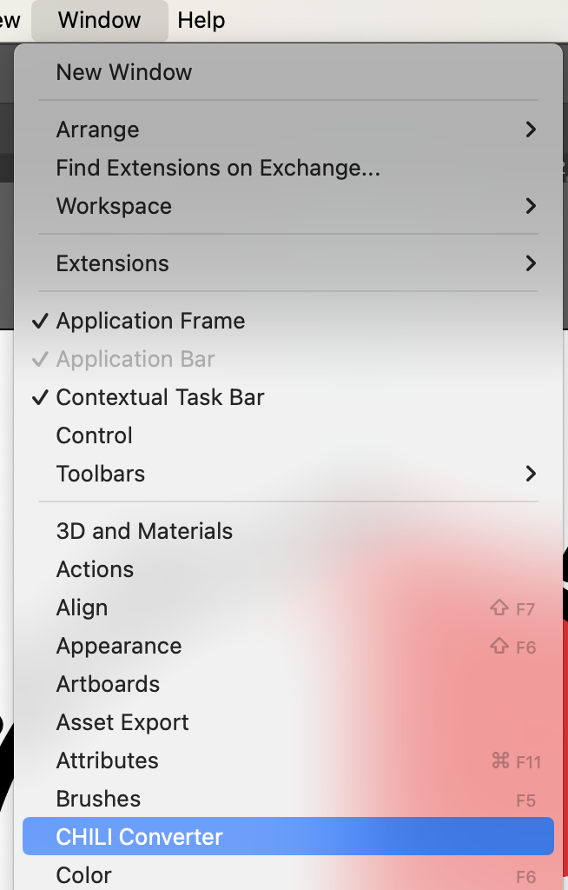
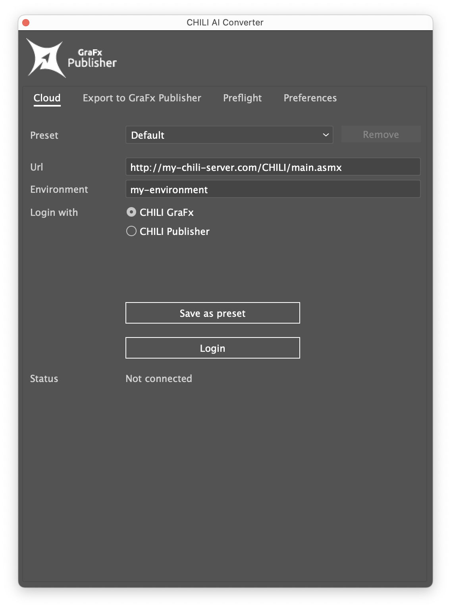
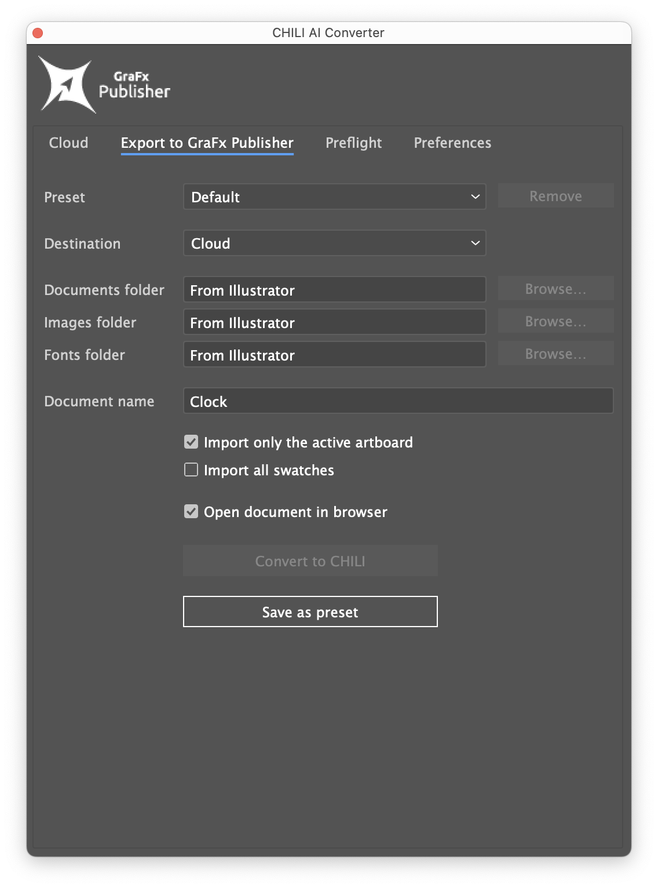
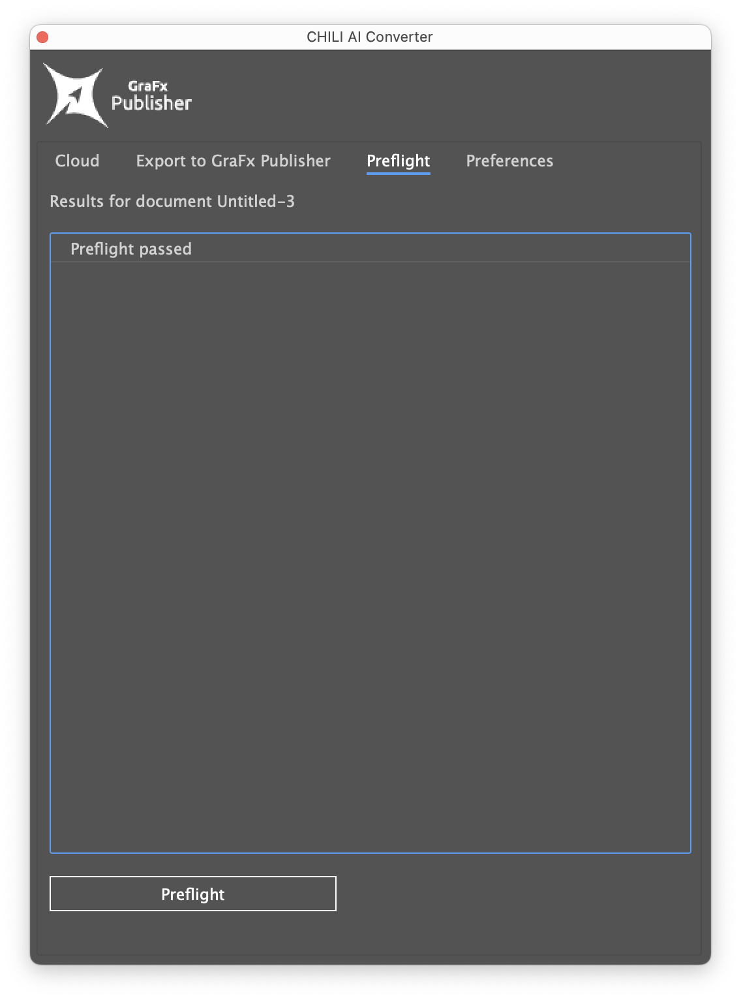
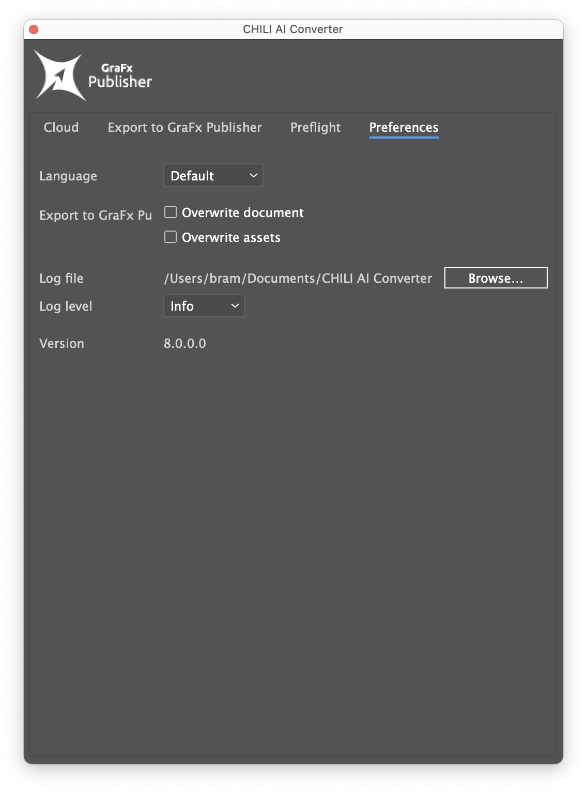

# GraFx Publisher Converter for Illustrator

## Download the Latest Version

Get the newest release [Version 8.0 here](https://s3.eu-central-1.amazonaws.com/releases.chili-publish.com/releases/Desktop_Tools/8.0.0.0_Ai_202403130815/CHILI_Illustrator_Plugin_8.0.0.0.zip).

## Converter Overview

### Server Connection Setup

- **Preset**: Save your server connection as a preset for easy future access.
- **URL**: Enter the URL to your GraFx Publisher instance. 
    - GraFx Publisher format: `https://[your CHILI url]/main.asmx`
    - Legacy systems format: `https://[your CHILI url]/CHILI/main.asmx`
- **Environment**: Specify the name of your environment.
- **Login**: Authenticate using your CHILI GraFx platform credentials.
- **Status**: Check your connection status.

### Exporting to GraFx Publisher

Configure your export settings:

- **Preset**: Use a previously saved preset.
- **Destination**: Choose between uploading to GraFx Publisher or creating a local CHILI package.
- **Folders**: Designate folders for documents, images, and fonts. Ensure these exist before conversion.
- **Document Name**: Set your file's name.

### Preflight Checks

Identify potential issues before conversion with Preflight checks.

### Preferences

Customize your settings:

- **Language**
- **Overwrite Options**
- **Logging**: Enable detailed conversion logs.
- **Log Level**: Select the amount of detail for your logs.
- **Version**: View the current version.