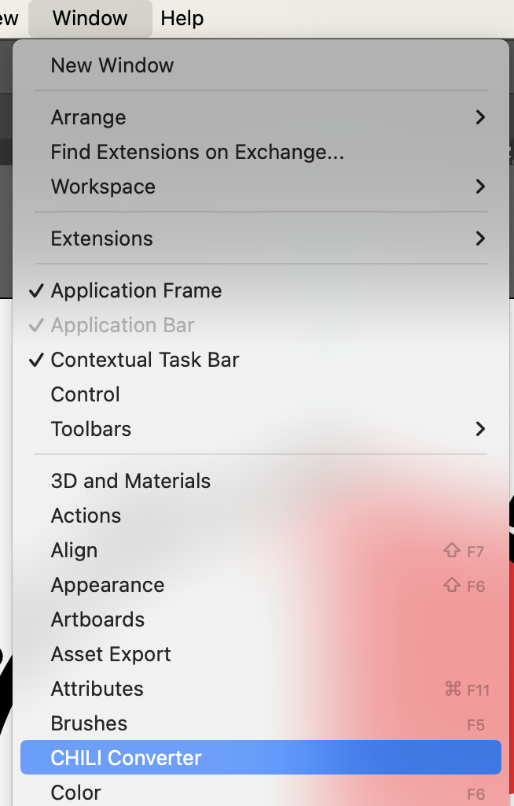
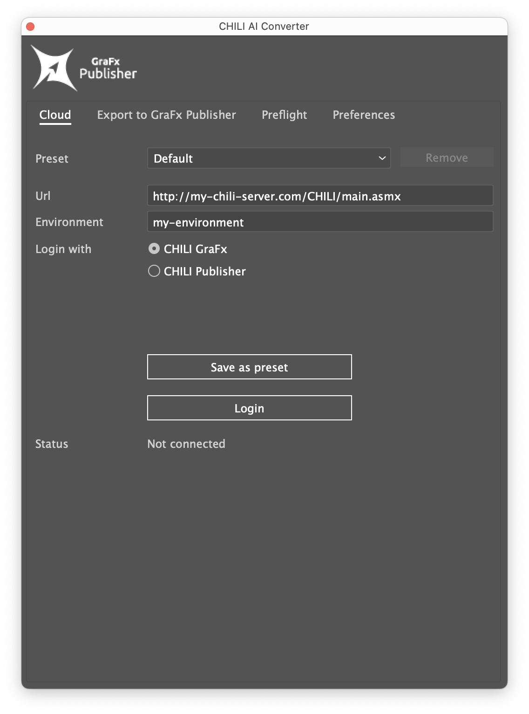
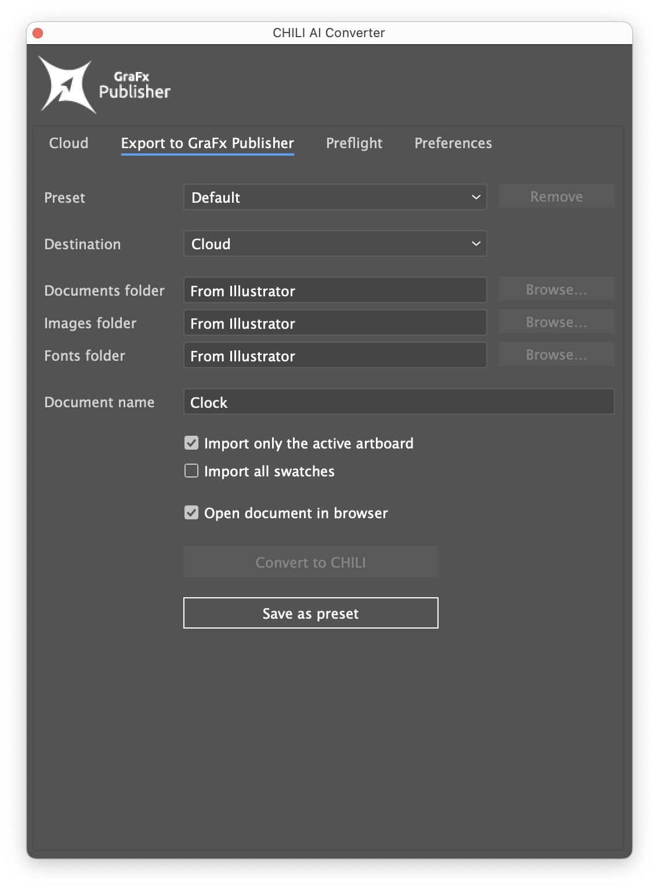
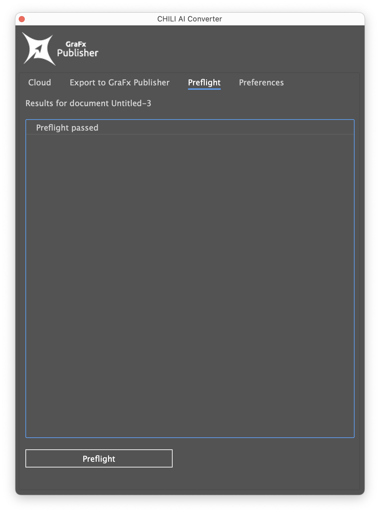
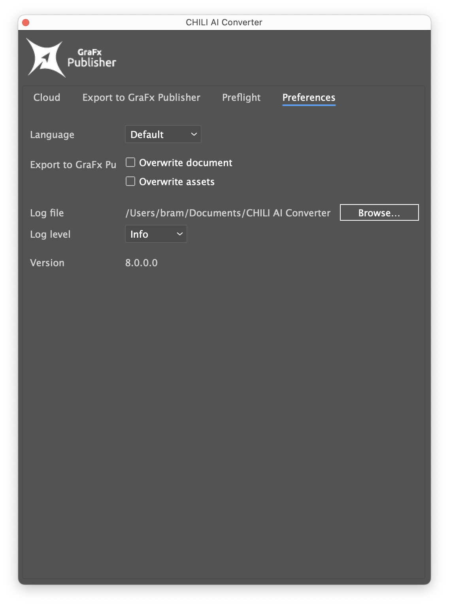

# GraFx Publisher Converter for Adobe® Illustrator®

## Download

Get the latest plugin from the [GraFx Publisher plugin downloads](/GraFx-Publisher/convert/downloads/) page.

The plugin has been tested and is compatible with Adobe® Illustrator® versions from 2024 and 2025.

The latest tested version is 29.2.1 (January 2025).

## Converter Overview

{.screenshot}

### Server Connection Setup

{.screenshot}

- **Preset**: Save your server connection as a preset for easy future access.
- **URL**: Enter the URL to your GraFx Publisher instance. 
    - GraFx Publisher format: `https://[your CHILI url]/main.asmx`
    - Legacy systems format: `https://[your CHILI url]/CHILI/main.asmx`
- **Environment**: Specify the name of your environment.
- **Login**: Authenticate using your CHILI GraFx platform credentials.
- **Status**: Check your connection status.

### Exporting to GraFx Publisher

{.screenshot}

Configure your export settings:

- **Preset**: Use a previously saved preset.
- **Destination**: Choose between uploading to GraFx Publisher or creating a local CHILI package.
- **Folders**: Designate folders for documents, images, and fonts. Ensure these exist before conversion.
- **Document Name**: Set your file's name.

### Preflight Checks

Identify potential issues before conversion with Preflight checks.

{.screenshot}

### Preferences

{.screenshot}

Customize your settings:

- **Language**
- **Overwrite Options**
- **Logging**: Enable detailed conversion logs.
- **Log Level**: Select the amount of detail for your logs.
- **Version**: View the current version.