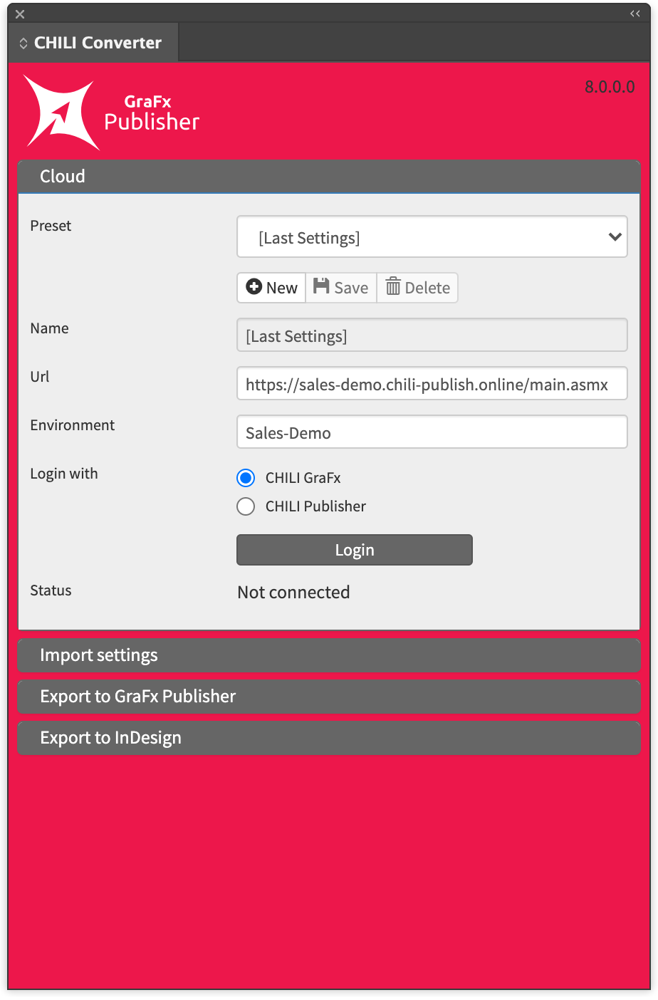

# GraFx Publisher Converter for Adobe® InDesign®

## Download

Download the newest version

[Version 8.0 (Unsigned)](https://s3.eu-central-1.amazonaws.com/releases.chili-publish.com/releases/Desktop_Tools/8.0.0.0_Id_202403130816/CHILI_InDesign_Extensions_8.0.0.0_Unsigned.zip)

[Version 8.0](https://s3.eu-central-1.amazonaws.com/releases.chili-publish.com/releases/Desktop_Tools/8.0.0.0_Id_202403130816/CHILI_InDesign_Extensions_8.0.0.0.zip)

The plugin has been tested and is compatible with Adobe® InDesign® versions from 2024 and 2025.

The latest tested version is 20.1 (January 2025).

## How to access Converter?

You can find the GraFx Publisher converter in Adobe® InDesign® under the "Window" menu.

There are two ways of working: online and offline.
When working offline the conversion of the document will happen locally and the end result will be a GraFx Publisher Package file [.zip] saved to your local drive.

This file will contain the converted document as well as all the images and fonts used in the document. This file will be uploaded to GraFx Publisher in a later stage.

When working online, a direct connection is made. To do that you specify the link to the server, the environment where you want to upload the document, and a username and password.

Once logged in you are presented with a similar interface as when working offline. If you are logged in as an admin you are still able to select another environment if necessary.
In this mode, the converted file, images and fonts will be uploaded immediately to the server after conversion.

Working in online modus also offers you the possibility to convert a GraFx Publisher document back to InDesign® via the "Export to InDesign®" panel.

## Export an Indesign® document to GraFx Publisher

### Server panel

- Preset: From the drop down menu you can select previously saved login settings. When you regularly need to connect to different servers this will save you time.
- New - Save - Delete: Via these buttons you can save and create presets for different connections to GraFx Publisher servers or different environments on one server.
- Preset name: Name used for the preset when saving connection settings
- URL: Connection to a GraFx Publisher server. http:// your server IP address or domain /CHILI/main.asmx
- Environment let's you specify the environment for which you have an account
- Name: your username
- Password: your password
- Auto login: click this button to login to the server and environment
- Status: displays the connection status

## Import settings panel

- **Preset**: From the drop down menu you can select previously saved login settings. When you regularly need to connect to different servers this will save you time.
- **New - Save - Delete**: Via these buttons you can save and create presets for different connections to GraFx Publisher servers or different environments on one server.
- **Preset name**: Name used for the preset when saving connection settings
- **Documents** specifies the destination path of the document on the GraFx Publisher server after conversion.
- **Images**: specifies the destination path of the images on the GraFx Publisher server after conversion.
- **Fonts**: specifies the destination path of the fonts on the GraFx Publisher server after conversion.

Paths can be entered manually or selected via the browse button. If the destination folder doesn't exist yet, it will be created automatically. 
 

- **Log file**: specifies the destination path for the log file. This is a local path on your computer (f.e. path on a macintosh: /Users/Usersname/chiliLog.txt)
- **Log detail**: Specifies the level of detail when logging items in the log file.
- **Include Document Preview** creates a preview of the InDesign® file along with the conversion
- **Convert gradients** to PDF will convert complex gradients to pdf and places them as an image in the online document.
- **Include hidden layers** includes the hidden layers of the InDesign® document
- **Use high resolution for locked layers** converts everything on the selected layer to pdf and places this on the layer
- **Import selection only** converts only the frames selected in the document.

## Export to GraFx Publisher

- **Source** specifies the document to convert (as multiple document can be opened in InDesign®)
- **Destination** allows to switch between online (server) or offline (package) conversion
- **Environment** let's you specify the environment where the converted document will be uploaded to [the selection is only available if your account gives you access to multiple environments]
- **Pages**: Specify the range of pages to convert or convert all pages
- **Locked Layers** is used to lock all elements on the selected layer [and the layer] automatically in the online version after conversion Saving you time. Layers with "lock" in the name or layers called "background" will be selected here by default
- **Go!** Starts the conversion. When you're working in offline, you will be asked where to save the package file after conversion
- **Open document** in browser Only available in online mode. After conversion the document will be opened in your default webbrowser when this is checked
- **Create ZIP** starts the conversion and the creation of the CHILI Package in offline modus

## Export to InDesign®

- **Environment** let's you specify the environment where the target document can be found
- **Document Name** Select the file for conversion
- **Layout** specifies which alternate lay-out will be converted in case the CHILI document has several defined [more about alternate lay-outs can be found here: Alternate Layouts]
- **Export setting** specifies which IDML preset to use for the conversion. More information can be found here: IDML conversion settings
- **Destination folder** specifies the save location on your local disk
- **File name**: Name of the file after conversion
- **Create document folder** creates a folder that will contain the converted document and the assets and fonts
- **Export** initiates the conversion process

## How to change the settings for the conversion of locked layers and images. 

With the installation of the converter 3 PDF presets are configured in Adobe® InDesign® as well, that control the conversion to PDF of locked layers and images.

The default presets are tested and guaranteed to work with GraFx Publisher and we offer full support for these.
You're welcome to change the settings at your own risk. Changes to these default settings are beyond our responsibility.

## Adobe PDF Presets

**Converter - Images**: This preset defines the settings for the conversion to pdf of images used in the InDesign® file (tiff, eps, psd, ai). GraFx Publisher supports these type of files natively as well, but when the conversion is done, images are optimized according to their dimensions used in the document (300dpi, at placed dimensions).

**Converter - Locked Layers High Res**: This preset defines the settings for the conversion to pdf of locked layers when the checkbox "Use high resolutions for Locked Layers" is selected.

**Converter - Locked Layers Low Res**: This preset defines the settings for the conversion to pdf of locked layers

