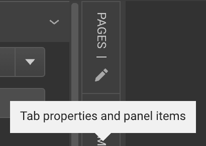
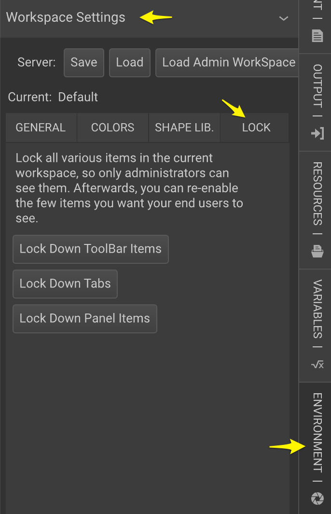
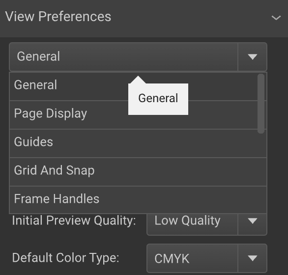
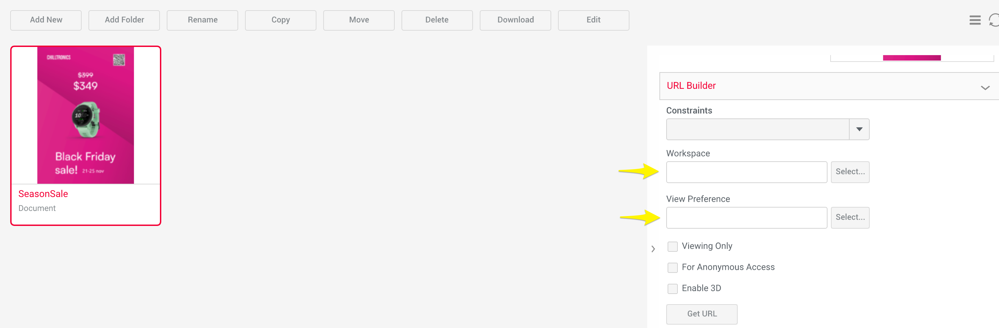
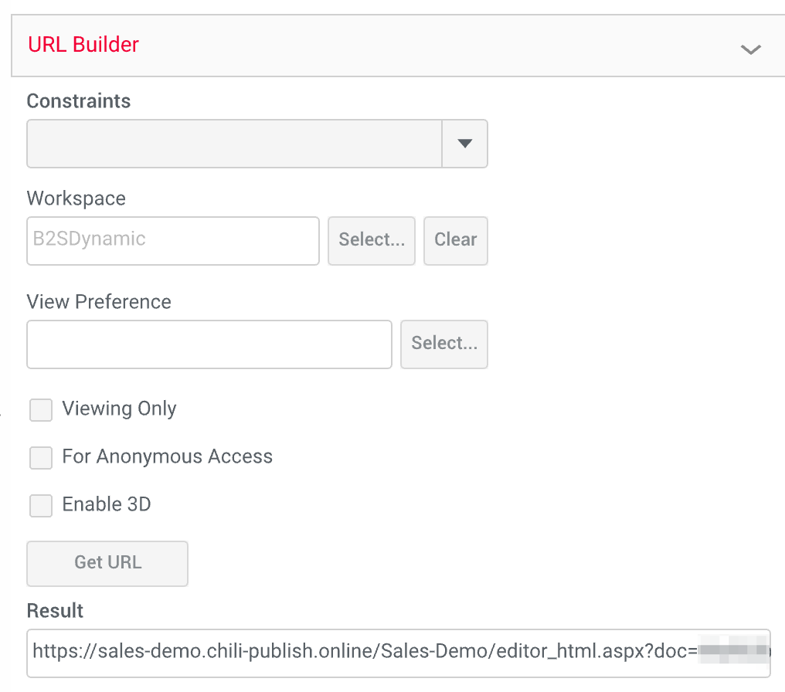

# Create Your First Document

Our guide introduces you to Smart Template creation using the tracer bullet approach. This method provides a quick, comprehensive overview of GraFx Publisher, highlighting key steps like converting Adobe InDesign documents, adding business logic, and more, without overwhelming you with intricate details.

This approach ensures you understand the overall workflow, laying the groundwork for future exploration.

- Convert an existing Adobe InDesign document
- Add business logic
- Define the end user experience
- Publish a link

## Pre-requisites

See [prerequisites](/GraFx-Publisher/guides/prerequisites/) for all the generic requirements to follow along.

Download the design package. (Contains an Adobe InDesign file and the necessary assets). You need the fonts on your local computer. (they are not included in the package).

- [Adobe InDesign file](Guide-01.zip)

## Convert

- Open the "**SeasonSale.indd**" file in Adobe InDesign.
- If you don't see the GraFx Publisher plugin yet, choose it from the Window menu.

- In the converter plugin, add your credentials in the "**server**" section of the plugin.
Your Environment Admin can provide you with the credentials.  
You need a Template Designer Seat.

- In the "**Import settings**" section, choose the destination where to store all converted elements.  
Documents, is where your converted file will be stored.  
Images, is where your placed assets will be stored in GraFx Media.
Fonts, is where your uploaded fonts will be stored in the GraFx Publisher Fonts repository.

- In the "**Export**" section, confirm the file you want to convert (only if you have more than one file open).
- Choose the destination "Server" means you'll convert to GraFx Publisher.
- Environment should be pre-selected, since you have entered your credentials for that environment.

- Press "Go"

- A dialog will ask to save the file.
- A progress bar will show the progress.

- When the conversion and upload are done, you'll get confirmation.

## Opening the Document

- Open [CHILI GraFx](https://chiligrafx.com/environments).
- Choose the Environment you have sent the document to.

- Open GraFx Publisher.

- Go to Resources > Documents > "**[foldername]**" (the destination you chose).

- Double-click the converted document.  
You will see the full workspace, with all Template Designer tools, panels, and tabs.

## Add Business Logic

Adding the "Smart" to your templates can be done in many ways. We'll highlight Variables and Constraints in this introductory guide.

Other options include:

- Dynamic layouts
- Snippets
- Data sources

### Variables

Variables allow you to create placeholders for text, images, or barcodes, and allow end-users to fill in their content.

For this guide, we'll make 2 variables, to allow the end-user to provide the price and reduced price for the promotion.

- Create 2 number variables (Tab: Variable Data, Panel: Variable List):  
  - price  
  - price-reduced

- Edit the created variables (pencil next to variables).  
Only change the type to "Number" for this guide.

- On the left in the "Variables" tab, you will see the entry fields.

- Add variables to the frames.  
In the frame of the price select the numbers of the price (don't select the $ sign).

- Double-click the Variable.  
In the variable list, double-click on the "price" variable.  
At first, you'll see a warning sign, since the name of the variable does not fit the small price field.

- Tell the frame it contains variables.  
Check the box in the "Variable Tools" panel, to tell the frame it contains a variable.

- Play with different values.  
Enter a few values in the Variable input panel, and see the live changes.

- Repeat for the other variable.  
Repeat the above steps to add a variable to the other frame.

!!! Tip "Tip: See the text frame contents"
    With a text frame selected, click on the "Edit story" button to see the full contents, including the variables.
     
     
     
     
     
     Uncheck the "Edit with formatting" to see black text on the background. Sometimes the text color will make it difficult

 to see and edit the contents.

     

### Constraints

One example of a constraint is the locking of, e.g., movement of frames.

- Lock 1 frame.  
Select the frame you want to lock.  
In the Frame tab, find the **Frame Constraints** panel.

- Lock for end users.  
Select the **lock for end users** at the "Set all to" dropdown. 
This will set all the fields below, to locked (for end users).

Frame constraints are saved with the template.

You can repeat this for all individual frames. But if you have a lot of frames, you can set constraints on the Document, Layer, or individual level. And you can set inheritance for the settings. More on setting constraints in this guide on [constraints](/GraFx-Publisher/guides/templates/set-constraints/).

## Define End User Experience

Until now, we worked in the Template Designer view (Workspace Administrator).

GraFx Publisher allows you to fine-tune how the end user will view the document. All elements surrounding the document are called the "Workspace." You can define what parts of that workspace will be visible for the end users.

Once you have defined what will be visible, and what not, you can save it into a settings file; the Workspace settings.

Another part of this definition is called View Preferences.

What you want to show is saved in the Workspace Settings.  
Things like units, default color space, color of the frame handles, are all saved into the View Preferences.

- Hide Workspace Elements
- Define View Preferences

### Preview End-User View

In the bottom toolbar, choose Simulate > End User. This will simulate how an end-user will see the document.

If you don't see the full dropdown list, hover your mouse over the right arrow to allow the bar to move so you see the full button.

You'll see a slightly different look. But it's far from a clean view at first sight.

In the guide [Arrange your workspace](/GraFx-Publisher/guides/templates/arrange-workspace/), we'll go into more detail on how to close the end-user view even more.

In the next steps, we'll explain how to define what you see as an end user.

### Hide Workspace Elements

Hover over a workspace element, and click on the pencil icon.

In the panel, select what type of users can see this panel.

- All: everybody
- Administrators: Only Template Designers a.k.a. Workspace Administrators
- Normal user: Only End Users

Close the panel, and repeat for all workspace elements.

But since there are a lot, you can choose to lock all of them down at once.

Go to Tab "Environment" > "Workspace Settings" > "Lock"

You can click all 3 buttons, to 

- Lock Down Toolbar Items
- Lock Down Tabs
- Lock Down Panel Items

This will set all elements to be hidden for end users.

Now you can set each individual panel, tab, or toolbar item back to visible.

When happy, click the save button in the "Workspace Settings" panel, to save the settings to CHILI GraFx. Give it a name, and you'll be able to recall it later.

### Define View Preferences

Set all items, for each group under the dropdown.

When ready, click the "Save" button to save these settings also to CHILI GraFx.

## Publish Link to the Document

The Smart Template is now defined, and you have defined Workspace Settings, and View Preferences.

There are even more options, you can find more information, e.g., on constraints here.

### Direct Links

An easy way to provide someone quick access is to provide a link to that person.

Go to the BackOffice, and select the Smart Template in the Resources > Documents section.

In the URL Builder, select a Workspace settings file, and in the View Preferences field, also select a View Preferences file.

Click the "Get URL" button.

You can copy the URL and send this to someone to interact with the document.

### Integration

Similarly, for the Integration, you would call the respective REST APIs to load a document, load Workspace Settings, load View Preferences, and get a URL to then populate to an iFrame or Div in your integration.

---

[A](https://chilipublishdocs.atlassian.net/wiki/spaces/CPDOC/pages/1413931/Creating+your+first+document)

[B](https://chilipublishdocs.atlassian.net/wiki/spaces/CPDOC/pages/1412230/Creating+a+first+document)