# Create your first document

This guide will walk you through all steps to create you first smart template.

- Convert an existing Adobe InDesign document
- Add Business logic
- Lock down the UI for end users
- Publish link

With a CHILI GraFx subscription, you can follow along.

## Pre-requisites

See [prerequisites](/GraFx-Publisher/guides/prerequisites/) for all generic requirements to follow along.

Download the design package. (Contains an Adone InDesign file, and the necessary assets). You will need the fonts on your local computer. (they are not supplied in the package).

- [Adobe InDesign file](Guide-01.zip)

## Convert

- Open the "**SeasonSale.indd**" file in Adobe InDesign.
- If you don't see the GraFx Publisher plugin yet, choose it from the Window menu

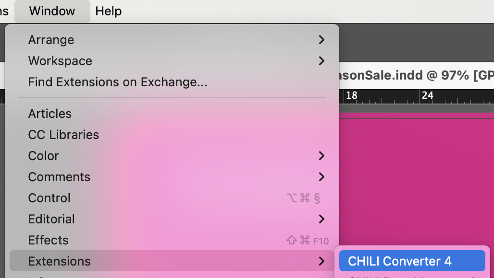

- In the converter plugin, add your credentials in the "**server**" section of the plugin.
You Environment Admin can provide you with the credentials.  
You'll need a Template Designer Seat.

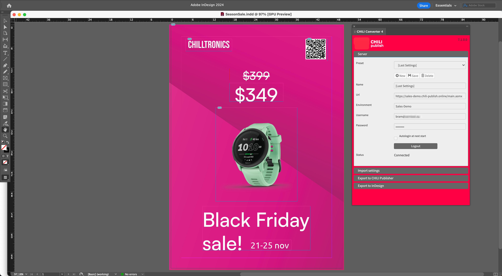

- In the "**Import settings**" section, choose the destination, where to store all converted elements.  
Documents, is where your converted file will be stored.  
Images, is where your placed assets will be store in GraFx Media.
Fonts, is where your uploaded fonts will be stored in the GraFx Publisher Fonts repository.

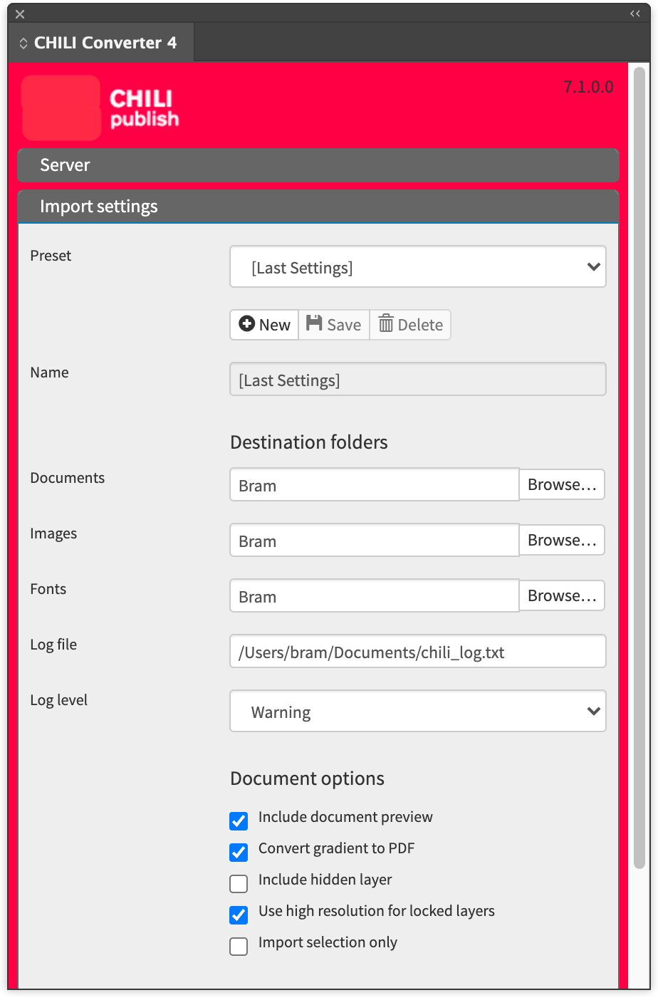

- In the "**Export**" section, confirm the file you want to confirm (only if you have more than one file open)
- Choose the destination "Server" means you'll convert to GraFx Publisher.
- Environment should be pre-selected, since you have entered your credentials for that environment.

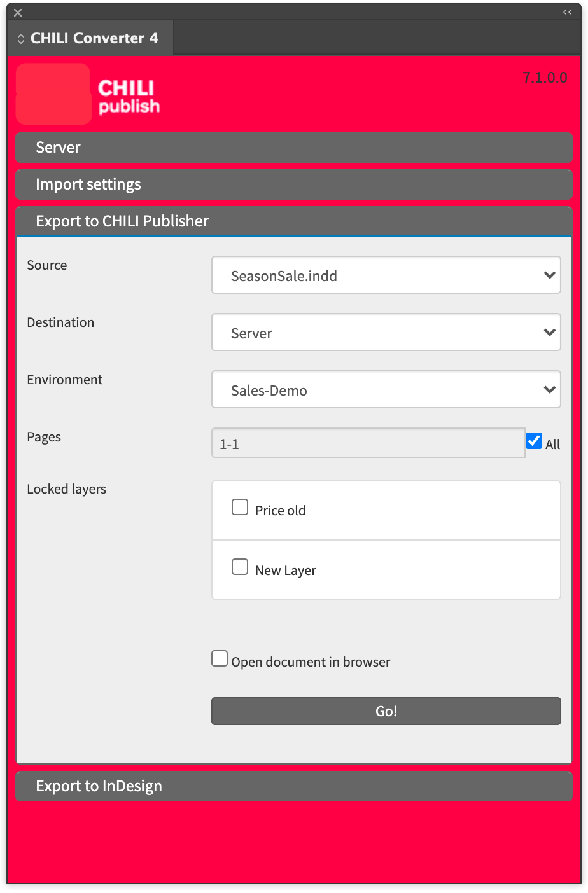

- Press "Go"

- A dialog will ask to save the file
- A progress bar will show the progress (pun intended)

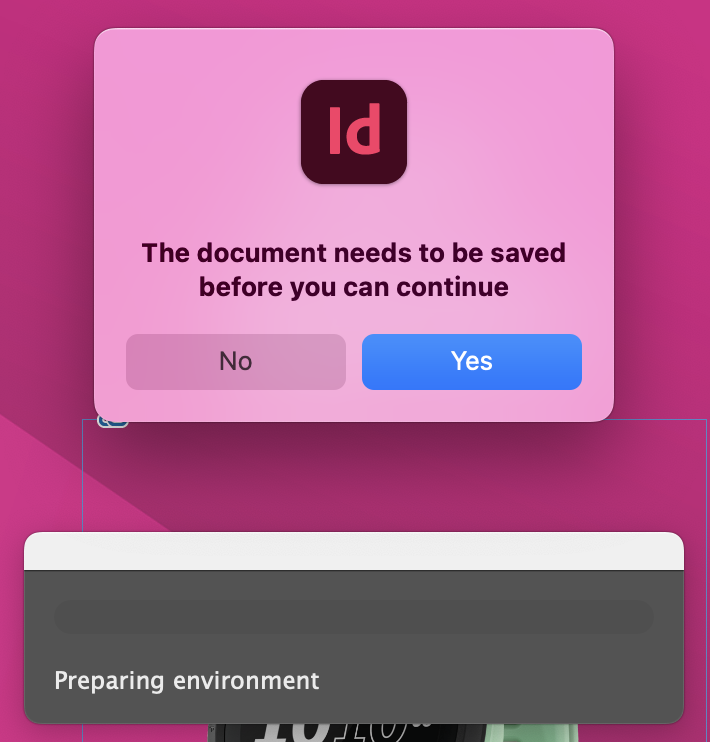

- When the conversion and upload is done, you'll get confirmation.

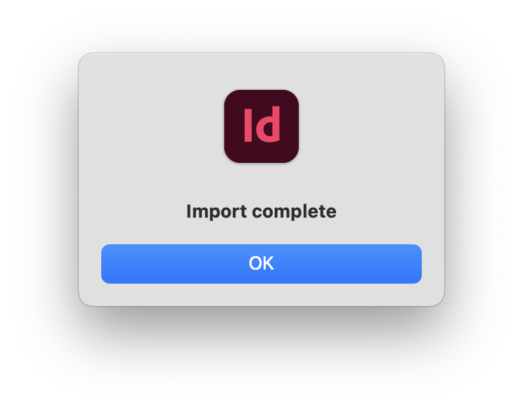

## Opening the document

- Open [CHILI GraFx](https://chiligrafx.com/environments)
- Choose the Environment you have sent the document to

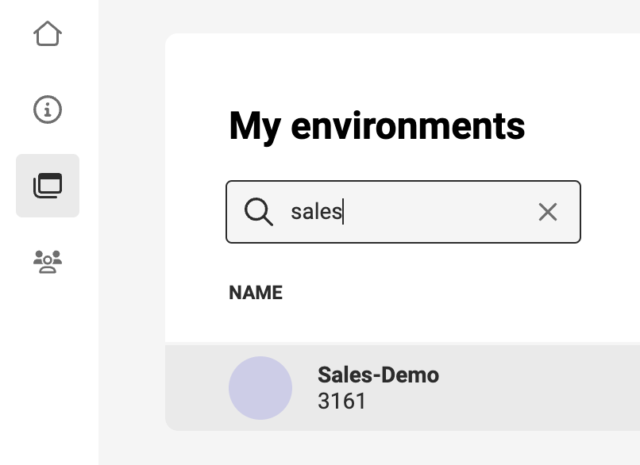

- Open GraFx Publisher

- Go to Resources > Documents > "**[foldername]**" (the destination you chose)

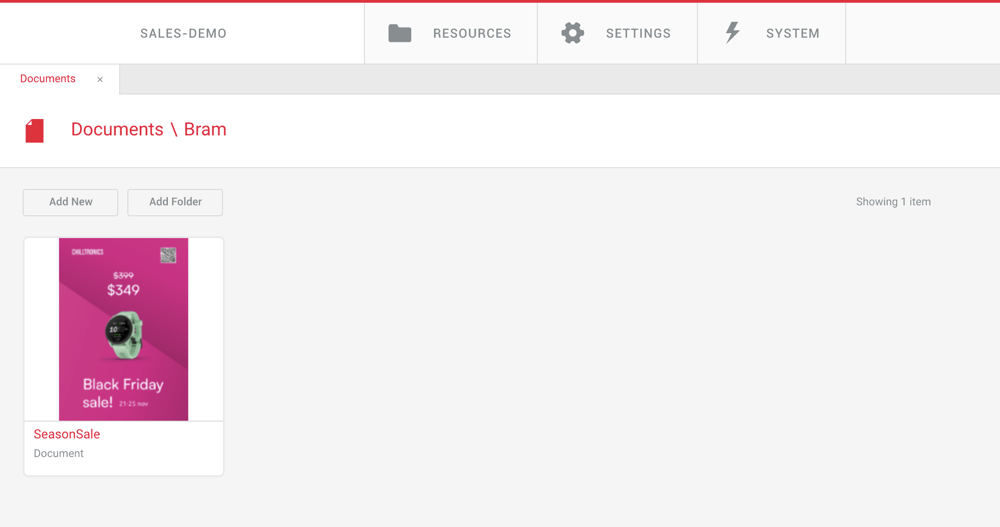

- Double click the converted document  
You will see the full workspace, with all Template Designer tools, panels and tabs.

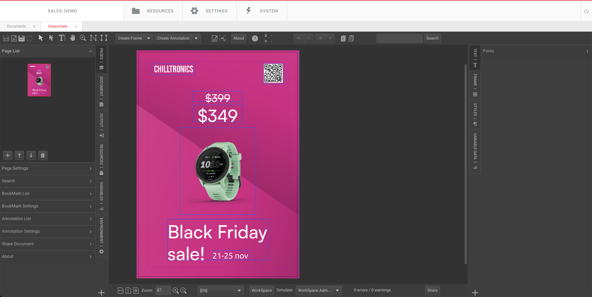

## Add business logic

### Variables

Variables allow you to create placeholders for text, images or barcodes, and allow end-users to fill in their content.

For this guide, we'll make 2 variables, to allow the end-user to provide the price and reduced price for the promotion.

- Create 2 number variables (Tab: Variable Data, Panel: Variable List):  
price  
price-reduced

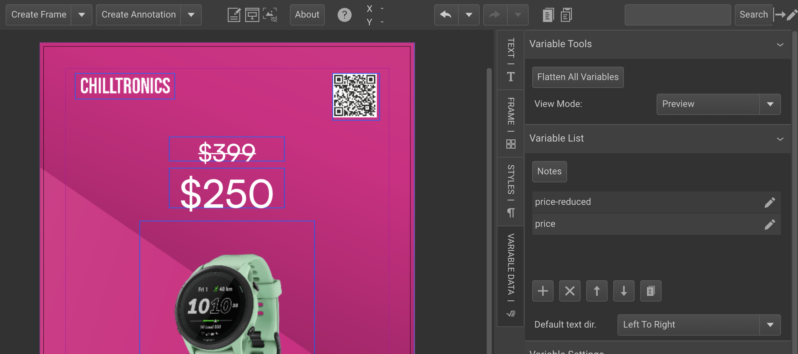

- Edit the created variables (pencil next to variables)  
Only change the type to "Number" for this guide.

- On the left in the "Variables" tab, you will see the entry fields

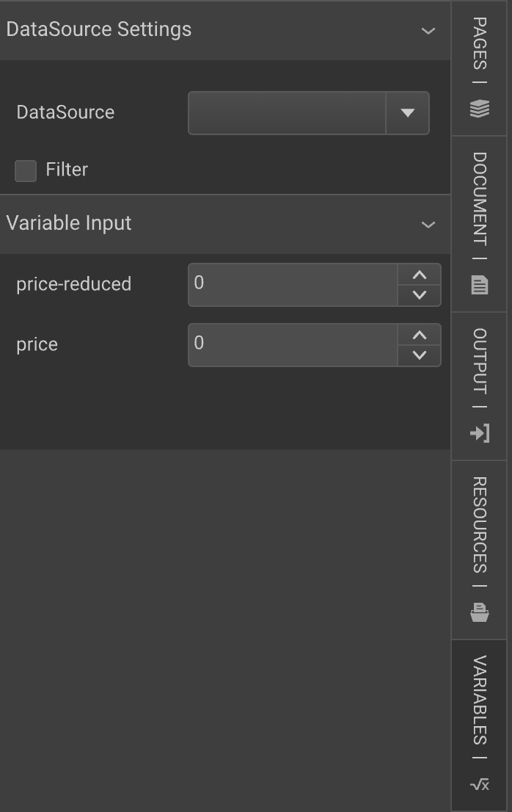

- Add variables to the frames  
In the frame of the price select the numbers of the price (don't select the $ sign)

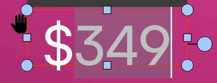

- Double-click the Variable  
In the variable list, double click on the "price" variable.  
At first, you'll see a warning sign, since the name of the variable does not fit the small price field.

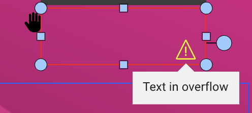

- Tell the frame it contains variables  
Check the box in the "Variable Tools" panel, to tell the frame it contains a variable.

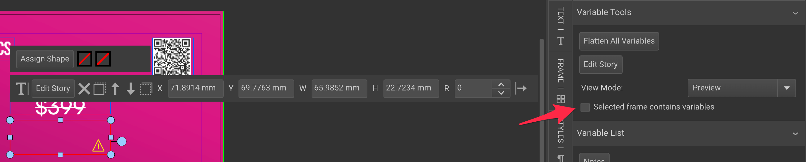

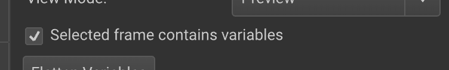

- Play with different values  
Enter a few values in the Variable input panel, and see the live changes

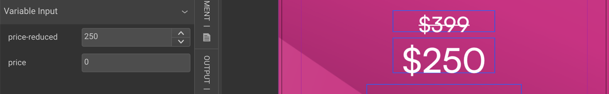

- Repeat for the other variable  
Repeat the above steps to add a variable to the other frame.

!!! Tip "Tip: See the text frame contents"
	With a text frame selected, click on the "Edit story" button to see the full contents, including the variables
     
     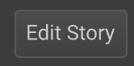
     
     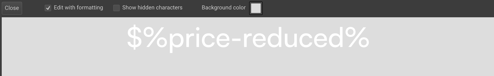
     
     Uncheck the "Edit with formatting" to see black text on the background. Sometimes the text color will make it difficult to see and edit the contents.

     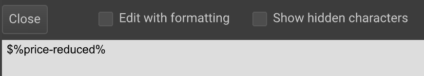

### Preview end-user view

In the bottom toolbar, choose Simulate > End User. This will simulate how an end-user will see the document.

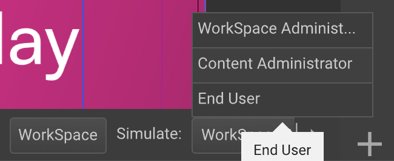

If you don't see the full drop-down list, hover your mouse over the right arrow to allow the bar to move so you see the full button.

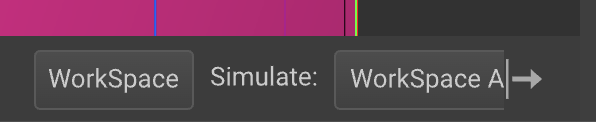

You'll see a slightly different look. But it's far from a clean view at first sight.

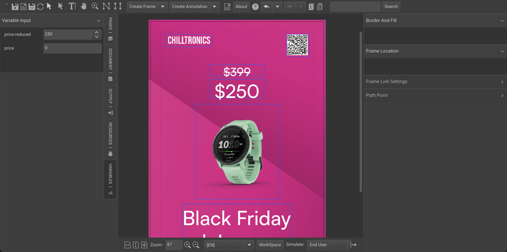

In the guide [Arrange your workspace](/GraFx-Publisher/guides/templates/arrange-workspace/), we'll go into more detail how to close the end-user view even more.

### Lock frames

In the Template Designer view (Workspace Administrator) and even in the End user view, you are still able to move frames around. 

This is **not** the behaviour we want. We want to protect the brand, and only allow interaction with what we define an end user can change.

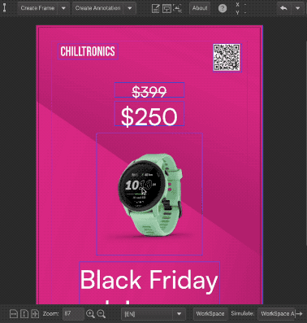

- Lock 1 frame  
Select the frame you want to lock.  
In the Frame tab, find the **Frame Constraints** panel.

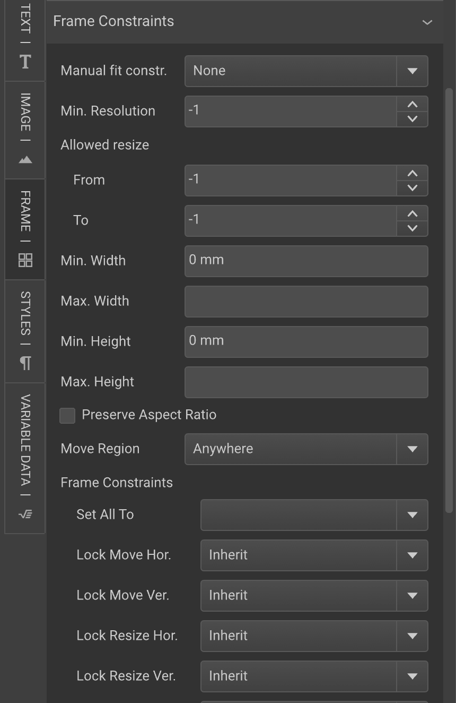

- Lock for end users  
Select the **lock for end users** at the "Set all to" drop down. 
This will set all the fields below, to locked (for end users).

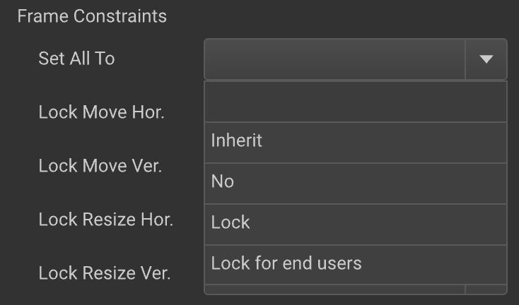

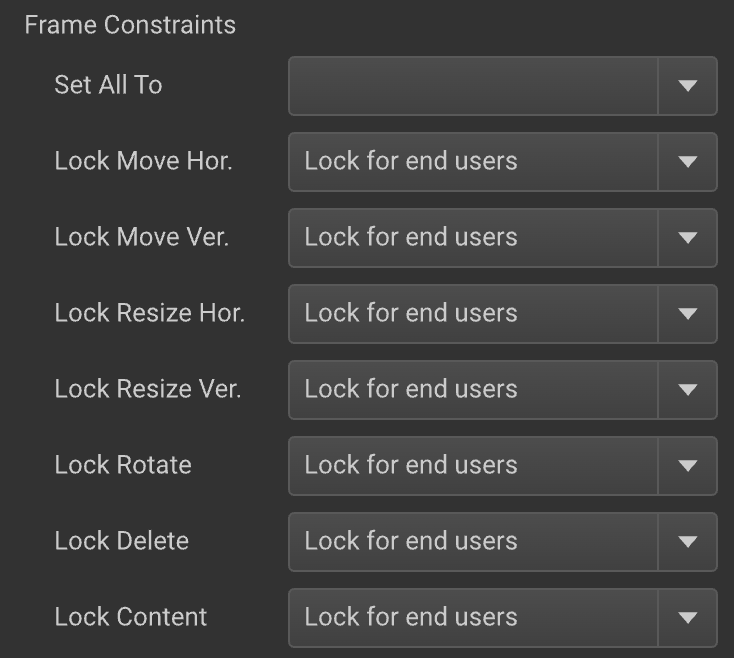

Frame constraints are saved with the template.

You can repeat this, for all individual frames. But if you have a lot of frames, you can set constraints on the Document, Layer or individual level. And you can set inheritance for the settings. More on setting constraints on this guide on [constraints](/GraFx-Publisher/guides/templates/set-constraints/).

[A](https://chilipublishdocs.atlassian.net/wiki/spaces/CPDOC/pages/1413931/Creating+your+first+document)

[B](https://chilipublishdocs.atlassian.net/wiki/spaces/CPDOC/pages/1412230/Creating+a+first+document)