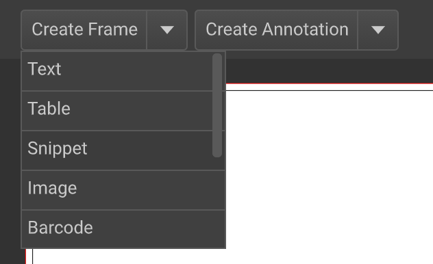
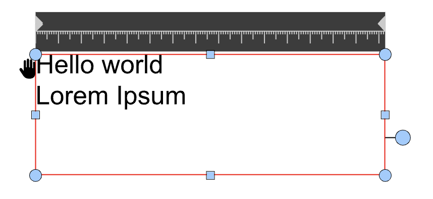
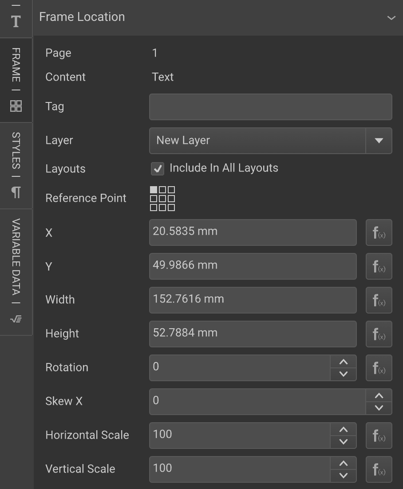
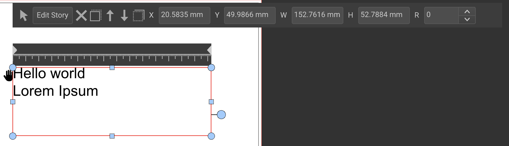
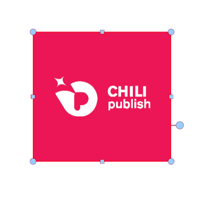

# Frames

[A](https://chilipublishdocs.atlassian.net/wiki/spaces/CPDOC/pages/1412121/Frames)

## Add a frame

You can add frames through the Create Frame toolbar item:

Upon clicking the Create Frame button, a dropdown menu appears from where you can choose between several kind of frames.

## Moving, resizing, z-index
Frames can be moved  and resized either manually (using inline frame handles), or using input fields.

To resize freely, click on one of the corner handles (little blue circles) and drag.
Between each corner handle there is a rectangular handle on the frame edge, use these to resize in fixed mode.
For example use the upper and lower handle to resize only vertically, and the left- and right handle to resize only horizontally.

The style of the frame handles can be changed via the view preferences; ViewPreference Settings

Input fields are available in the Frame tab > Frame Location panel main interface toolbar.

Here, Template Designers can configure more advanced settings such as the Layer, exclusion from certain Alternate Layouts, etc.

You can also set the Frame Location in the inline toolbar.

The fields consist of the position coordinates (X,Y), width & height size (W, H) and rotation degree (R).

If the input fields are greyed out, you might have set constraints or formulas with Dynamic Layout functions

### Rotation

Frames rotate around the center.

Rotation around the center occurs both when directly manipulated by the user or when triggered by an action.

#### Reference points

You can assign a reference point for each frame using a 9-point grid: From top left, top center ... to bottom right.

The specified reference point is used when automatic transformations are applied to a given frame, providing more accurate control over the position of each frame without using complex actions.

NOTE: Changing the reference point will not have any impact on the auto-grow direction of a text frame or the rotation point of any frame.

Z-Index
Frames also have a "vertical" (or depth) position, much like sheets of paper on a stack. This is called the z-index.

The z-index controls are located to left of the frame input fields in the toolbar:   

From left to right : Bring To Front, Move Up, Move Down, Send To Back.

Bring To front: topmost, -or in front of- above all other frames.

Move Up: move one position forward.

Move Down: move one position backwards.

Send To Back: behind -or under- all other frames.

General Frame Settings
Most of the general Frame settings (borders, anchoring, wrap settings, ...) are available on the right hand "Frame" tab:

Frame > Border And Fill panel

see Frame Border And Fill for more details

New in version 6.2 and 2020.2

Handling frames on a mobile device
The mobile UX of the CHILI editor on mobile devices is a continuous effort to improve.

We have increased the touch area (for mobile devices) of every control to be 48x48px, in alignment with common standards, such as "Material Design" (Android) and "Adobe Spectrum".

Scrolling and panning using touch interactions has been enabled.

When inline image positioning is enabled (via the view preferences), the icon is always visible on mobile devices. For desktop users, the icon only appears on mouse hover.