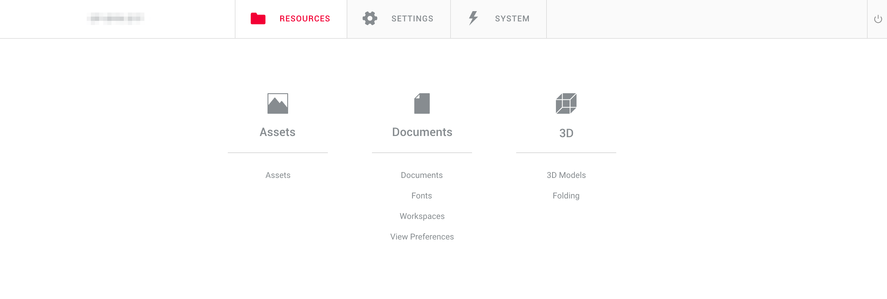
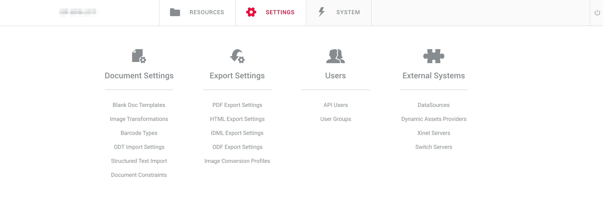
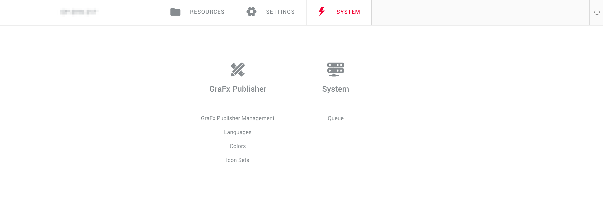

# GraFx Publisher Backoffice Overview

The Backoffice in GraFx Publisher is a comprehensive management hub, featuring various elements essential for smart template creation:

## Resources

- **Assets**: Initially used for storing assets, this section has evolved with GraFx Media. While assets are now primarily managed in GraFx Media, certain properties like **points of interest** are still handled here.
- **Documents**: The central area for managing Smart Templates for GraFx Publisher.
- **Fonts**: Dedicated to font management for GraFx Publisher. Note that GraFx Studio fonts are managed separately in [GraFx Fonts](/GraFx-Fonts/).
- **Workspaces**: Here, users can manage workspaces. Detailed description will be provided later. 
- **View Preferences**: This section allows managing view preferences. More details to follow.
- **3D Models and Folding**: A section for managing 3D models and folding setups, which are planned for deprecation in future versions.

## Settings

Administrators can create and manage settings here

- **Document settings**: Manage settings that are related to documents.
- **Export settings**: Manage settings related to exporting documents. Create presets to export a document using the same settings using a single preset name.
- **Users**: Manage API users and the groups that define their access.
- **External systems**: Manage presets of connections to external systems.

## System

- **System Area**: Provides access to global application settings and elements.

[A](https://chilipublishdocs.atlassian.net/wiki/spaces/CPDOC/pages/1413938/Browse+search)