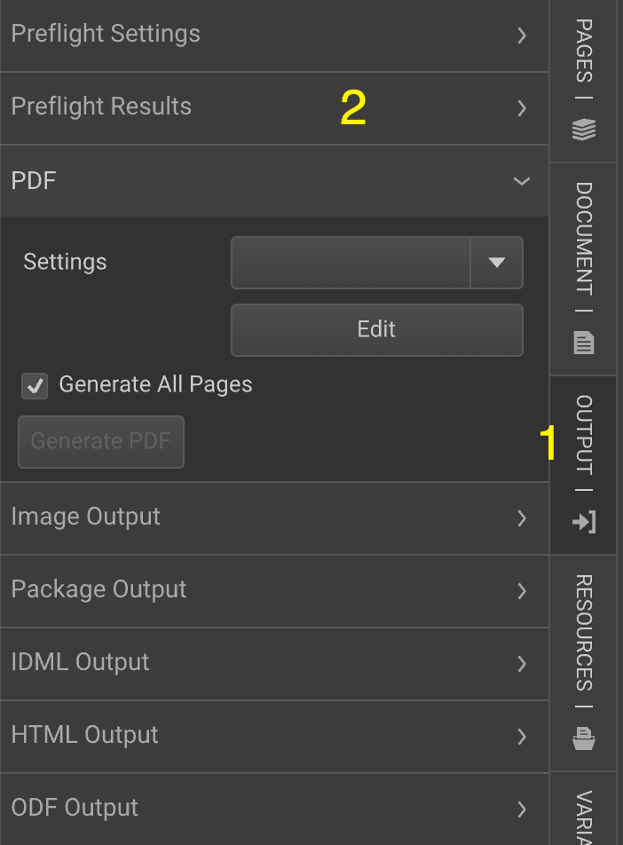

# Editor Workspace Panels

Panels in GraFx Publisher are groups of properties, like the PDF (output) panel under the Output tab.

Panels are part of the Workspace. When loading a document, a set of panels will be loaded as defined in the Workspace Settings.

## Organizing Panels

Panels are grouped within [Tabs](GraFx-Publisher/overview/editor-tabs/). Each panel has a default location.

Editing a Tab allows you to add or remove panels from it.

In the Tab Properties panel, panels can be inserted (A), deleted (B), or moved (C).

## Available Panels

A list of available panels is provided, covering a wide range of functionalities from layout settings to asset management.

A list of available panels is to be found here.

- About
- Alternate Layout List
- Alternate Layout Settings
- Anchors
- Animation Output (obsolete)
- Annotation List
- Annotation Settings
- Barcode Settings
- Batch Placement
- BookMark List
- Border And Fill
- Character Settings
- Character Style Settings
- Character Styles
- Color Settings
- Colors
- Copy Fitting Style Settings
- Copy Fitting Styles
- DAM Feed
- DataSource Settings
- Debug Window
- Document Annotations
- Document BaselineGrid
- Document Constraints
- Document Crop
- Document Link Settings
- Document Settings
- Event Action List
- Event Action Settings
- External Assets
- External Snippets
- External Texts
- Font settings
- Fonts
- Frame Constraints
- Frame Custom BaselineGrid
- Frame Link Settings
- Frame Location
- Glyphs
- HTML Output
- IDML Output
- Image MetaData
- Image Output
- Image Settings
- Import Warnings
- Layers List
- Layer settings
- ODF Output
- Package Output
- Page List
- Page Settings
- Paragraph Settings
- Paragraph Style Settings
- Paragraph Styles
- Path Point
- PDF
- Placed Asset list
- Preflight Results
- Preflight Settings
- Private Data Input
- Search
- Share Document
- Snippet MedaData
- Snippet Settings
- Snipper Variables
- Snippets
- Structured Text Rule Settings
- Structured Text Settings
- Table Cell
- Table Column
- Table Row
- Table settings
- Text Frame Settings
- Text Panel
- Variable Input
- Variable List
- Variable Settings
- Variable Tools
- View Preferences
- Workspace settings
- Wrap Settings
- Xinet Feed (Obsolete)