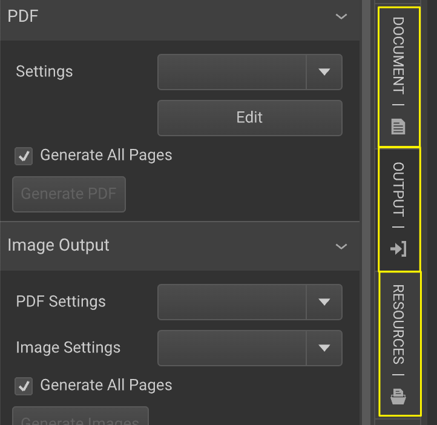
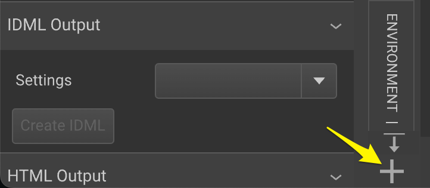
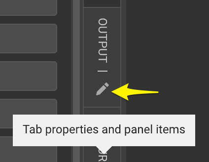
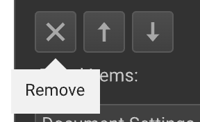

# Editor Workspace Tabs

Tabs in the Workspace are vertical elements grouping one or more panels. The list of tabs, their order, and the panels within are part of the Workspace settings loaded with a document.

## Organizing Tabs

Tabs have a default location. Editing a tab allows for adding or removing panels. New tabs can be added by clicking the "+" sign at the bottom of the Tabs area.

Tabs can be removed or reordered in the Tab Properties panel.

